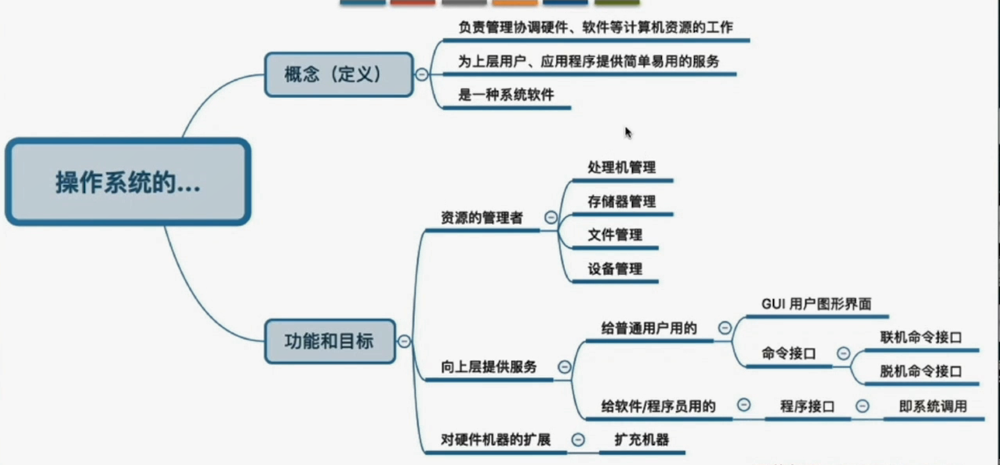
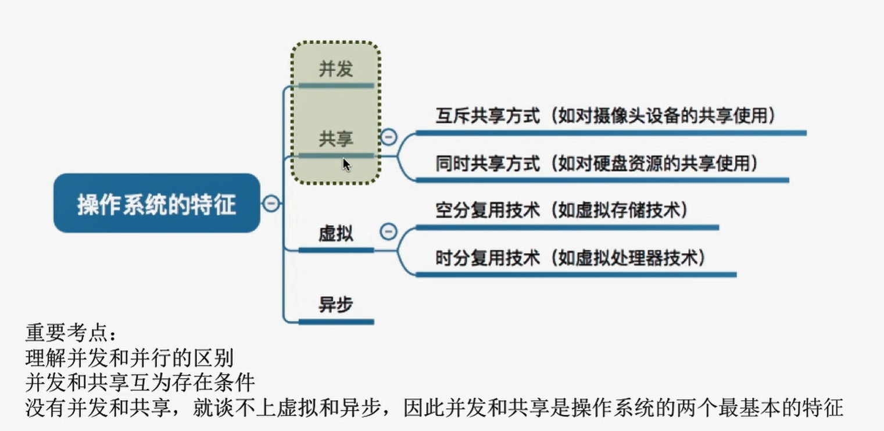
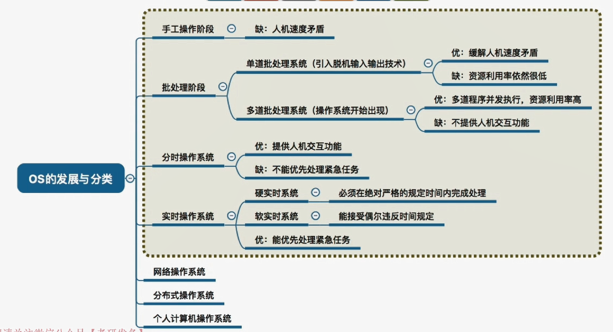
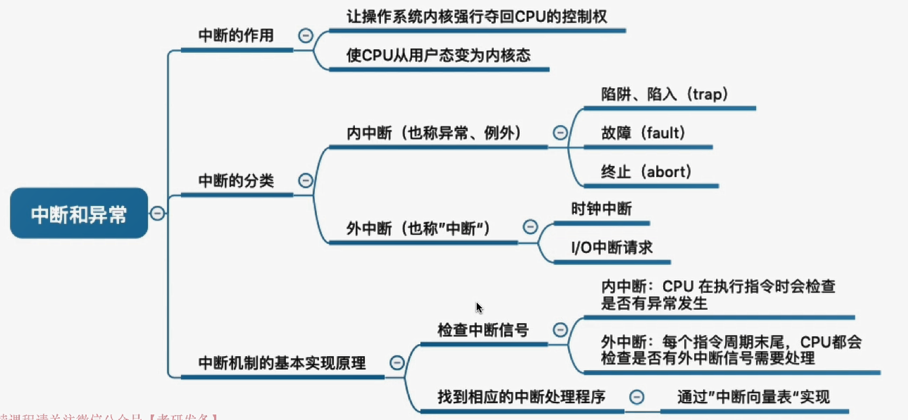
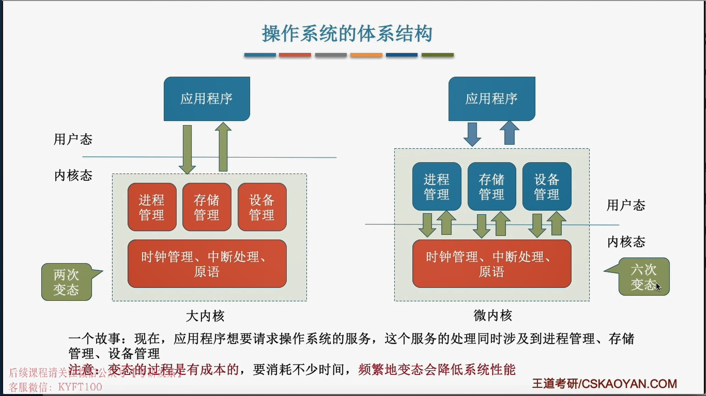

# 1.1 操作系统的基本概念
## 1.1.1 操作系统的概念
$\qquad$**操作系统**是指控制和**管理**整个计算机系统的**硬件和软件**资源，并合理地组织调度计算机的工作和资源分配；以**提供给用户和其他软件方便的接口和环境**；它是计算机系统中最基本的**系统软件**

## 1.1.2 操作系统的目标和功能

1. 操作系统作为系统的管理者
   1. 处理机管理
   2. 存储器管理
   3. 文件管理
   4. 设备管理
2. 操作系统作为用户与计算机硬件系统之间的接口
   1. 命令接口
      1. 交互式命令接口(联机命令接口)：用户说一句，系统说一句
      2. 批处理命令接口(脱机命令接口)：用户说一堆，系统做一堆
   2. 程序接口
      - 可以在程序中进行**系统调用**来使用程序接口。普通用户不能直接使用程序接口，只能通过程序代码**间接**使用。
3. 操作系统用作扩充机器
   - 没有任何软件支持的计算机称为裸机
   - 覆盖了软件的机器成为扩充机器，又称虚拟机

## 小结

## 1.1.3 操作系统的特征
1. 并发
   - 指两个或多个事件在同一时间间隔内发生。
   - 这些事件宏观上是同时发生的，但微观上是交替发生的。
2. 共享
   - 资源共享，是指系统中的资源可供内存中多个并发执行的进程共同使用。
      - 互斥共享：一个时间段内指允许一个进程访问该资源。
      - 同时共享：允许一个时间段内多个进程"同时(宏观上的)"对它们进行访问。
3. 虚拟
   - 是指把一个物理上的实体变为若干个逻辑上的对应物，前者是实际存在的，后者是用户感知的。
     - 空分复用技术
     - 时分复用技术
4. 异步
   - 在多道程序环境下，允许多个程序并发执行，但是由于资源有限，进程的执行不是一贯到底的，而是走走停停，以不可预知的速度向前推进。
## 小结  

# 1.2 操作系统的发展与分类
## 1.2.1 手工操作阶段

**此阶段无操作系统**
👎缺点:
1. 用户独占全机
2. 人机速度矛盾导致资源利用率极低

## 1.2.2 批处理阶段

1. 单批处理系统
   1. 主要特征
      1. 自动性
      2. 顺序性
      3. 单道性
   2. 👍优点：
      1. 缓解了一定程度的人机速度矛盾，资源利用率有所提升
   3. 👎缺点：
      1. 内存中仅能有一道程序允许，串行
      2. CPU有大量的时间是在空闲等待I/O完成，资源利用率依然低。
2. 多道批处理系统
   1. 主要特征
      1. 多道
      2. 宏观上并行
      3. 微观上串行
   2. 👍优点
      1. 多道程序并发执行，共享计算机资源。
      2. 资源利用率大幅提升。
   3. 👎缺点
      1. 用户响应时间长
      2. 没有人机交互功能(中间不能控制自己的程序执行)

## 1.2.3 分时操作系统

计算机以时间片为单位轮流为各个用户服务。
1. 主要特征
   1. 同时性
   2. 交互性
   3. 独立性
   4. 及时性
2. 👍优点
   1. 用户的请求可以及时的被响应，解决了人机交互问题。
3. 👎缺点
   1. 不能优先的处理紧急任务

## 1.2.4 实时操作系统 

能够优先的响应一些紧急任务
1. 主要特征
   1. 及时性
   2. 可靠性
2. 硬实时系统
   1. 必须在绝对严格的规定时间内完成处理
3. 软实时系统
   1. 偶尔能违反时间

## 小结

# 1.3 操作系统的运行环境
## 1.3.1 操作系统的运行机制

**CPU有两种状态，"内核态"和"用户态"，由硬件负责切换**

1. **内核态=核心态=管态**
   - 说明此时正在运行的是内核程序，可以执行特权指令
2. **用户态=目态**
   - 说明此时正在运行的是应用程序，此时只能执行非特权指令

**内核态、用户态的切换**
1. 内核态$\rightarrow$用户态
   - 执行一条特权指令，修改PSW寄存器的值，系统主动让处CPU的使用权
2. 用户态$\rightarrow$内核态
   - 由"中断"引发，硬件自动完成切换过程，系统强行夺回CPU的使用权

## 1.3.2 中断和异常的概念

1. 中断的类型
   1. 内中断(也称异常)：与当前执行的指令**有关**，中断信号来源于**CPU内部**
      1. 陷入
         - 是应用程序故意引发的
      2. 故障
         - 由错误条件引起的，可能被内核程序修复。修复后会把使用权还给应用程序
      3. 终止
         - 由致命错误引起，内核程序无法修复该错误，因此一般直接终止该程序。
   2. 外中断(也称中断)：与当前执行的指令**无关**，中断信号来源于**CPU外部**  
      1. 时钟中断
      2. I/O中断请求

## 1.3.3 中断处理的基本原理

$\qquad$不同的中断信号，需要用不同的中断处理程序来处理。当CPU检测道中断信号后，会根据中断信号的类型去查询"中断向量表"，来找到相应的中断处理程序在内存中的存放位置。

## 小结

## 1.3.4 系统调用

与共享资源相关、会直接影响到其他进程的操作都需要通过系统调用方式向操作系统发出服务请求。

**按功能分类**
1. 设备管理
2. 文件管理
3. 进程管理
4. 进程通信
5. 内存管理

**系统调用的过程**
1.  传递系统调用参数
2.  执行陷入指令
3.  执行相应的内请求核程序处理系统调用($\color{red}{内核态}$)
4.  返回应用程序

⚠️**注意**
1. 陷入指令是在**用户态**下执行的，执行陷入指令之后立即引发一个**内中断**，使CPU进入**内核态**。
2. 发出系统调用请求是在**用户态**，而对系统调用的相应处理在**内核态**下进行
3. 进入核心态是不仅状态需要切换，所用的堆栈也可能需要由用户堆栈切换到系统堆栈，但这个系统堆栈也是属于该进程。

# 1.4 操作系统的体系结构 ❌
## 1.1.4 大内核和微内核
**大内核**
1. 时钟管理
2. 中断处理
3. 原语
4. 对系统资源进行管理的功能
   1. 进程管理
   2. 存储器管理
   3. 设备管理

**微内核**
1. 时钟管理
2. 中断处理
3. 原语

⚠️ 注意
1. 操作系统内核需要运行在内核态
2. 操作系统非内核功能运行在用户态

