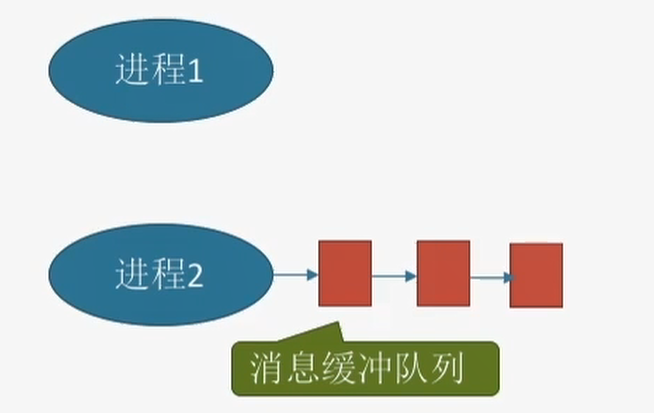
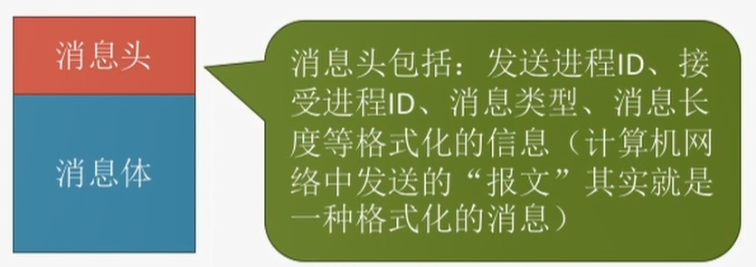

# 2.1 进程与线程
## 2.1.1 进程的概念
进程是程序的一次执行过程
**进程控制块(PCB)**:进程存在的唯一标志(用来保存操作系统对进程管理工作所需的信息)。
**进程实体** ：进程在动态执行过程中某一刻的一个快照
1. PCB(系统用)
2. 程序段(进程自己用)
3. 数据段。(进程自己用)

进程是**动态**的，进程实体是**静态**的

## 2.1.2 进程的特征
**理解即可** :anger:
1. 动态性**(最基本特征)**
   - 进程是程序的一次执行过程，是动态地产生、变化、消亡的。
2. 并发性
   - 内存中有多个进程实体，各程序可并发执行。
3. 独立性
   - 进程是能够独立运行、获得资源、接受调度的基本单位
4. 异步性。
   - 各进程按各自独立的、不可预知的速度向前推进。
5. 结构性
   - 每个进程都会配置一个PCB。

## 2.1.2 进程的状态与转换

**状态**
1. 创建态
   - 进程正在被创建，这个阶段操作系统会给进程分配资源。
2. 就绪态
   - 进程获得了除处理机外的一切资源，因为没有空闲的CPU暂时不能运行。
3. 运行态
   - 正在处理机上运行。
4. 阻塞态
   - 正在等待某一事件而暂停运行，即使处理机空闲，也无法运行。
5. 结束态
   - 进程正在系统中消失。

**转换**
1. 就绪态$\rightarrow$运行态
   - 处于就绪态的进程被调度后，获得处理机资源时。
2. 运行态$\rightarrow$就绪态
   - 时间片用完后
3. 运行态$\rightarrow$阻塞态
   - 进程正在等待某一事件发生
4. 阻塞态$\rightarrow$就绪态
   - 等待的事件到来时

⚠️注意
1. 阻塞态不能直接转换到运行态
2. 就绪态也不能直接转换到阻塞态

## 2.1.3 进程的组织

## 小结

## 2.1.4 进程控制

### 1、进程的创建

1. 引进创建进程的事件
   1. 用户登录
      - 分时系统中，用户登录成功，系统会为其建立一个新的进程
   2. 作业调度(作业是指在外存里面没有投入运行的程序)
      - 多道批处理系统中，有新的作业放入内存时，会为其创建一个新的进程
   3. 提供服务
      - 用户向操作系统提出某些请求时，会新建一个进程处理该请求
   4. 应用请求
      - 由用户进程主动请求创建一个子进程
2. 创建原语(创建进程)
   1. 申请空白的PCB
   2. 为新进程分配所需资源
   3. 初始化PCB
   4. 将PCB插入就绪队列

### 2、进程的终止

1. 引进进程终止的事件
   1. 正常结束
   2. 异常结束
   3. 外界干预(用户杀死进程)
2. 撤销原语
   1. 从PCB集合中找到终止进程的PCB
   2. 若进程正在运行，立即剥夺CPU，将CPU分配给其他进程
   3. 终止其所有子进程
   4. 将该进程拥有的所有资源归还给父进程或操作系统
   5. 删除PCB

### 3、进程的阻塞和唤醒

**理解为主**

1. 进程的阻塞
   1. 引进进程阻塞的事件
      1. 需要等待系统分配资源
      2. 需要等待相互合作的其他进程完成工作
   2. 阻塞原语
      1. 找到阻塞的进程对应的PCB
      2. 保护进程运行现场，将PCB状态信息设置为"阻塞态"，暂时停止进程运行
      3. 将PCB插入相应事件的等待队列
2. 进程的唤醒
   1. 引进进程唤醒的事件
      1. 等待的事件发生
   2. 唤醒原语
      1. 在事件等待队列中找到PCB
      2. 将PCB从等待队列移出，设置进程为就绪态
      3. 将PCB插入就绪队列，等待被调度

### 4、进程的切换

**改变两个进程的状态**

1. 引起进程切换的事件
   1. 当前进程时间片到
   2. 有更高优先级的进程到达
   3. 当前进程主动阻塞
   4. 当前进程终止
2. 切换原语
   1. 将运行环境信息存入PCB
   2. PCB移入相应队列
   3. 选择另一个进程执行，并更新其PCB
   4. 根据PCB恢复新进程所需的运行环境

## 2.1.5 进程通信

**为了安全保证一个进程不能直接访问另一个进程的地址空间**

1. 共享存储(**互斥访问**)
   1. 进程之间存在一个可直接访问的共享空间
      1. 基于数据结构的共享
         - 速度慢、限制多，低级通信方式
      2. 基于存储区的共享
         - 速度更快，高级的通信方式
2. 消息传递
   1. 以格式化的消息为单位进行数据传输(操作系统提供"发送消息/接受消息"两个原语)
      1. 直接通信方式  
         - 消息直接挂到接收进程的消息缓冲队列上
         - 
      2. 间接通信方式(信箱通信方式)
         - 先发送到中间实体"信箱"中
         - 
    2. 消息格式
       -  
3. 管道通信(互斥访问)
   1. 内存中开辟一个大小固定的缓冲区
      1. **管道只能采用半双工，否则需要设置两个管道**
      2. 数据以字符流的形式写入管道，当管道写满时，写进程的write()系统调用将被阻塞，等待读进程将数据取走。当读进程将数据全部取走后，管道变空，此时读进程的read()系统调用将被阻塞。
      3. **如果没有写满就不允许读。如果没读空，就不允许写**
      4. 数据一旦被读出，就从管道中被抛弃，即读进程只有一个。

## 2.1.6 线程概念和多线程模型

线程是一个基本的CPU执行单元，也是程序执行流的最小单位。

引入进程提高了系统的并发度，进程只作为除CPU之外的系统资源的分配单元(内存地址、打印机都是分配给进程)。

**引入线程带来的变化**
1. 资源分配、调度
   1. 传统进程机制中，进程是资源分配、调度的基本单位
   2. 引入线程后，进程是资源分配的基本单位，线程是调度的基本单位
2. 并发性
   1. 传统进程机制中，只能进程间并发
   2. 引入线程后，各线程间也能并发，提高了并发度
3. 系统开销
   1. 传统的进程间并发，需要切换进程的运行环境，系统开销大
   2. 线程间并发，如果是同一进程捏的线程切换，不需要切换
   3. 引入线程后，并发所带来的系统开销减小

***

**线程的属性**

1. 线程是处理机调度的单位
2. 多CPU计算机中，各个线程可占用不同的CPU
3. 每个线程都有一个线程ID、线程控制块(TCB)
4. 线程也有就绪、阻塞、运行三种基本状态
5. 线程几乎不拥有系统资源
6. 同一进程的不同线程间共享进程的资源
7. 由于共享内存地址空间，同一进程种的线程间通信甚至无需系统干预
8. 同一进程中的线程切换，不会引起进程切换
9. 不同进程中的线程切换，会引起进程切换
10. 切换同进程内的线程，系统开销很小

***

**线程的实现方法**

1. **用户级线程**
   1. "线程"由线程库实现，操作系统看不见
   2. 👍优点：线程切换在用户空间即可完成，不需要切换到核心态，线程管理的系统开销小，效率高
   3. 👎缺点：当一个用户级线程被阻塞后，整个进程都会被阻塞，并发度不高。多个线程不可在多核处理机上运行。
2. **内核级线程(处理机分配的基本单位)**
   1. 操作系统支持的线程
   2. 👍优点：当一个线程被阻塞后，别的线程还可以继续执行，并发能力强。多线程可在多核处理机上并行执行。
   3. 👎缺点：一个用户进程占用多个内核级线程，线程切换由操作系统内核完成，需要切换到核心态，线程管理的成本高，开销大。

**多线程模型**

1. 一对一模型(内核级线程)
   1. 一个用户级线程映射到一个内核级线程
   2. 👍优点：当一个线程被阻塞后，别的线程还可以继续执行，并发能力强。线程可在多核处理机上并行执行。
   3. 👎缺点：一个用户进程会占用多个内核级线程，线程切换由系统内核完成，管理成本高，开销大
2. 多对一模型(用户级线程)
   1. 👍优点：线程切换在用户空间即可完成，不需要切换到核心态，线程管理的系统开销小，效率高
   2. 👎缺点：当一个用户级线程被阻塞后，整个进程都会被阻塞，并发度不高。多个线程不可在多核处理机上运行。
3. 多对多模型
   1. n个用户级线程映射到m个内核级线程(n$\gneq$m)，每个用户级进程对应m个内核级线程。
   2. 克服了多对一模型并发度不高的缺点，一对一模型中一个用户进程占用太多内核级线程，开销大的缺点。