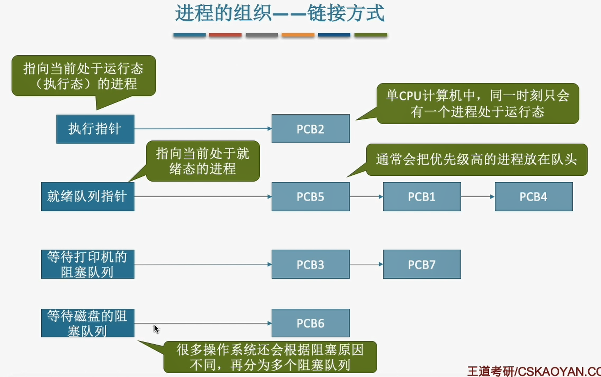

# 2.1 进程与线程
## 2.1.1 进程的概念
进程是程序的一次执行过程
**进程控制块(PCB)**:进程存在的唯一标志(用来保存操作系统对进程管理工作所需的信息)。
**进程实体** ：进程在动态执行过程中某一刻的一个快照
1. PCB(系统用)
2. 程序段(进程自己用)
3. 数据段。(进程自己用)

进程是**动态**的，进程实体是**静态**的

## 2.1.2 进程的特征
**理解即可** :anger:
1. 动态性 **(最基本特征)**
   - 进程是程序的一次执行过程，是动态地产生、变化、消亡的。
2. 并发性
   - 内存中有多个进程实体，各程序可并发执行。
3. 独立性
   - 进程是能够独立运行、获得资源、接受调度的基本单位
4. 异步性。
   - 各进程按各自独立的、不可预知的速度向前推进。
5. 结构性
   - 每个进程都会配置一个PCB。

## 2.1.2 进程的状态与转换

**状态**
1. 创建态
   - 进程正在被创建，这个阶段操作系统会给进程分配资源。
2. 就绪态
   - 进程获得了除处理机外的一切资源，因为没有空闲的CPU暂时不能运行。
3. 运行态
   - 正在处理机上运行。
4. 阻塞态
   - 正在等待某一事件而暂停运行，即使处理机空闲，也无法运行。
5. 结束态
   - 进程正在系统中消失。

**转换**
1. 就绪态$\rightarrow$运行态
   - 处于就绪态的进程被调度后，获得处理机资源时。
2. 运行态$\rightarrow$就绪态
   - 时间片用完后
3. 运行态$\rightarrow$阻塞态
   - 进程正在等待某一事件发生
4. 阻塞态$\rightarrow$就绪态
   - 等待的事件到来时

⚠️注意
1. 阻塞态不能直接转换到运行态
2. 就绪态也不能直接转换到阻塞态

## 2.1.3 进程的组织

## 小结

## 2.1.4 进程控制

### 1、进程的创建

1. 引进创建进程的事件
   1. 用户登录
      - 分时系统中，用户登录成功，系统会为其建立一个新的进程
   2. 作业调度(作业是指在外存里面没有投入运行的程序)
      - 多道批处理系统中，有新的作业放入内存时，会为其创建一个新的进程
   3. 提供服务
      - 用户向操作系统提出某些请求时，会新建一个进程处理该请求
   4. 应用请求
      - 由用户进程主动请求创建一个子进程
2. 创建原语(创建进程)
   1. 申请空白的PCB
   2. 为新进程分配所需资源
   3. 初始化PCB
   4. 将PCB插入就绪队列

### 2、进程的终止

1. 引进进程终止的事件
   1. 正常结束
   2. 异常结束
   3. 外界干预(用户杀死进程)
2. 撤销原语
   1. 从PCB集合中找到终止进程的PCB
   2. 若进程正在运行，立即剥夺CPU，将CPU分配给其他进程
   3. 终止其所有子进程
   4. 将该进程拥有的所有资源归还给父进程或操作系统
   5. 删除PCB

### 3、进程的阻塞和唤醒

**理解为主**

1. 进程的阻塞
   1. 引进进程阻塞的事件
      1. 需要等待系统分配资源
      2. 需要等待相互合作的其他进程完成工作
   2. 阻塞原语
      1. 找到阻塞的进程对应的PCB
      2. 保护进程运行现场，将PCB状态信息设置为"阻塞态"，暂时停止进程运行
      3. 将PCB插入相应事件的等待队列
2. 进程的唤醒
   1. 引进进程唤醒的事件
      1. 等待的事件发生
   2. 唤醒原语
      1. 在事件等待队列中找到PCB
      2. 将PCB从等待队列移出，设置进程为就绪态
      3. 将PCB插入就绪队列，等待被调度

### 4、进程的切换

**改变两个进程的状态**

1. 引起进程切换的事件
   1. 当前进程时间片到
   2. 有更高优先级的进程到达
   3. 当前进程主动阻塞
   4. 当前进程终止
2. 切换原语
   1. 将运行环境信息存入PCB
   2. PCB移入相应队列
   3. 选择另一个进程执行，并更新其PCB
   4. 根据PCB恢复新进程所需的运行环境

## 2.1.5 进程通信

**为了安全保证一个进程不能直接访问另一个进程的地址空间**

1. 共享存储(**互斥访问**)
   1. 进程之间存在一个可直接访问的共享空间
      1. 基于数据结构的共享
         - 速度慢、限制多，低级通信方式
      2. 基于存储区的共享
         - 速度更快，高级的通信方式
2. 消息传递
   1. 以格式化的消息为单位进行数据传输(操作系统提供"发送消息/接受消息"两个原语)
      1. 直接通信方式  
         - 消息直接挂到接收进程的消息缓冲队列上
         - 
      2. 间接通信方式(信箱通信方式)
         - 先发送到中间实体"信箱"中
         - 
    2. 消息格式
       -  
3. 管道通信(互斥访问)
   1. 内存中开辟一个大小固定的缓冲区
      1. **管道只能采用半双工，否则需要设置两个管道**
      2. 数据以字符流的形式写入管道，当管道写满时，写进程的write()系统调用将被阻塞，等待读进程将数据取走。当读进程将数据全部取走后，管道变空，此时读进程的read()系统调用将被阻塞。
      3. **如果没有写满就不允许读。如果没读空，就不允许写**
      4. 数据一旦被读出，就从管道中被抛弃，即读进程只有一个。

## 2.1.6 线程概念和多线程模型

线程是一个基本的CPU执行单元，也是程序执行流的最小单位。

引入进程提高了系统的并发度，进程只作为除CPU之外的系统资源的分配单元(内存地址、打印机都是分配给进程)。

**引入线程带来的变化**
1. 资源分配、调度
   1. 传统进程机制中，进程是资源分配、调度的基本单位
   2. 引入线程后，进程是资源分配的基本单位，线程是调度的基本单位
2. 并发性
   1. 传统进程机制中，只能进程间并发
   2. 引入线程后，各线程间也能并发，提高了并发度
3. 系统开销
   1. 传统的进程间并发，需要切换进程的运行环境，系统开销大
   2. 线程间并发，如果是同一进程捏的线程切换，不需要切换
   3. 引入线程后，并发所带来的系统开销减小

***

**线程的属性**

1. 线程是处理机调度的单位
2. 多CPU计算机中，各个线程可占用不同的CPU
3. 每个线程都有一个线程ID、线程控制块(TCB)
4. 线程也有就绪、阻塞、运行三种基本状态
5. 线程几乎不拥有系统资源
6. 同一进程的不同线程间共享进程的资源
7. 由于共享内存地址空间，同一进程种的线程间通信甚至无需系统干预
8. 同一进程中的线程切换，不会引起进程切换
9. 不同进程中的线程切换，会引起进程切换
10. 切换同进程内的线程，系统开销很小

***

**线程的实现方法**

1. **用户级线程**
   1. "线程"由线程库实现，操作系统看不见
   2. 👍优点：线程切换在用户空间即可完成，不需要切换到核心态，线程管理的系统开销小，效率高
   3. 👎缺点：当一个用户级线程被阻塞后，整个进程都会被阻塞，并发度不高。多个线程不可在多核处理机上运行。
2. **内核级线程(处理机分配的基本单位)**
   1. 操作系统支持的线程
   2. 👍优点：当一个线程被阻塞后，别的线程还可以继续执行，并发能力强。多线程可在多核处理机上并行执行。
   3. 👎缺点：一个用户进程占用多个内核级线程，线程切换由操作系统内核完成，需要切换到核心态，线程管理的成本高，开销大。

**多线程模型**

1. 一对一模型(内核级线程)
   1. 一个用户级线程映射到一个内核级线程
   2. 👍优点：当一个线程被阻塞后，别的线程还可以继续执行，并发能力强。线程可在多核处理机上并行执行。
   3. 👎缺点：一个用户进程会占用多个内核级线程，线程切换由系统内核完成，管理成本高，开销大
2. 多对一模型(用户级线程)
   1. 👍优点：线程切换在用户空间即可完成，不需要切换到核心态，线程管理的系统开销小，效率高
   2. 👎缺点：当一个用户级线程被阻塞后，整个进程都会被阻塞，并发度不高。多个线程不可在多核处理机上运行。
3. 多对多模型
   1. n个用户级线程映射到m个内核级线程(n$\gneq$m)，每个用户级进程对应m个内核级线程。
   2. 克服了多对一模型并发度不高的缺点，一对一模型中一个用户进程占用太多内核级线程，开销大的缺点。

# 2.2 处理机调度
## 2.2.1 调度的概念

1. **调度的基本概念**
   1. 当有一堆任务要处理，但资源有限，这些事情没法同时处理。就需要确定**某种规则**来**决定**这些任务的**顺序**。
2. **调度的层次**$\qquad$==频率从高到低==
   1. 低级调度(进程调度/处理机调度)
      1. 按照某种策略从就绪队列中选取一个进程，将处理机分配给它
      2. 最基本的一种调度。
      3. 频率很高
      4. 就绪态$\rightarrow$运行态
   2. 中级调度(内存调度)
      1. 按照某种策略决定将哪个处于挂起状态重新调入内存 
         1. 内存不够时，可将某些进程的数据调出外存。等内存空闲或者进程需要运行时再重新调入内存。
         2. 暂时调到外存等待的进程状态为**挂起状态**。被挂起的进程PCB会被组织成**挂起队列**
      2. 挂起态$\rightarrow$就绪态
   3. 高级调度(作业调度)               
      1. 按一定的原则从外存的作业后备队列挑选一个作业调入内存，并创建进程。每个作业只调入一次，调出一次。作业调入时会建立PCB，调出时才撤销PCB。
      2. **简化理解**：好几个程序要启动，先启动哪一个。
      3. 无$\rightarrow$创建态$\rightarrow$就绪态

## 2.2.2 调度的时机、切换与过程

1. 需要进行进程调度与切换的情况
   1. 主动放弃
      1. 进程正常终止
      2. 运行过程中发生异常而终止
      3. 进程主动请求阻塞
   2. 被动放弃
      1. 分配进程的时间片用完
      2. 有更紧急的事情要处理
      3. 有更高优先级的进程进入就绪队列
2. 不能进行进程调度与切换的情况
   1. 在处理**中断的过程中**。
   2. 在进程在**操作系统内核程序临界区**中(普通的临界区是可以切换调度的)
   3. 在**原子操作过程**中(原语)

***
1. 狭义的进程调度
   1. 从就绪队列中选一个要运行的进程(可以是刚刚被暂停的进程也可以是另一个，后者需要进程切换)
2. 进程切换
   1. 一个进程让出处理机，由另一个进程占用处理机的过程
3. 广义的进程调度
   1. 包含了选择一个进程和进程切换两个步骤。

## 2.2.3 进程的调度方式

1. 非剥夺调度方式(非抢占方式)
   1. 只允许进程主动放弃处理机
   2. 实现简单，系统开销小但无法及时处理紧急任务
   3. 适于早期的批处理系统
2. 剥夺调度方式(抢占方式)
   1. 允许被动放弃
   2. 可以优先处理更紧急的进程，也可实现让各进程按时间片轮流执行的功能

## 2.2.4 调度的基本准则

1. CPU利用率
   1. $\frac{忙碌的时间}{总时间}$
2. 系统吞吐量
   1. $\frac{总共完成了多少道作业}{总共花了多少时间}$
3. 周转时间
   1. 作业完成时间$-$作业提交时间
   2. 平均周转时间
      1. $\frac{各作业周转时间之和}{作业数}$
   3. 带权周转时间
      1. $\frac{作业周转时间}{作业实际运行的时间}=\frac{作业完成时间-作业提交时间}{作业实际运行的时间}$
   4. 平均带权周转时间
      1. $\frac{各作业带权周转时间之和}{作业数}$
4. 等待时间
   1. 指进程/作业处于等待处理机状态时间之和
   2. 对于进程
      1. 进程建立后被服务的时间之和，在等待I/O完成的期间也算被服务
   3. 对于作业
      1. 还要加上在外存后备队列中等待的时间
5. 响应时间
   1. 用户**提出请求**后到**首次响应**的时间

## 2.2.5 经典的调度算法

**注意到达时刻和就绪队列**

1. **先来先服务(FCFS)**
   1. 算法思想
      1. 从公平的角度考虑
   2. 算法规则
      1. 按照作业/进程到达的先后顺序
   3. 是否可抢占
      1. 非抢占算法
   4. 优缺点
      1. 👍优点：公平、算法实现简单
      2. 👎缺点：对长作业有利，对短作业不利
   5. 是否会导致饥饿(某进程/作业长期得不到服务)
      1. 不会
2. **短作业优先(SJF)**
   1. 算法思想
      1. 最求最少的平均等待时间，最少的平均周转时间、最少的平均带权周转时间
   2. 算法规则
      1. 最短的作业/进程优先得到服务
   3. 是否可抢占
      1. 没有说明的话默认为非抢占
   4. 优缺点
      1. 👍优点："最短的"平均等待时间、平均周转时间
      2. 👎缺点：不公平。对短作业有利，对长作业不利。可能会产生饥饿现象。
   5. 是否会导致饥饿
      1. 会，甚至会饿死。
3. **高响应比优先(HRRN)**
   1. 算法思想
      1. 综合考虑等待和服务时间
   2. 算法规则
      1. 在每次调度时先计算各个进程/作业的响应比，选择相应比最高的进程/作业为其服务
      2. $响应比=\frac{等待时间+要求服务时间}{要求服务时间}$
   3. 是否可抢占
      1. 非抢占
   4. 优缺点
      1. 👍优点：
         1. 综合考虑了等待时间和运行时间
         2. 避免了长作业饥饿的问题
   5. 是否会导致饥饿
      1. 不会

***
1. **时间片轮转(RR)**
   1. 算法思想
      1. 公平、轮流地为各个进程服务，让每个进程在一定时间间隔内都可以得到响应
   2. 算法规则
      1. 轮流让各个进程执行一个时间片，在时间片内没有执行完则剥夺处理机
   3. 用于进程调度
   4. 是否可抢占
      1. 抢占式
   5. 优缺点
      1. 👍优点：公平、响应快，适合分时操作系统
      2. 👎缺点：由于高频率的进程切换，因此有一定开销，不区分任务的紧急程度。
   6. 是否会导致饥饿
      1. 不会
   7. 时间片的影响
      1. 太大
         1. 退化为先来先服务
      2. 太小
         1. 切换进程的花销过高
2. **优先级**
   1. 算法思想
      1. 随着计算机的发展，越来越多的应用场景需要根据任务的紧急程度来决定处理顺序
   2. 算法规则
      1. 调度时选择优先级最高的
   3. 是否可抢占
      1. 都有
   4. 优缺点
      1. 👍优点：用优先级区分紧急程度、重要程度，适用于实时操作系统
      2. 👎缺点：可能会导致饥饿
   5. 是否会导致饥饿
      1. 会
   6. 优先级
      1. 动态优先级
         1. 在运行过程中根据情况可更改优先级
      2. 静态优先级
         1. 优先级不可更改
3. 多级反馈队列
   1. 算法思想
      1. 对其他调度算法的折中权衡
   2. 算法规则
      1. 设置多级就绪队列，各级队列优先级从高到低，时间片从小到大
      2. 新进程到达时先进入第1级队列，按先到先服务原则排队等待分配时间片，若用完时间片还没有结束，则进入下一级队列队尾，如果已经是在最下级的队列，则重新放回该队列队尾
      3. 只有第k级队列为空时，才会为k+1级对头的进程分配时间片
   3. 用于进程调度
   4. 可抢占
      1. 在的进程运行过程中，若在优先级更高的队列中进入了新的进程，会抢夺处理机，被抢夺的进程会回到当前队列的队尾。 
   5. 优点
      1. 综合其他算法的优点
   6. 是否会导致饥饿 
      1. 会

# 2.3 进程同步
## 2.3.1 进程同步的基本概念
**为了解决进程异步**

1. **临界资源**：一个时间段内只允许一个进程使用的资源(互斥共享的资源)
   1. 进入区
      - 负责检查是否可进入，若可进入则应上锁，以阻止其他进程同时进入临界区
   2. 临界区(临界段)
      - 访问临界区的代码
   3. 退出区
      - 负责解锁
   4. 剩余区
      - 做其他处理
2. **进程互斥**：为了实现对临界资源的互斥访问，同时保证系统整体性能，需遵循以下原则
   1. 空闲让进
   2. 忙则等待
   3. 有限等待
      - 对请求访问的进程，应保证能在有限时间内进入临界区(不会饥饿)
   4. 让权等待
      - 当进程不能进入临界区时，应立即释放处理机，防止进程忙等待。

## 2.3.2 实现临界区互斥的基本方法

1. **软件实现方法**
   1. **单标志法**
      1. 算法思想
         1. 进程在访问完临界区后会把使用临界区的权限交给另一个进程。也就是说每个进程进入临界区的**权限只能被另一个进程赋予**
         2. 
      2. 👎主要问题
         1. 违反了"空闲让进"原则
   2. **双标志先检查法**
      1. 算法思想
         1. 设置一个布尔类型数组，数组中各个元素用来**标记各进程是否想进入临界区**，每个进程在进入临界区之前先检查是否有别的进程想进入临界区，如果没有，则把自身对应的标志更改，之后访问临界区。
         2. 
      2. 👎主要问题
         1. 违反了"忙则等待"原则
   3. **双标志后检查法**
      1. 算法思想
         1. 先检查法的改良版，先更改数组再检查
      2. 👎主要问题
         1. 违反了"空闲让进"和"有限等待"原则
   4. **Peterson**
      1. 算法思想
         1. 结合了单标志和双标志
         2. 
      2. 主要问题
         1. 违反了"让权等待"
2. **硬件实现方法**
   1. **中断屏蔽方法**
      1. 思想
         1. 利用关中断指令
      2. 👍优点
         1. 简单高效
      3. 不适用于多处理机(因为关中断只关当前这个处理机)；只适用于操作系统内核进程，不适用于用户进程。
   2. **TestandSet指令(TS)**或者TestandSetLock指令(TSL)
      1. 思想
         1. 先记录临界区是否上锁，在将临界区上锁，最后循环检测记录的值
         2. 
      2. 👍优点:
         1. 实现简单，适用于多机处理机环境
      3. 👎缺点：
         1. 不满足"让权等待"原则，暂时无法进入临界区的进程会占用CPU并循环执行TSL指令。
   3. **Swap指令**或Exchange、XCHG
      1. 
      2. 与TS指令相识
 
 ## 2.3.3信号量

**信号量**就是一个变量，可以用一个信号量来**表示系统中某种资源的数量**，

用户进程可以通过**一对原语(wait(S)、signal(S))**来对信号量进行操作

1. 整形信号量
   1. 用一个整形变量作为信号量
   2. 不满足"让权等待"会发生"忙等"
2. 记录型信号量 ⚠️高频考点
   1. 
   2. 

***
⚠️重要！
1. 利用信号量实现同步
   1. 分析什么地方需要实现同步，即必须"一前一后"
   2. 设置同步信号量**S**，初始值为0
   3. 在"前操作"之后执行V(S)
   4. 在"后操作"之前执行P(S)
   5. 
2. 利用信号量实现互斥
   1. 分析并发进程的关键活动
   2. 设置互斥信号量**mutex**，初值为1
   3. 在进入区P(mutex)--申请资源
   4. 在退出区V(mutex)--释放资源
3. 利用信号量实现前驱关系
   1. 为每一对前驱关系各设置一个同步信号量
   2. 在"前操作"之后对应的同步信号量执行V操作
   3. 在"后操作"之前对相应的同步信号量执行P操作
   4. 

## 2.3.4 经典同步问题

PV操作题目的解题思路
1. 关系分析
   - 找出题目中描述的各个进程，分析它们之间的同步、互斥关系
2. 整理思路
   - 根据各进程的操作流程确定P、V操作的顺序
3. 设置信号量
   - 设置需要的信号量，并根据题目条件确定信号量初值。

***

1. **生产者-消费者问题**
   1. 问题分析
      1. 缓冲区没满，生产者才能把产品放入缓冲区
      2. 缓冲区没空，消费者才能取
      3. 缓冲区是互斥访问
      4. 生产者消费者同步关系
   2. 思路
      1. 生产者把产品放入缓冲区之前会消耗一个空闲缓冲区，之后会增加一个产品
      2. 消费者把从缓冲区取走之前会消耗一个产品，之后会增加一个空闲缓冲区
      3. 同时缓冲区是互斥访问
      4. 实现互斥的P操作一定要在实现同步的P操作之后
   3. 信号量设置
      1. 
2. **多生产者-多消费者问题**
   1. 问题分析
      1. 父亲将苹果放入盘子后，女儿才能取苹果
      2. 母亲将橘子放入盘子后，儿子才能取橘子
      3. 只有盘子为空父亲或母亲才能放入水果
      4. 盘子是互斥资源
   2. 思路
      1. 母亲先使用P操作检测盘子是否可以放入水果，放入后使用V操作增加橘子数
      2. 父亲先使用P操作检测盘子是否可以放入水果，放入后使用V操作增加苹果数
      3. 女儿先使用P操作检测盘子是否可以取苹果，放入后使用V操作增加可放入水果数
      4. 儿子先使用P操作检测盘子是否可以取橘子，放入后使用V操作增加可放入水果数
      5. 盘子是互斥访问的
   3. 信号量设置
      1. 
      2. 不用设置mutex也不会出现有多个进程同时访问的问题因为本题的缓冲区为1(**不是所有为1都不需要设置**)
3. **吸烟者问题(单生产者-多消费者)**
   1. 问题分析
      1. 桌子上有组合几第几个抽烟者才能取走东西
      2. 桌子为互斥访问资源
      3. 抽完烟后需要向供应者发出信号
   2. 思路
      1. 第一位吸烟者使用P操作检测是否是组合一，吸完后使用V操作将桌子容量+1
      2. 二三同理
      3. 桌子互斥
   3. 信号量设置
      1. 
4. **读者-写者问题**
   1. 问题分析
      1. 读者与读者不互斥
      2. 写者与读者互斥
      3. 写者与写者互斥
   2. 思路
      1. 设置一个计数器，并且让读者互斥访问计数器
   3. 信号量设置
      1. 
5. **哲学家进餐问题**
   1. 问题分析
      1. 每个进程都需要同时持有旁边的两个资源

## 2.3.5 管程

1. 管程的定义和基本特征
   1. 管程:一种特殊的软件模块，有如下部分组成
      1. 局部于管程的共享数据结构说明
      2. 对该数据结构进行操作的一组过程
      3. 对局部于管程的共享数据设置初始值的语句
      4. 管程有一个名字
   2. 管程的基本特征
      1. 局部于管程的数据只能被局部于管程的过程访问
      2. 一个进程只有通过调用管程内的过程才能进入管程访问共享数据
      3. 每次仅允许一个进程在管程内执行某个内部过程