# 5.1 I/O管理概述

## 5.1.1 I/O设备

**按特性分类**
1. 人机交互类外部设备
2. 存储设备
3. 网络通信设备

**按传输速率分类**

1. 低速设备
2. 中速设备
3. 高速设备

**按信息交互的单位分类**

1. 块设备
   1. 传输快，可寻址
2. 字符设备
   1. 传输慢，不可寻址

## 5.1.2 I/O控制方式

**I/O控制器**
1. 接收和识别CPU发出的命令
2. 向CPU报告设备的状态
3. 数据交换
4. 地址识别
***
1. 程序直接控制方式
   1. 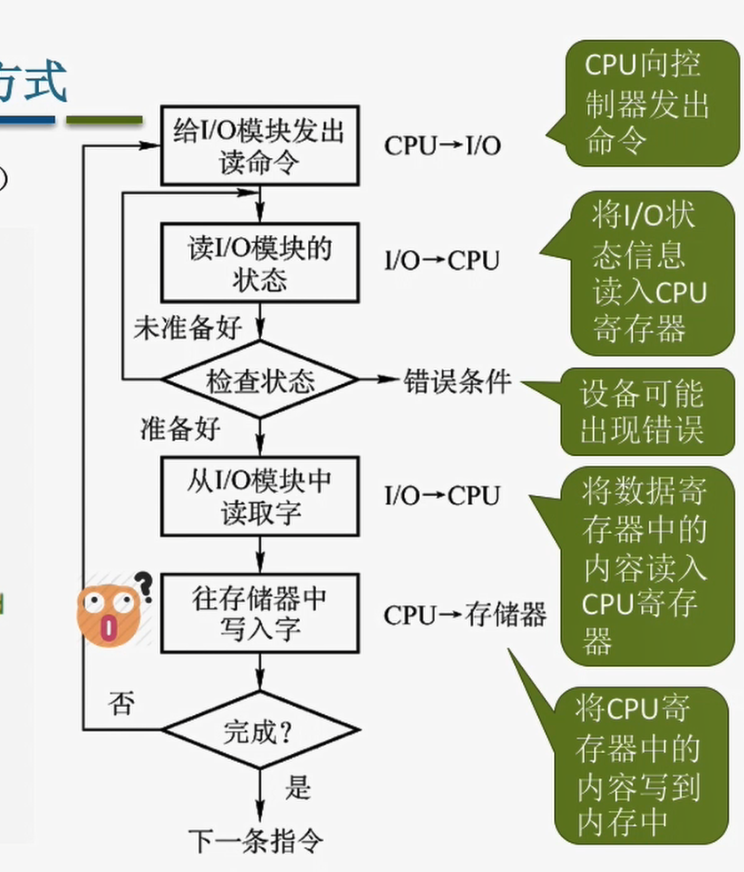  
   2. CPU干预频繁
   3. 数据按字传输  
   4. 数据流向
      1. 读：I/O设备$\rightarrow$CPU(内的寄存器)$\rightarrow$内存
      2. 写：内存$\rightarrow$CPU$\rightarrow$I/O设备
   5. 优缺点
      1. 👍优点：实现简单
      2. 👎缺点：CPU与I/O设备只能串行的工作，CPU需要一直检查，CPU利用率低
2. 中断驱动方式
   1. 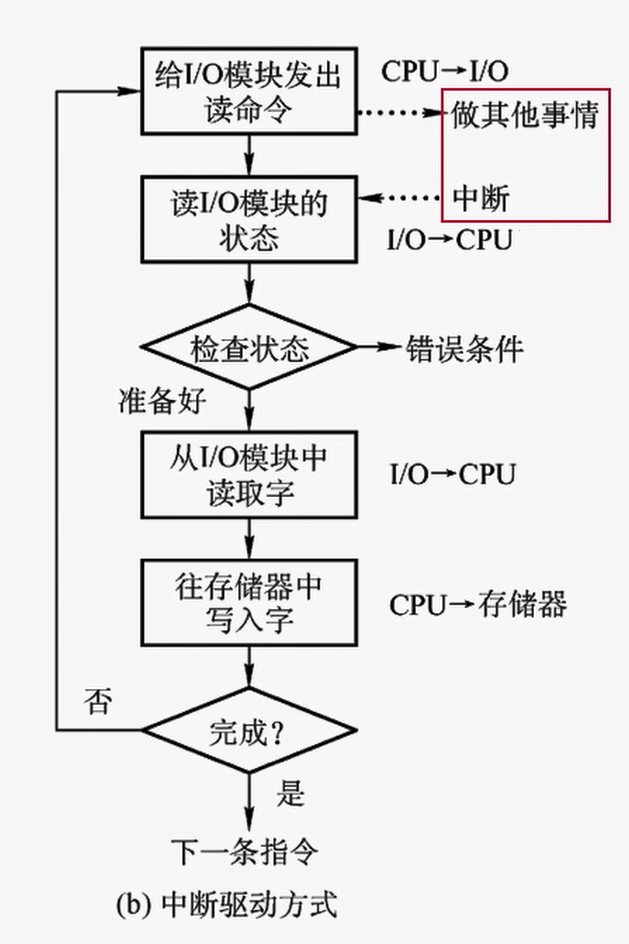
   2. CPU只需要在开始之前和完成之后介入
   3. 按照传输
   4. 数据流向
      1. 读：I/O设备$\rightarrow$CPU(内的寄存器)$\rightarrow$内存
      2. 写：内存$\rightarrow$CPU$\rightarrow$I/O设备
   5. 优缺点
      1. 👍优点：与"程序直接控制方式"相比，CPU利用率明显提高
      2. 👎缺点：CPU与I/O设备只能串行的工作，CPU需要一直检查，CPU利用率低
3. DMA方式
   1. 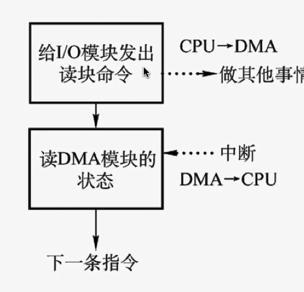
   2. 开始和结束时干预
   3. 数据按块(可以多个连续的块)传输
   4. 数据流向
      1. 读：I/O设备$\rightarrow$内存
      2. 写：内存$\rightarrow$I/O设备
   5. 优缺点
      1. 👍优点：数据以块传输，CPU的介入频率进一步降低，CPU和I/O设备的并行性能得到提升
      2. 👎缺点：只能传输连续的块否则需要多条指令
4. 通道控制方式
   1. 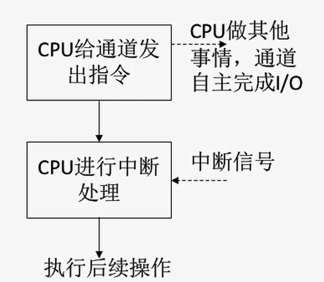
   2. 只有完成一组数据块的读写时CPU才会干预
   3. 每次传输一组数据块
   4. 数据流向(在通道的控制下)
      1. 读：I/O设备$\rightarrow$内存
      2. 写：内存$\rightarrow$I/O设备
   5. 优缺点
      1. 👍优点：CPU、通道、I/O设备可以并行工作，资源利用率极高
      2. 👎缺点：实现复杂

## 5.1.3 I/O 子系统的层次结构
1. 用户层软件
   - 实现了与用户交互的接口。
2. 设备独立性软件(系统调用处理程序)
   - 向上提供了系统调用，并且负责处理系统调用
   - 对设备的保护
   - 差错处理
   - 设备的分配与回收
   - 数据缓冲区管理
   - 建立逻辑设备名到物理设备名的映射关系(使用逻辑设备表LUT)；根据设备类型选择调用相应的驱动程序
3. 设备驱动程序
   - 主要负责对硬件设备的具体控制，将上层发出的一系列命令转换特定设备"能听得懂"的一系列操作。包括设置设备寄存器；检查设备状态等
4. 中断处理程序
   - 进行中断处理
5. 硬件
   - 执行I/O操作

**I/O请求从上至下
I/O应答从下至上**

# 5.2 I/O 核心子系统

## 5.2.1 I/O 调度
用某种算法确定一个好的顺序来处理各个I/O请求。
如：磁盘调度

## 5.2.2 假脱机技术(SPOOLing技术)
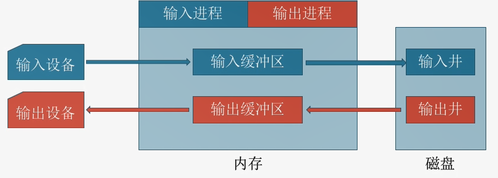
1. 输入井和输出井
   1. 输入井用于收容I/O设备输入的数据
   2. 输出井用于收容用户程序输出的数据
2. 输入缓冲区和输出缓冲区
   1. 暂存数据
3. 输入进程和输出进程
   1. 模拟外围控制机，控制数据

## 5.2.3 设备的分配与回收

1. 设备分配概述
   1. 独占设备
      1. 一个时间段只能分配给一个进程
   2. 共享设备
      1. 可同时分配给多个进程
   3. 虚拟设备
      1. 采用SPOOLing技术将独占设备改造成虚拟的共享设备
2. 设备分配的安全性
   1. 安全分配方式
      1. 为进程分配一个设备后就将进程阻塞，本次I/O完成后才将进程唤醒
      2. 👍优点：不会死锁
      3. 👎缺点：对于一个进程来说CPU和I/O设备只能串行工作
   2. 不安全分配方式
      1. 进程发出I/O请求后，系统为其分配I/O设备，进程可继续执行，之后还可以发出新的I/O请求。只有某个I/O请求得不到满足时才将进程阻塞。
      2. 👍优点：进程的计算任务和I/O任务可以并行处理，使进程迅速推进
      3. 👎缺点：有可能发生死锁
3. 设备分配方式
   1. 静态分配
      1. 进程运行前就给它分配全部资源
   2. 动态分配
      1. 进程运行中动态申请设备资源d
4. 设备分配管理中的数据结构
   1. 设备分配表(DCT)
      1. 系统为每个设备配置一张表
      2. 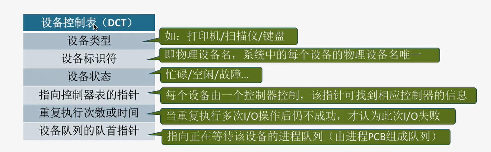
   2. 控制器控制表(COCT)
      1. 每个设备控制器都会对应一张表
      2. 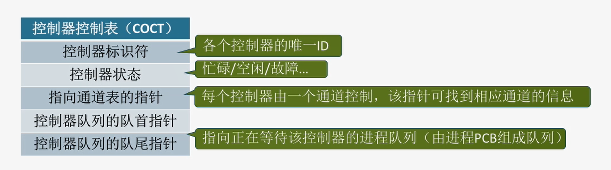
   3. 通道控制表(CHCT)
      1. 每个通道对应一张
      2. 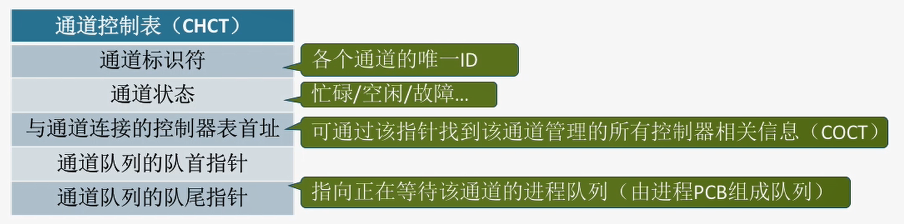
   4. 系统设备表(SDT)
      1. 记录了系统中全部设备的情况，每个设备对应一个表目
      2. 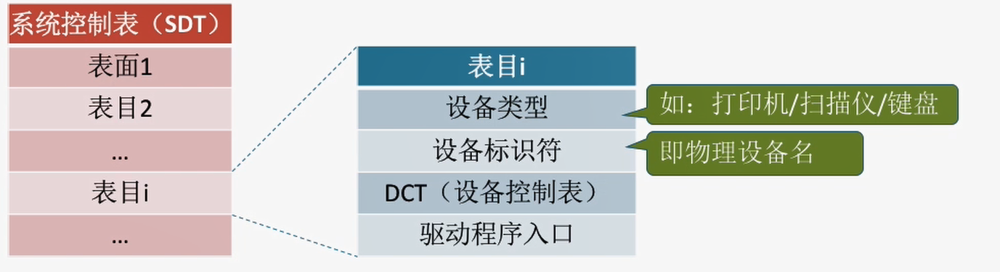
5. 设备分配步骤
   1. 根据进程请求的**逻辑设备名**查找SDT
   2. 根据SDT找到DCT，找到用户进程**指定类型的、并且空闲**的设备，将它分配给该进程。操作系统**在逻辑设备表(LUT)中心增一个表项**
   3. 根据DCT找到COCT，若控制器忙碌则将进程PCB挂到控制器等待队列中，不忙碌则将控制器分配给进程
   4. 根据COCT找到CHCT，若通道忙碌则将进程PCB挂到通道等待队列中，不忙碌则将通道分配给进程
   5. ⚠️只有三者同时都分配成功时，这次设备分配才算成功，之后便可启动I/O设备进行数据传送。
   6. LUT的设置问题
      1. 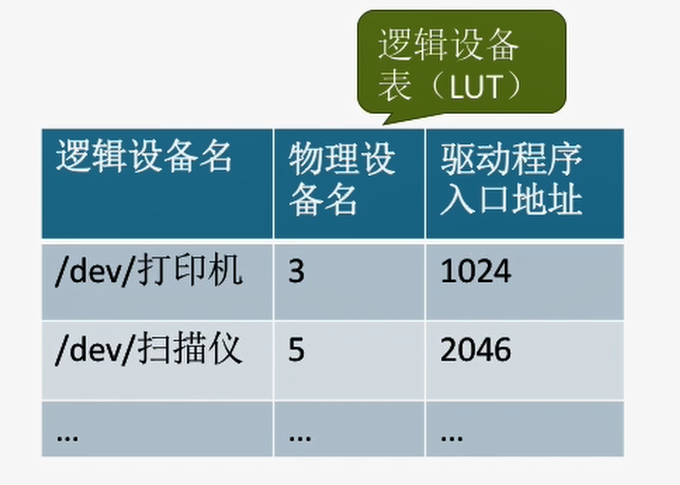
      2. 整个系统一张：各个用户的逻辑设备名不能重复，适合单用户系统
      3. 每个用户一张：不同用户可重复，适合多用户操作系统

## 5.2.4 缓冲区管理
⚠️
1. 单缓冲
   1. 操作系统在主存中为其分配一个缓冲区
2. 双缓冲
   1. 操作系统在主存中为其分配两个缓冲区
3. 循环缓冲区
   1. 将多个**大小相等**的缓冲区连成一个**循环队列**
   2. 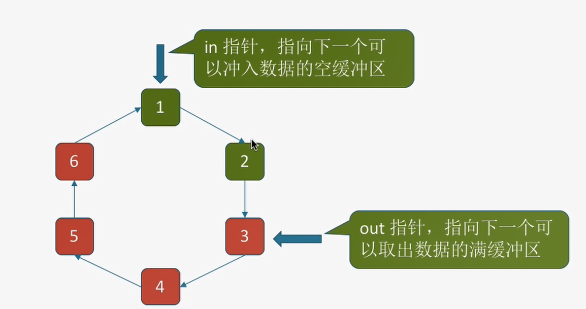
4. 缓冲池
   1. 使用三个队列(空缓冲、输入、输出)
   2. 四种工作区收容输入数据、提取输入数据、收容输出数据、提取输出数据
   3. 