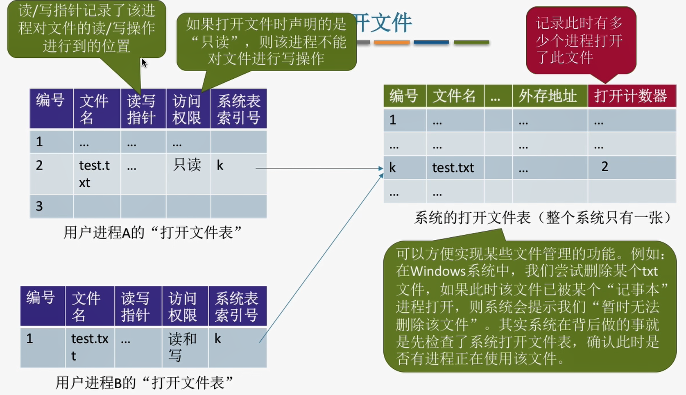
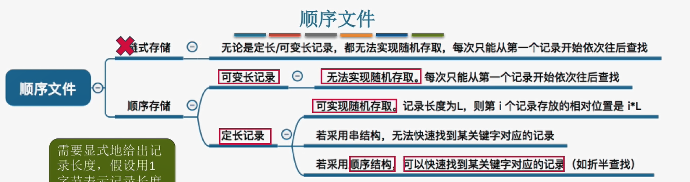
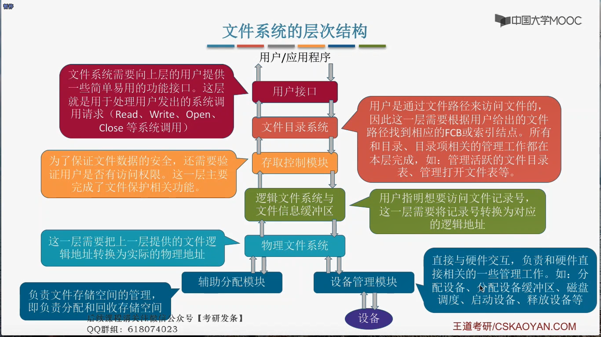
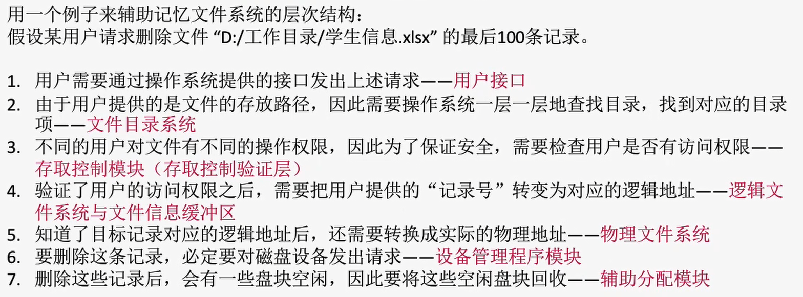

# 4.1 文件系统基础
## 4.1.1 文件的概念
### 1. 文件的属性

1. 名称
2. 标识符
3. 类型
4. 位置
5. 大小
6. 保护
7. 时间、日期、和用户标识

### 2. 文件的基本操作

1. 创建文件(create系统调用)
   - 需要提供的参数
      1. 所需的外存空间大小
      2. 文件存放路径
      3. 文件名
   - 系统处理
      1. 在外存中在到文件所需空间
      2. 在目录中创建该文件对应的目录项
2. 删除文件(delete系统调用)
   - 需要提供的参数
      1. 文件存放路径
      2. 文件名
   - 系统处理
     1. 找到文件名对应的目录项
     2. 回收文件占用的磁盘块
     3. 删除目录项
3. 读文件(read系统调用)
   1. **必须先打开才能读**
   2. 需要提供的参数
      1. 打开文件表中的索引号
      2. 读入多少数据
      3. 读入的数据存放在内存中的什么位置
   3. 系统处理
      1. 
4. 写文件(write系统调用)
   1. 需要提供的参数
      1. 打开文件表中的索引号
      2. 写出多少数据
      3. 写回外存需要存放在哪个位置
5. 打开文件(open系统调用)
   1. 需要提供的参数
      1. 文件存放路径
      2. 文件名
      3. 要对文件的操作类型(如：只读、读写等)
   2. 系统处理
      1. 找到目录项，并检查用户是否拥有权限
      2. 将目录项复制到内存的"打开文件表"中
6. 关闭文件(close系统调用)
   1. 系统处理
      1. 将"打开文件表"中的表项删除
      2. 回收内存空间
      3. 系统打开文件表的打开计算器count减一
7. **打开文件表**
   - 
## 4.1.2 文件的逻辑结构

1. 无结构文件(流式文件)
   - 由一系列二进制或字符流组成
2. 有结构文件(记录式文件又分为定长记录和变成记录)
   1. 顺序文件
      1. 文件中的记录一个接一个地顺序排列(逻辑上)，记录可以是**定长**的或**可变长**的。各个记录在物理上可以**顺序存储**或**链式存储**
      2. 串结构：记录之间的顺序与关键字无关
      3. 顺序结构：记录之间的顺序按关键字排列
      4. 
      5. 
   2. 索引文件
      1. 建立一个索引表(索引号、长度、指针)
      2. 索引表本身是定长记录的顺序文件
      3. 主要用于对信息处理的及时性要求比较高的场合
      4. 👎缺点：索引表会占用而外的存储空间
   3. 索引顺序文件
      1. 将记录分组。每组对应一个索引表项
   4. 直接文件或散列文件    

## 4.1 目录结构

### 1. 文件控制块和索引结点
1. 文件控制块(FCB)
   1. 基本信息：文件名、文件的物理位置...
   2. 存取控制信息：存取权限...
   3. 使用信息：建立、修改信息...
2. 索引结点(FCB的改进)
   1. 把除了文件名以外的数据存到索引结点中，增加一个索引结点指针，降低读盘次数(目录表大小减小)，提高查询速度。

### 2. 目录结构
- 搜索
- 创建文件
- 删除文件
- 显示目录
- 修改目录
1. 单级目录结构
   - 实现了按名存取，但**不允许重名**
2. 两级目录结构
   - 早期多用户系统采用，用户不能对自己的文件进行分类
3. 多级目录结构(树形目录结构)
   - 不便于实现文件的共享
4. 无环图目录结构
   - 可以用不同的文件名指向同一个文件，甚至目录。需要为每个共享结点设置一个共享计数器。
   - ⚠️不同于复制文件，共享文件只要有一个用户修改了文件数据，那么所有用户都可以看到文件数据的变化。

## 4.1.4 文件共享
1. 基于索引结点的共享方式(硬链接)
   1. 只有链接计数变量count为0时才会把数据删除
2. 基于符号链的共享方式(软链接)
   1. 快捷方式

## 4.1.5 文件保护
1. 口令保护
   1. 为文件设置一个"口令"，用户访问此文件是必须提供口令
   2. 口令一般存储在FCB或者索引结点中
   3. 👍优点：保存口令的空间开销不多，验证口令的时间开销也很小
2. 使用某个"密码"对文件进行加密，在访问文件时需要提供正确的"密码"才能对文件进行正确的解密
   1. 👍优点：保密性强，不需要在系统中存储"密码"
   2. 👎缺点：加密/解密需要花费一定时间
3. 访问控制
   1. 在每个文件的FCB中增加一个**访问控制列表**，该表中记录了各个用户可以对该文件执行哪些操作
   2. 👍优点：实现灵活，可以实现复杂的文件保护功能
# 4.2 文件系统实现
## 4.2.1 文件系统层次结构

## 4.2.2 目录实现
## 4.2.3 文件实现——文件分配方式
**访问的两个磁盘块越远，所需(移动磁头)时间越长**
1. 连续分配
   1. 要求每个文件在磁盘上占有一组连续的块
   2. 文件目录中记录存放的起始块号和长度
   3. 👍优点：
      1. 支持顺序、随机访问
      2. 在顺序读/写速度最快
   4. 👎缺点：
      1. 不方便拓展
      2. 空间利用率低
2. 链接分配(题目中没有提及默认为隐式)
   1. 利用指针链接磁盘块
   2. 隐式
      1. 目录中记录起始块号和结束块号
      2. 👍优点：
         1. 拓展文件方便
         2. 外存利用率高
      3. 👎缺点：
         1. 只支持顺序访问，不支持随机访问
         2. 指针也需要耗费存储空间 
   3. 显式
      1. 把链接关系存放在一张文件分配表(FAT)中
      2. 一个磁盘仅设置一张FAT，开机时将其存入内存，且常驻内存。
      3. 👍优点：
         1. 支持顺序、随机访问
         2. 方便文件拓展
      4. 👎缺点：
         1. FAT也会占用内存
3. 索引分配
   1. 允许文件离散的分配在各个磁盘块中，系统会**为每个文件建立一张索引表**，索引表中**记录了文件的各个逻辑块对应的物理块**。索引表存放的磁盘块为索引块，文件数据存放的磁盘块为数据块。
   2. 目录中记录的是索引块号
   3. 👍优点：
      1. 支持顺序、随机访问
      2. 文件拓展方便
   4. 👎缺点：
      1. 索引表要占用一定空间
   5. 索引表太大一个磁盘块存不下
      1. 链接方案
         1. 利用指针将磁盘块链接起来
         2. 读盘次数过多、查找效率低
      2. 多层索引
         1. 采用k层索引结构，且顶层索引表没有被调入内存，需要k+1次读盘
         2. 即使是小文件也需要k+1次读盘
      3. 混合索引
         1. 多级索引的结合
         2. 索引表中有直接索引(直接指向数据)、一级间接索引(单层索引表)二级间接索引

## 4.2.4 文件存储空间管理

**连续的空闲盘块组成一个盘区(单个盘块也算)**

1. 存储空间的划分与初始化
   1. 一个文件卷中被划分成目录区和文件区(通常一个物理盘对应一个文件卷)
2. 空间管理
   1. 空闲表法
      1. 系统建立一张空闲块表，每个**盘区**对应一个空闲表项
      2. 表中记录第一个空闲盘块号和空闲盘块数
   2. 空闲链表法
      1. **操作系统需要保存链头和链尾**
      2. 空闲盘块链
         1. 以盘块为单位组成一条空闲链
         2. 回收时将盘块依次挂到链尾
      3. 空闲盘区链
         1. 以盘区为单位组成一条空闲链
         2. 第一个盘块记录了盘区的长度和下一个盘区的指针
         3. 回收时如果周围没有相邻的空闲盘区则作为单独的盘区挂到链尾
   3. 位示图法
      1. $盘块号=字长*字号+位号$
      2. $字号=\frac{盘块号}{字长}$
      3. 位号=盘块号%字长
   4. 成组链接法
      1. 在文件目录中专门用一个磁盘块作为"超级块"，系统启动时读入内存，且要保证内存与外存的超级快数据一致
      2. 超级块中记录了下一组空闲盘块数和所有空闲盘块号
      3. 超级块的一个的块也会记录下一组空闲盘块数和所有空闲盘块号以-1为结尾
      4. 如果超级块中的空闲块分配完了，将下一组复制到超级块中
      5. 如果回收时的空闲块数，超级块中放不下了，则让新回收的块成为超级快的下一组，并且把超级快中的空闲块尽可能的转移过去

## 4.3 磁盘组织与管理

### 4.3.1 磁盘调度算法

**一次硬盘操作所需时间=寻道时间+延迟时间(转盘圈所需的时间)+传输时间**
1. 先来先服务(FCFS)
   1. 根据进程的请求访问磁盘先后顺序进行调度
   2. 👍优点：公平；如果请求访问的磁盘比较集中，算法性能还是过的去。
   3. 👎缺点：如果有大量进程竞争使用磁盘，请求访问的磁盘很分散，则FCFS在性能上很差，寻道时间长
2. 最短寻址时间最优(SSTF)
   1. 先处理磁道是与当前磁头最近的磁道。(贪心算法的思想)
   2. 👍优点：性能较好，平均寻道时间短
   3. 👎缺点：可能产生"饥饿"
3. 扫描算法(SCAN 解决了SSTF可能会产生饥饿的现象)
   1. 只要磁头移动到最外侧的磁道时才能向内移动，另一边同理。(也称电梯算法)
   2. 👍优点：性能较好，平均寻道时间较短，不会产生"饥饿"
   3. 👎缺点：
      1. 只有到最边上的磁道才能改变移动方向
      2. 对各个位置磁道的响应频率不平均
4. LOOK调度算法
   1. 如果在移动方向上已经没有别的请求了，就可以立即改变磁头移动方向
   2. 👍优点：寻道时间更短了
5. 循环扫描算法(C-SCAN)
   1. 只有朝特定方向时才会处理磁道访问请求，移动到边上时直接回到起始端
   2. 👍优点：比起SCAN，对各个磁道响应频率很平均
   3. 👎缺点：只有到达边上的磁道时才能改变返回，而且只能返回到起点。
6. C-LOOK算法
   1. 返回时，返回到有磁道访问请求的磁道

**减少延迟时间**
1. 交替编号(每次读完数据后磁头有一段时间不能读入数据)
2. 错位命名

### 4.3.2 磁盘管理
1. 磁盘初始化
   1. 进行**低级格式化(物理分区)**，将磁盘的各个磁道划分为扇区，一个扇区通常可分为头、数据区域、尾四个部分组成。管理扇区所需要的各种数据结构一般放在头、尾两个部分，包括扇区校验码。
   2. 将磁盘进行分区,每个分区由若干个相邻的柱面组成(逻辑上的 C盘、D盘)
   3. 进行逻辑格式化，创建文件管理系统
2. 引导块
   1. 开机时计算机先运行"自举装入程序(存储在ROM中，集成在主板上)"，通过执行该程序就可以找到引导块，并将完整的"自举程序"读入内存，完成初始化。
3. 坏块
   1. 标记出来
   2. 坏块链