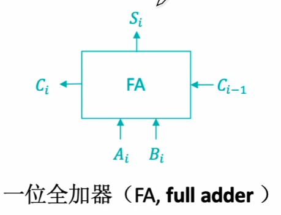
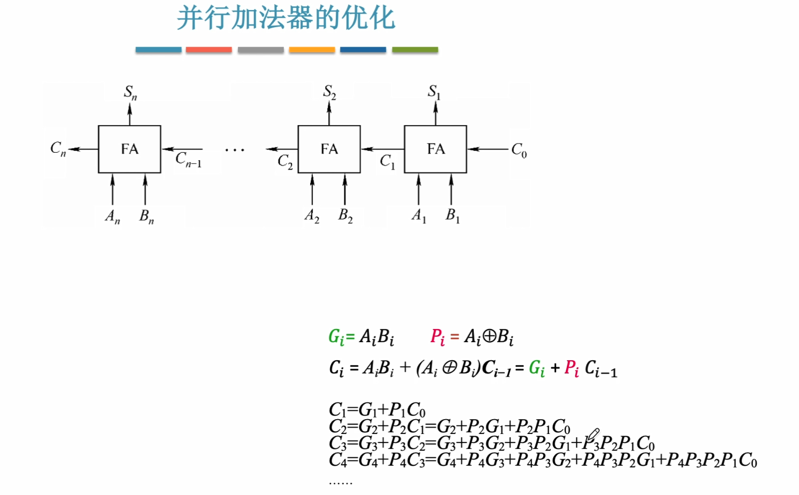

# 2.3 浮点数的表示
## 2.3.1 浮点数的表示
### 1、浮点数的表示格式
**阶码为定点整数，尾数为定点小数**
如：a=0,01;1.001$\rightarrow$阶符,阶码的数值部分;尾数的符号.尾数的数值部分
阶符为阶码的符号位。
a的阶码对应二进制真值：+1
a的尾数对应二进制真值：-0.0111
a的二进制真值=2^1$\times$(-0.0111)=-0.111；
基数越大表示的范围越大，精度越小(数越稀疏)

****
### 2、浮点数的规格化
**规格化主要是为了增加数据的精度**
尾数的最高位必须是一个有效值，否则会丢失精度。

***

### 3、规格化浮点数
**左规：当浮点数运算的结果为非规格化时要进行规格化处理。尾数算术左移一位，阶码减一。**
**右规：当浮点数运算结果尾数出现溢出时，将尾数算术右移一位，阶码加一**

**规格化后**
原码的特征：
正数为：0.1XXXX的形式
负数为：1.1XXXX的形式
补码的特征：
正数为：0.1XXXX的形式
==负数为：1.0XXXX的形式==

当基数为4时，原码的尾数最高2位不全为0
当基数为8时，原码的尾数最高3位不全为0
当基数为4时，负补码的尾数最高2位不全为1

如果尾数是负的补码
如：1.1110100
则将尾数进行算术左移直到第一位为0(1.0100000)。

### 小结

### 4、IEEE 754 标准

**普通的移码**

移码的定义：移码=真值+偏置值

此处8位移码的偏置值=128D=1000 0000B，即$2^{n-1}$

真值 - 127 = -111 1111B
移码 = -111 1111+1000 0000 = 0000 0001

**IEEE 754标准中的移码**

此处8位移码的偏置值=127D=0111 1111B，即$2^{n-1}-1$

真值 - 128 =-1000 0000B
移码 = -1000 0000 +0111 1111 = 1111 1111
当被减数的绝对值比减数绝对值小的时候，可以让被减数加上$2^8$即1 0000 0000然后在正常运算。
实际计算时可以把移码看作无符号数转换成十进制计算。

**IEEE 754 标准**
阶码用补码表示
正常表示范围：- 126~127，- 128(全1) - 127(全0)用来表示不在表示正常范围内的小数。

尾数用原码表示(隐藏表示最高位为1，免去规格化的步骤)，所以表示尾数时前面要加上1。

例子

**特殊情况**
**当阶码为全0，而尾数不全为0时：**，表示非规格化小数$\pm$(0.xx...x)$_2\times2^{-126}$即不在正常表示范围内的小数。
此时隐含的最高位为0，阶码的真值固定视为-126.

如0.001$\times$2$^{-126}$ 数符为0，阶码全0 尾数为 .00100...

**当阶码全为0，尾数全为0时：** 表示真值$\pm$0.

**当阶码全为1，尾数不全为0时：** 表示非数值"NaN"(Not a Number)。
如$\frac{0}{0}、\infty -\infty$等非法运算时结果就是NaN

**当阶码全为1，尾数全为0时：** 表示无穷大$\pm\infty$(如果在计算中发生了溢出，计算机通常会记为$\pm\infty$)。

## 2.3.2 浮点数的加减运算
浮点数加减运算的步骤
**1.对阶：** 小阶向大阶靠齐
1.23 $\times$ 10^3 + 1.23 $\times$ 10^1 $\Rightarrow$ 1.23 $\times$ 10^3 + 0.0123 $\times$ 10^3 
**2.尾数相加：**
1.23-0.0123=1.2177 $\times$ 10^3
**3.规格化:** 视情况而定 比如尾数部分出现0.0xx或者xx.xx
**4.舍入:** 直接砍多余部分(非0入1)或者四舍五入
**5.判断溢出：** 阶码超过两位，发生溢出(尾数溢出未必导致整体溢出，可以通过3 4步拯救)

## 2.3.3强制类型转换
范围、精度从小到大，转换过程没有损失(浮点数看尾数部分+1(隐藏的1))

### 小结

## 2.4算术逻辑单元(ALU)

**最基本的逻辑运算**
与门：

或门：

非门：

**复合逻辑**

与非：

或非：

异或：

### 2.4.1串行加法器和并行加法器
**一位全加器(FA)**
最基本的加法器

本位：当前计算的位

**串行加法器**
优点：器件少、成本低
缺点：运算速度慢
多用于某些低速的专用运算器

**并行加法器**
n个全加器组合，位数位机器字长

### 小结

**串行进位的并行加法器**
高位计算需要等待低位的进位，位数越多延迟时间越长。

**并行进位的并行加法器**
又称先行进位、同时进位，特点是各级进位信号同时形成。
利用递归思想(这里的"+"是或运算)

### 2.4.2算术逻辑单元的功能和结构
