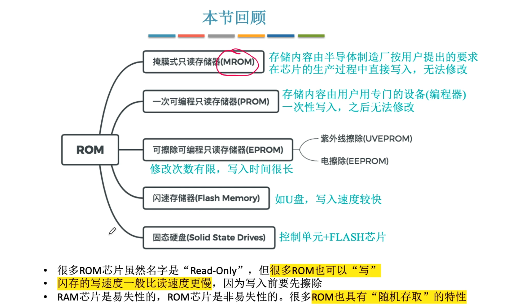
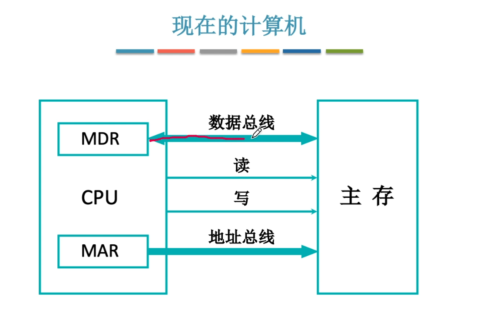
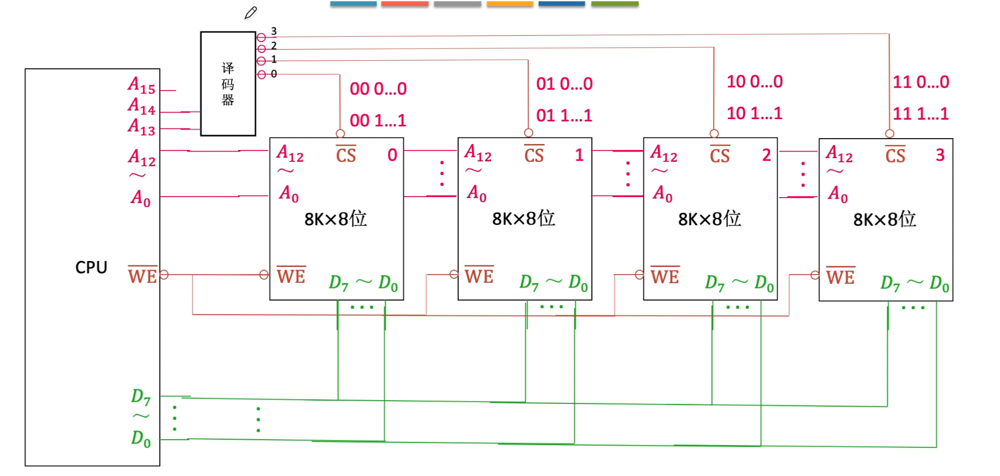
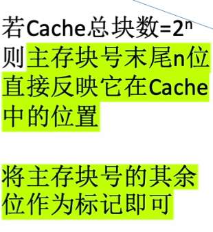

# 3.1存储器概述
## 3.1.1存储器的分类
1. 按在计算机中的作用分类
   1. 主存储器
   2. 辅助存储器
   3. 高速缓存存储器
2. 按在存储介质分类
   1. 磁性
   2. 半导体
   3. 光
3. 按照存取方式分类
    1. 随机存储器：RAM，存取时间与存储单位的物理位置无关。
    2. 只读存储器：ROM，只能读取，存储方式也为随机存储。
    3. 串行访问存储器：包含随机与顺序。
    4. 顺序存储器：读取时间与存储单位的物理位置有关。

4. 按照信息的可保存性分类
    1. 易失性存储器，断电后存储信息消失。
    2. 非易失性存储器，断电后存储信息依然存在。

**破坏性读出**：信息读出后，原信息被破坏。
**非破坏性读出**：信息读出后，原信息不被破坏。
## 3.1.2存储器的性能指标
1. 存储容量：存储字长$\times$字长(如1M$\times$8位)。
2. 单位成本：每位价格=$\frac{总成本}{总容量}$

3. 存储速度：数据传输率=$\frac{数据的宽度(存储字长)}{存储周期}$

**存取时间(Ta)**:从启动一次存储器操作到完成该操作所经历的时间，分为读出时间与写入时间

**存取周期(Tm)**:又称读写周期或访问周期。存储器进行一次完整的读写操作所需的全部时间，即连续两次存储器操作之间所需的最小时间间隔。

**主存带宽(Bm)**:又称数据传输率，表示每秒从主存进出信息的最大数量，单位为 字/秒、字节/秒或位/秒

# 3.2存储器的层次化结构
## 3.2.1多级存储系统

主存-辅存：实现虚拟存储系统，解决了主存容量不够的问题
cache-主存：解决了CPU和主存之间的速度不匹配的问题
# 小结

# 3.3半导体随机存储器
## 3.3.1SRAM和DRAM
### 1.SRAM的工作原理
**使用==双稳态触发器==存储信息**
SRAM的存取速度快，但集成度低，功耗较大。

读出数据，触发器状态保持稳定，是==非破坏性读出==，无需==重写==

### 2.DRAM的工作原理
**写数据：** 给电容充电
**读数据：** 给电容放电
电容放电信息会被破坏，是==破坏性读出==。读出后应有==重写==操作，也称再生

**使用==栅极电容==存储信息**

相对于SRAM来说，DRAM具有容易集成、价位低、容量大和功耗低等优点，但是速度比SRAM的慢。

**刷新周期：** DRAM电容上的电荷一般只能维持1~2ms，因此即使电源不断电，信息也会自动消失。为此每隔一段时间必须刷新，一般位2ms
一次完整的刷新占用一个存储周期。

分两次送是因为使用了地址线复用技术，地址线会因此减半。

## 3.3.2只读存储器
### 1、只读存储器的特点
1）结构简单，位密度比RAM更高
2）非易失性，可靠性高

### 2、ROM的类型
**1）掩模式只读存储器(MROM):** 厂家负责初始化，之后任何人不能更改，可靠性高、灵活性差、生产周期长、只适合批量定制。

**2）一次可编程只读存储器(PROM):** 可用专门的PROM写入器写入信息，写==一次==之后就不能更改。

**3）可擦除可编程只读存储器(EPROM):** 允许用户写入信息，之后用某种方式擦除数据，可以进行==多次重写==
**EPROM又分两种:**
**紫外线擦除UVEPROM**和**电擦除EEPROM**

**4）闪速存储器:** 可以进行多次快速擦除重写，写入比读取速度慢，集成度高、价格便宜。

**5）固态硬盘:** 由控制单元+存储单元(Flash芯片)构成，保留了Flash Memory 长期保存信息、快速擦除与重写的特性，缺点是价格较高。

### 3、计算机内的重要ROM
主板上的BIOS芯片，存储了“自举装入程序”，负责引导装入操作系统(开机) ==逻辑上应该把它看成主存的一部分==。

### 小结

## 3.3.3主存储器的基本组成

控制电路在根据MAR中的电压是否稳定来判断是否将信息传输给译码器，MDR同理。 

n位地址$\Rightarrow$ n根地址线$\Rightarrow 2^n$个存储单元

8(存储单元个数)$\times$8(存储字长)位的存储芯片
 
 **寻址**
 

## 小结
 

# 3.4主存储器与CPU的连接
## 3.4.1连接原理

## 3.4.2主存容量的扩展

### 1、位扩展法
更好的发挥数据总线的传输能力

### 2、字扩展法
可以更好的利用CPU的寻址能力

**线选法**

**译码片选法**

### 3、字位同时扩展法

### 小结

# 3.5双端口RAM和多模块存储器

## 3.5.1S双端口RAM

需要有两组完全独立的数据线、地址线、控制线，需要更复杂的设计。

两个端口对同一主存操作有以下4种情况:

**1.** 两个端口同时对不同的地址单元存取数据。(√)

**2.** 两个端口同时对同一的地址单元读出数据。(√)

**3.** 两个端口同时对同一的地址单元写入数据。(写入错误，被禁止)

**4.** 两个端口同时对同一的地址单元，一个写入，一个读出。(读出错误，被禁止)

**解决办法:** 由判断逻辑决定暂时关闭一个端口(即被延时)。

## 3.5.2多模块存储器

### 1.单体多字存储器

只能读取一整行，不能单独读取其中的某一个字。数据和指令必须是连续存放

### 2.多体并行存储器

每个存储器独立的工作。

**1.高位交叉编址**
 利用高位来区分存储体

 **2.低位交叉编址**
 利用高位来区分存储体
 

 **对比**
 

 **应该取多少个体**

 存取周期为T，存期时间为r，应保证m$\geq \displaystyle\frac{T}{r}$

### 小结

# 3.6速缓冲存储器

## 3.6.1程序访问的局部性原理

**空间局部性:** 在最近的未来要用到的信息(数据、指令)，很有可能与现在正在使用的信息在存储空间上是连续的。
**时间局部性:** 在最近的未来要用到的信息，很有可能是现在正在使用的信息。

基于局部原理，可以把CPU目前访问的地址“周围”的部分数据放到Cache中。

## 3.6.2Cache的基本工作原理

**命中率H:** CPU欲访问的信息已在Cache中的比率

**缺失率M:** 1-H

Cache-主存 系统的**平均访问时间** 
**先访问Cache，若Cache未命中再访问主存**
$t=Ht_c+(1-H)(t_c+t_m)$

**同时访问Cache和主存，若Cache命中则立刻停止访问主存**
$t=Ht_c+(1-H)t_m$

$t_c:$CPU访问Cache耗时
$t_m:$CPU访问主存耗时

## 小结

## 3.6.2Cache和主存的映射方式

### 1、直接映射
每个主存块只能放在对应的位置。
**Cache块号=主存块号%Cache总块数**
优点：查找速度快，对于任意一个地址只需要查找一个标记。
缺点：空间利用率低，命中率低。

### 2、全相联映射

主存块可以放在Cache的任意位置。
优点：空间利用率高，命中率高。
缺点：查找速度慢。

### 3、组相联映射
将Cache分成若干组，每个主存块只能放在对应的组。
**组号=主存块号%分组数**。
折中，综合效果好。

### 小结

### 4、Cache替换算法

**随机算法(RAND)**
实现简单，但完全没有考虑局部性原理，命中率低，实际效果很不稳定。

**先进先出算法(FIFO)**
实现简单，但依旧没有考虑局部性原理，最先被调入Cache的块也可能是被频繁访问的

**近期最少使用(LRU)**
为每一个Cache块设置一个“计算器”，用于记录每一个Cache块已经多久没有被访问了。当Cache块满后替换“计算器”最大的。

基于局部性原理，近期被访问过的主存块，在不久的将来也很有可能被再次访问，LRU算法实际运行效果优秀，Cache命中率高。
若被频繁访问的主存块数量>Cache行，则有可能发生“抖动”

**最近不常使用(LFU)**
为每一个Cache块设置一个“计算器”，用于记录每一个Cache块被访问多少次了。当Cache块满后替换“计算器”最小的。

曾经被经常访问的主存块在未来不一定会用到并没有很好到遵循局部性原理，因此运行效果不如LRU。

### 小结

### Cache写策略

**写命中**
1）全写法
**当CPU对Cache写命中时，把数据同时写入主存和Cache，一般使用写缓冲。**
**写缓冲:** SRAM实现的FIFO队列，CPU把数据同时写入Cache和队列，在CPU空闲时由专门的电路控制下把队列中的数据逐一写回主存。

访问次数增加，速度变慢，但更能保证数据一致性。

使用写缓存的速度很快，若写操作不频繁，则效果很好。若写操作很频繁，可能会因为写缓冲饱和而发生堵塞。

2）写回法
**当CPU对Cache写命中时，只修改Cache的内容，而不立即写入主存，只有当此块被换出时才写入主存。**
因此每个Cache块必须设置一个脏位(是否被修改)。

**写不命中法**
1）写分配法
**当CPU写不命中时，把主存的块调入Cache，在Cache中修改。通常搭配写回法使用。**

2）非写分配法
**当CPU写不命中时只写入内存，不调入Cache，搭配全写法使用**

### 小结

# 3.7虚拟存储器

## 3.7.1 页式存储器

一个程序(进程)在逻辑上被分成若干个大小相等的"==页面=="，=="页面"大小与块的大小相同==。每个页面可以离散地放入不同的主存块中。

**逻辑地址(虚地址):** 程序员视角看到的地址。
**物理地址(实地址):** 实际在主存中的地址。

### 1、页表
**页表储存在主存内**

记录了每个逻辑页面存放在哪个主存块中。

### 2、快表(TLB)
**基于局部性的思想引入的快表。**

快表通常采用全相联或组相联。

## 小结

## 3.7.2页式虚拟存储器

**页表的改进**

## 3.7.3段式虚拟存储器

按照功能模块拆成若干个块

## 3.7.4段页式虚拟存储器
**先分段在分页**