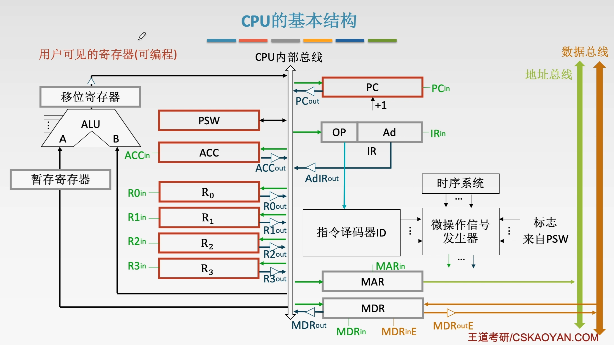
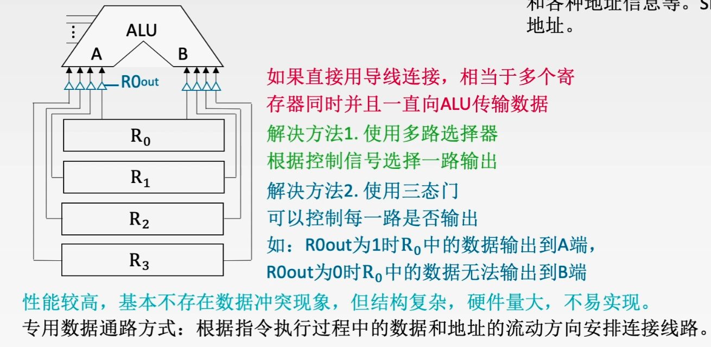
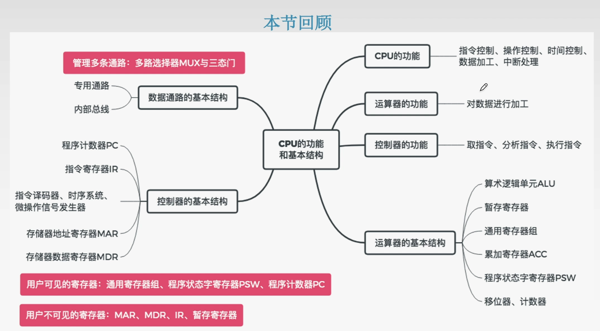

#5.1CPU的功能和基本结构

##5.1.1CPU的功能

###1、指令控制
完成取指令、分析指令和执行指令的操作，即对程序的顺序控制。

###2、操作控制
一条指令的功能往往由若干个操作信号来实现。CPU管理并产生由内存取出的每条指令的操作信号，把各种操作信号送往相应的部件，从而控制这些部件按指令的要求进行动作。

###3、时间控制。对各种操作加以时间上的控制。时间控制要求每条指令按时间顺序提供应有的控制信号。

###4、数据加工
对数据进行算术和逻辑运算。

###5、中断处理
对计算机运算过程中出现的异常情况和特殊请求进行处理。

##5.1.2CPU的基本结构

###1、运算器的基本结构

###2、控制器的基本结构

##小结

##5.2指令执行过程

###5.2.1指令周期
