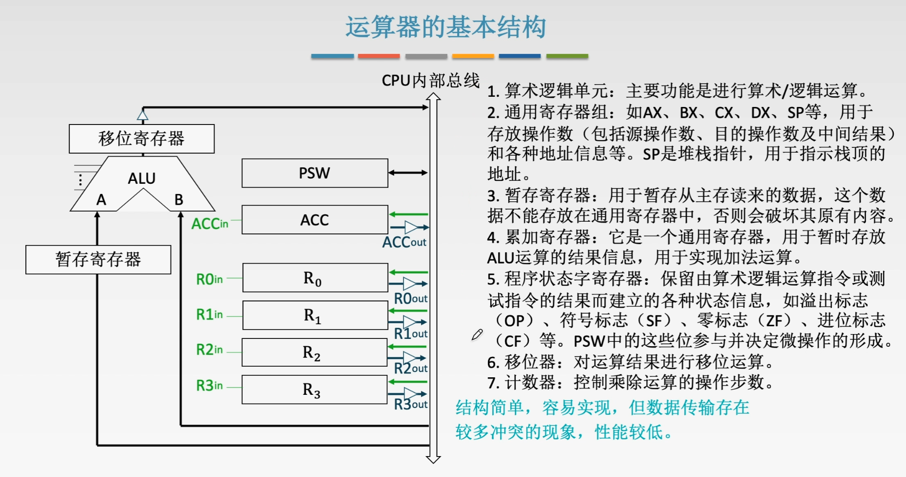
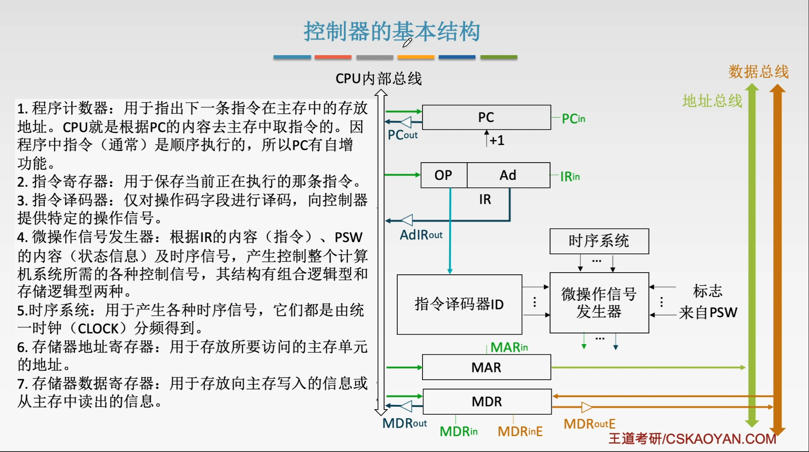
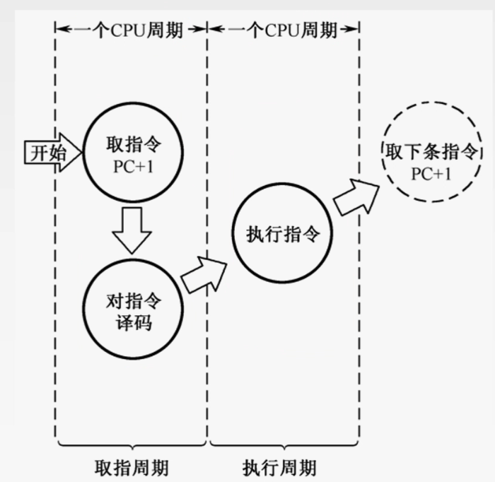
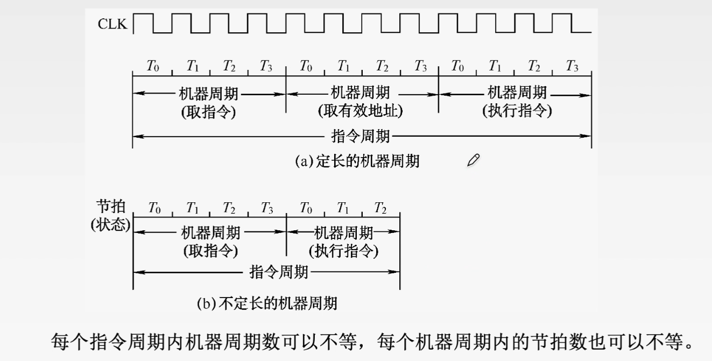
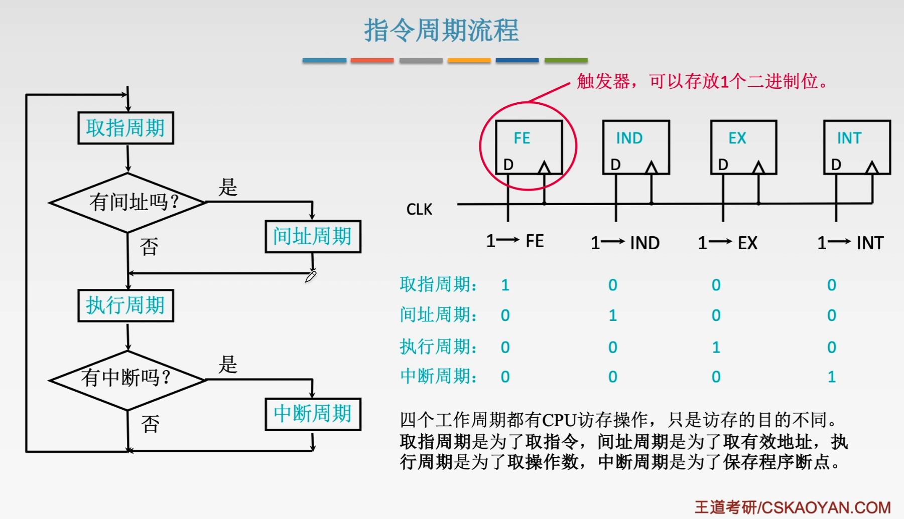
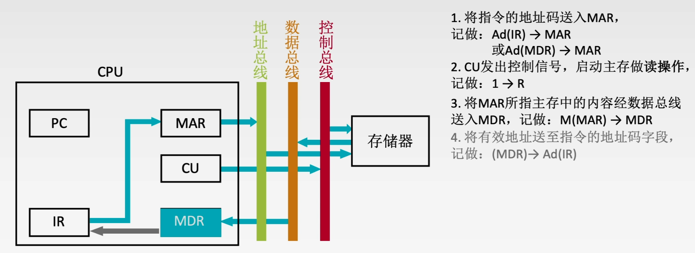

#5.1CPU的功能和基本结构

##5.1.1CPU的功能

###1、指令控制
完成取指令、分析指令和执行指令的操作，即对程序的顺序控制。

###2、操作控制
一条指令的功能往往由若干个操作信号来实现。CPU管理并产生由内存取出的每条指令的操作信号，把各种操作信号送往相应的部件，从而控制这些部件按指令的要求进行动作。

###3、时间控制。对各种操作加以时间上的控制。时间控制要求每条指令按时间顺序提供应有的控制信号。

###4、数据加工
对数据进行算术和逻辑运算。

###5、中断处理
对计算机运算过程中出现的异常情况和特殊请求进行处理。

##5.1.2CPU的基本结构

###1、运算器的基本结构

###2、控制器的基本结构

##小结

#5.2指令执行过程

##5.2.1指令周期

**指令周期：** CPU从主存中每取出并执行一条指令所需要的全部时间。
**指令周期：** 通常由若干个**机器周期**来表示，机器周期又叫**CPU周期**。
**机器周期：** 包含若干个时钟周期(也称节拍、T周期、CPU时钟周期，CPU操作最基本的单位)。

##5.2.2指令周期的数据流

###1、取指周期

###2、间址周期

###3、执行周期
没有统一的数据流向。

###4、中断周期

##5.2.3指令执行方案

###1、单指令周期
**对所有指令都选用相同的执行时间来完成**。
$\qquad$指令之间串行执行，指令周期取决于执行时间最长的执行时间。
$\qquad$对于那些本身可以在更短时间内完成的指令，要使用这个较长的周期来完成，会降低整个系统的运行速度。

###2、多指令周期
**允许不同类型的指令选用不同的执行步骤来完成**。
$\qquad$指令之间串行执行，可选用不同个数的时钟周期来完成不同的指令的执行过程。$\rightarrow$需要设计更复杂的电路。

###3、流水线方案
在每一个时钟周期启动一条指令，尽量让多条指令同时运行，但各自处在不同的执行步骤中。
指令之间并行执行。

##小结
