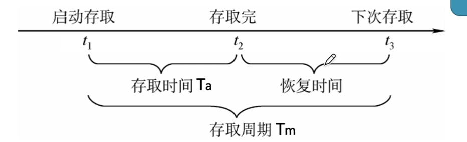
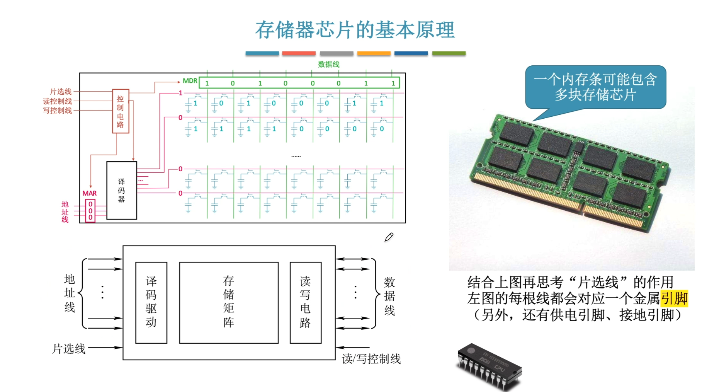
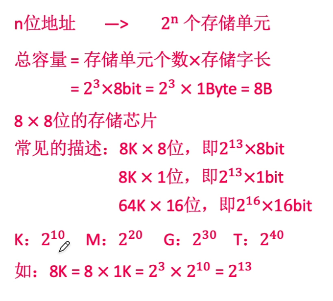
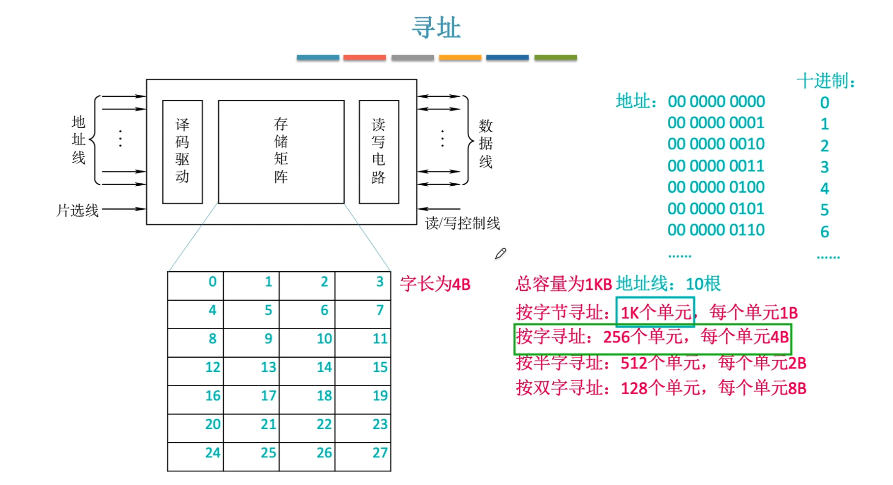

#3.1存储器概述
##存储器的分类
**1.按在计算机中的作用分类**
1）主存储器
2）辅助存储器
3）高速缓存存储器
**2.按在存储介质分类**
1）磁性
2）半导体
3）光
**3.按照存取方式分类**
1）随机存储器：RAM，存取时间与存储单位的物理位置无关。
2）只读存储器：ROM，只能读取，存储方式也为随机存储。
3）串行访问存储器：包含随机与顺序。
4）顺序存储器：读取时间与存储单位的物理位置有关。

**4.按照信息的可保存性分类**
1）易失性存储器，断电后存储信息消失。
2）非易失性存储器，断电后存储信息依然存在。

1）破坏性读出：信息读出后，原信息被破坏。
1）非破坏性读出：信息读出后，原信息不被破坏。
##3.1.2存储器的性能指标
1）存储容量：存储字长$\times$字长(如1M$\times$8位)。
2）单位成本：每位价格=$\displaystyle\frac{总成本}{总容量}$

3）存储速度：数据传输率=$\displaystyle\frac{数据的宽度(存储字长)}{存储周期}$

**存取时间(Ta)**:从启动一次存储器操作到完成该操作所经历的时间，分为读出时间与写入时间

**存取周期(Tm)**:又称读写周期或访问周期。存储器进行一次完整的读写操作所需的全部时间，即连续两次存储器操作之间所需的最小时间间隔。

**主存带宽(Bm)**:又称数据传输率，表示每秒从主存进出信息的最大数量，单位为 字/秒、字节/秒或位/秒

#3.2存储器的层次化结构
##3.2.1多级存储系统

主存-辅存：实现虚拟存储系统，解决了主存容量不够的问题
cache-主存：解决了CPU和主存之间的速度不匹配的问题
#小结

#3.3半导体随机存储器
##3.3.1SRAM和DRAM
###1.SRAM的工作原理
**使用==双稳态触发器==存储信息**
SRAM的存取速度快，但集成度低，功耗较大。

读出数据，触发器状态保持稳定，是==非破坏性读出==，无需==重写==

###2.DRAM的工作原理
**写数据：** 给电容充电
**读数据：** 给电容放电
电容放电信息会被破坏，是==破坏性读出==。读出后应有==重写==操作，也称再生

**使用==栅极电容==存储信息**

相对于SRAM来说，DRAM具有容易集成、价位低、容量大和功耗低等优点，但是速度比SRAM的慢。

**刷新周期：** DRAM电容上的电荷一般只能维持1~2ms，因此即使电源不断电，信息也会自动消失。为此每隔一段时间必须刷新，一般位2ms

##3.3.3主存储器的基本组成

控制电路在根据MAR中的电压是否稳定来判断是否将信息传输给译码器，MDR同理。 

n位地址$\Rightarrow$ n根地址线$\Rightarrow 2^n$个存储单元
使用地址服用技术时，地址线减半。

8(存储单元个数)$\times$8(存储字长)位的存储芯片
 
 **寻址**
 

##小结
 