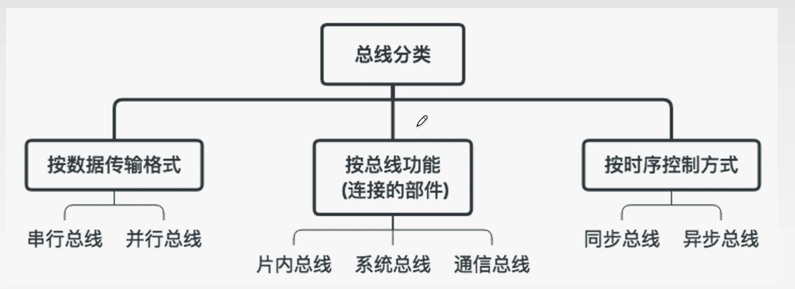
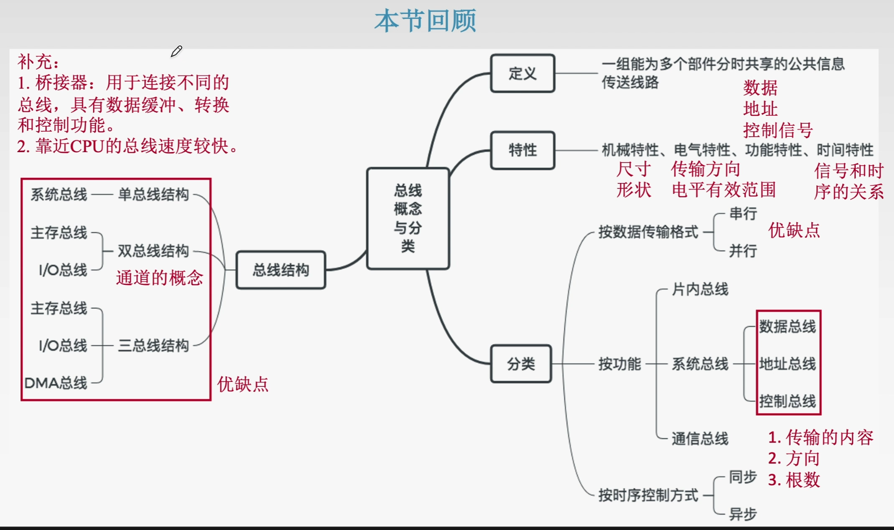
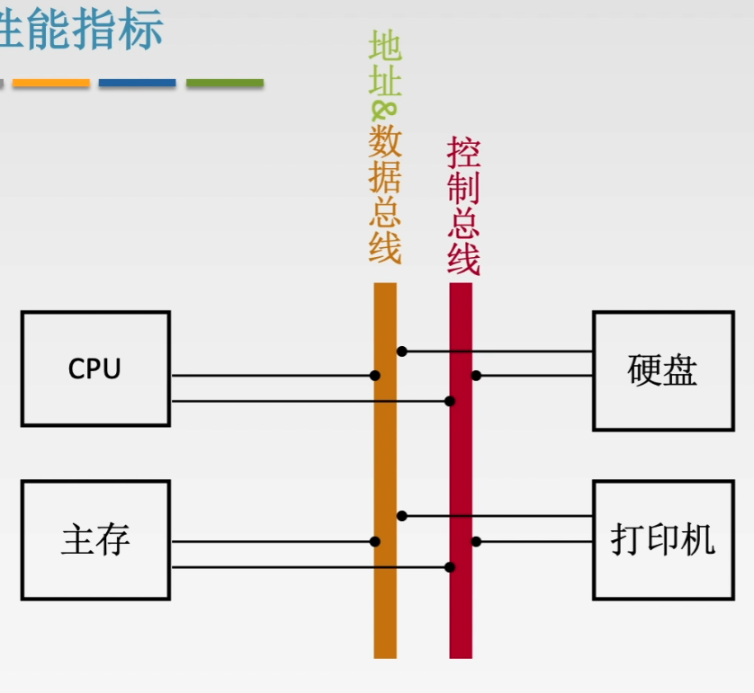

#6.1总线的概述

##6.1.1总线的基本概念
##1、总线的定义
总线是一组能为多个部件$\color{red}{分时}\color{blue}{共享}$的公共传送线路

**共享** 是指总线上可挂接多个部件，各个部件之间互相交换的信息都可以通过这组线路分时共享

**分时** 是指同一时刻指允许有一个部件向总线发送信息，如果系统中有多个部件，则它们只能分时地向总线发送信息。

###2、总线的特性

**机械特性:** 尺寸、形状、管脚数、排列顺序

**电气特性:** 传输方向和有效电平范围

**功能特性:** 每根传输线的功能(地址、数据、控制)

**时间特性:** 信号的时序关系

###3、总线的分类

**串行总线：** 每次只能传1位
👍优点：只需要一条传输线，成本低廉，广泛用于长距离传输；应用计算机内部时可以节省布线空间。
👎缺点：在数据发送和接收的时候要进行拆卸和装配，要考虑串行-并行转换问题。

**并行总线：** 每次可以传多位
👍优点：总线的逻辑时序比较简单，电路实现起来比较简单，
👎缺点：信号线数量多，占用更多的布线空间，远距离传输成本高。$\color{gray}{(由于工作频率较高时，并行的信号线之间会产生严重干扰，对每条线等长的要求也越高，所以无法持续提升工作频率,)}$

**片内总线：** 芯片内部的总线

**系统总线：** 连接计算机系统内各功能部件
按系统总线传输信息内容不同，可分3类:$\color{blue}{数据总线}$、$\color{red}{地址总线}$和$\color{green}{控制总线}$。

$\color{blue}{数据总线}$(DB):传输个功能部件之间的数据信息。包括指令和操作数，位数 ==(根数)== 与机器字长 ==(如果与机器字长一致，则CPU可以通过一次的读取取得CPU可处理的数据上限)== 、存储字长有关 ==(如果与存储字长一致，则每一次的主存读/写操作只需要用数据总线传输一次)== 。**双向**

$\color{red}{\text{地址总线}}$(AB):传输地址信息。包括主存单元或I/O端口的地址。位数与主存地址空间大小以及设备数量有关。**单向**

$\color{green}{控制总线}$(CB):传输控制信息。一根控制线传输一个信号。
📤有出:CPU送出的控制信号。
📥有入:主存(或外设)返回CPU的反馈信号。

**通信总线**：用于计算机系统之间或计算机系统与其他系统之间信息传送的总线，通信总线也称外部总线。

##6.1.3系统总线结构 (🐑能对付选择题就行)
###1、单总线结构

**结构：** CPU、主存、I/O设备都连接在一条总线上，允许I/O设备之间、I/O设备和CPU或I/O设备与主存之间直接交互信息。
**👍优点：** 结构简单，成本低，易于接入新的设备。
**👎缺点：** 带宽低、负载重，多个部件只能争用唯一的总线，且不支持并行操作。
**🚩注：** 单总线并不是指只有一根信号线，系统总线按传送信息的不同可以细分为地址总线和数据总线、控制总线。

###2、双总线结构

**结构：** 双总线结构有两条总线，一条是**主存总线**，用于CPU、主存和通道之间进行数据传送；另一条是**I/O总线**，用于多个外部设备于通道之间的数据传送。
**👍优点：** 将较低速的I/O设备从单总线上分离出来，实现存储器总线和I/O总线分离。
**👎缺点：** 需要增加通道等硬件。。
**🚩$\color{blue}{注:}$** 通道是具有特殊功能的处理器，能对I/O设备进行统一管理。通道程序放在主存之中。
**🚩$\color{red}{注:}$** 主存总线支持突发(猝发)传送：送出一个地址后收到多个地址连续的信息。

###3、三总线结构

**结构：** 三总线结构是在计算机系统各部件之间采用各自独立的总线来构成信息通路，这三条总线分别为**主存总线**、**I/O总线**和**直接内存访问DMA总线**。
**👍优点：** 提高了I/O设备的性能，使其更快地响应命令，提高系统的吞吐量。
**👎缺点：** 系统工作效率低。

##小结

##6.1.4总线的性能指标
**1、总线的传输周期(总线周期)**
一次总线操作所需的时间(包括申请阶段、寻址阶段、传输阶段和结束阶段)，
🚩注:通常一个总线周期包含若多个总线时钟周期。
$\qquad$有时，一个总线周期就是一个总线时钟周期。
$\qquad$有时，多个总线周期构成一个总线时钟周期。

**2、总线时钟周期**
即机器的时钟周期。计算机有一个统一的时钟，以控制整个计算机的各个部件，总线也要受此时钟的控制。

**3、总线的工作频率**
总线上的各种操作的频率，为**总线周期的倒数**。
若总线周期=N个时钟周期，则总线的工作频率=时钟频率/N。
实际上指**一秒内传送几次数据**。

**4、总线的时钟频率**
即机器的时钟频率，为**时钟周期的倒数**。
实际上指**一秒内有多少个时钟周期**。

**5、总线的宽度**
又称**总线位宽**，它是总线上**同时能够传输的数据位数**，通常是指数据**总线的根数**，如32根称为32位总线。

**6、总线带宽**
可理解为**总线的数据传输**，即**单位时间内总线上可传输数据的位数**，通常用每秒钟传送信息的字节数来衡量，单位可用字节/秒(B/s)表示。
$\color{red}{🚩注:总线带宽是指总线本身所能达到的最高速率。在计算实际的有效数据传送率时，要用实际的数据量除以耗时}$

总线带宽=总线工作频率$\times$总线宽度(bit/s)=总线工作频率$\times\frac{总线宽度}{8}$（B/s）=$\displaystyle \frac{总线宽度}{总线周期}$(bit/s)

**7、总线复用**

一总信号线在不同的时间传输不同的信息。可以使用较少的线传输更多的信息，从而节省了空间和成本。

**8、信号线数**
地址总线、数据总线和控制总线3种总线数合称信号线数。

#6.3总线的操作和定时

**总线定时是指总线在双方交换数据的过程中需要时间上配合关系的控制，这种控制称为总线定时，它的实质是一种协议或者规则。**

##6.3.1总线传输的4个阶段
###1、申请分配阶段
由需要使用总线的主模块提出申请，经总线仲裁机构决定下一传输周期的总线使用权授予某一申请者。也可以细分为**传输申请**和**总线仲裁**两个阶段
###2、寻址阶段
获得使用权的主模块通过总线**发出**本次要访问的从模块的**地址**及有关**命令**，启动参与本次传输的从模块
###3、传输阶段
主模块和从模块进行**数据交换**，可单向或双向。
###4、结束阶段
主模块的有关信息均从系统总线上**撤除**，让出总线使用权。

##6.3.2同步定时方式

总线控制器采用一个**统一的时钟信号**来协调发送和接收双方的传送定时关系。

若干个时钟产生相等的时间间隔，每一个间隔构成一个总线周期。

在一个总线周期中，发送方和接收方可进行一次数据传送。

因为采用统一的时钟周期，每个部件或设备发送或接收信息都在固定的总线传送周期中，一个总线的传送周期结束，下一个总线传送周期开始。

👍优点：传送速度快，具有较高的传输速率，总线控制逻辑简单。
👎缺点：主从设备属于强制性同步；不能及时进行数据通信的有效性校验，可靠性较差。

**适用于总线长度较短以及总线所接部件的存取时间比较接近的系统**

##6.3.3异步定时方式
$\qquad$没有统一的时钟，也没有固定的时间间隔，完全依靠传送双方相互制约的"握手"信号来实现定时控制。
$\qquad$主设备提出交换信息的"请求"信号，经接口传送到从设备从设备接到主设备的请求后，通过接口向主设备发出"回答"信号。

👍优点：总线周期长度可变，能保证两个工作速度相差很大的部件或设备之间可靠地进行信息交换，自动适应时间的配合。

👎缺点：比同步控制方式更加复杂，速度更慢。

#6.4总线的标准
**系统总线：** 通常直接与CPU相连
**局部总线：** 通常与北桥、显卡、网卡相连
**设备总线：** 通常与I/O设备相连

