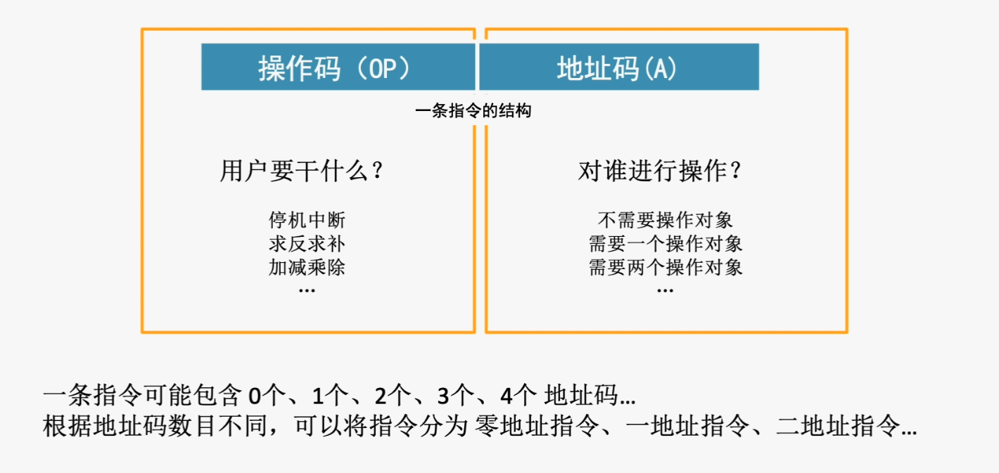
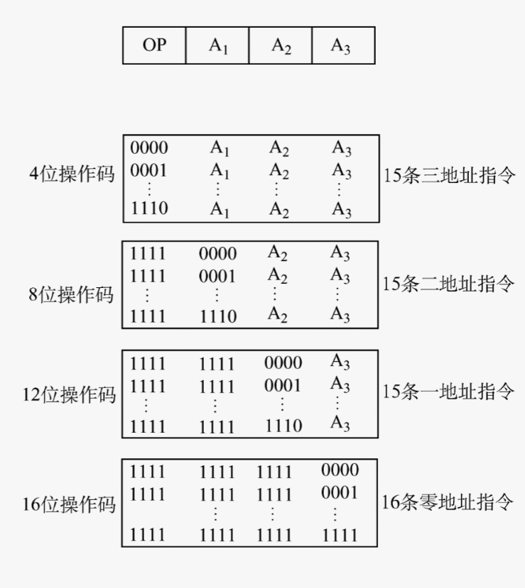
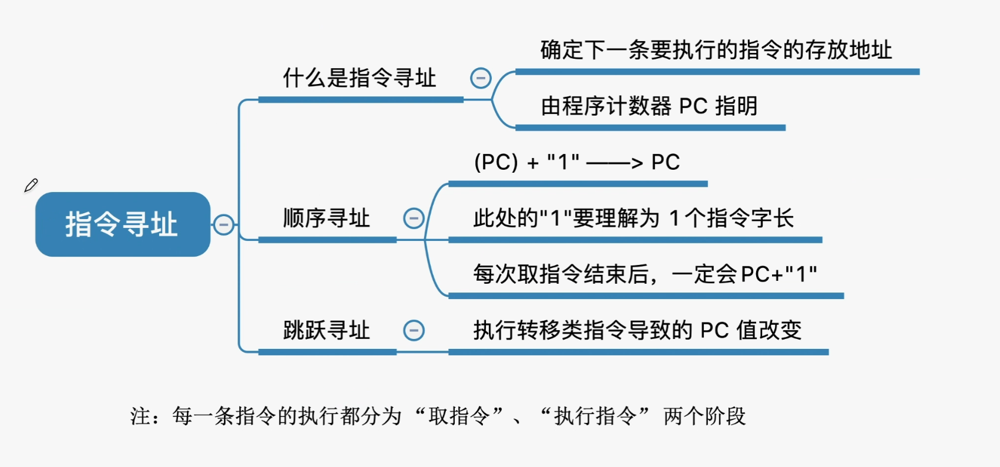
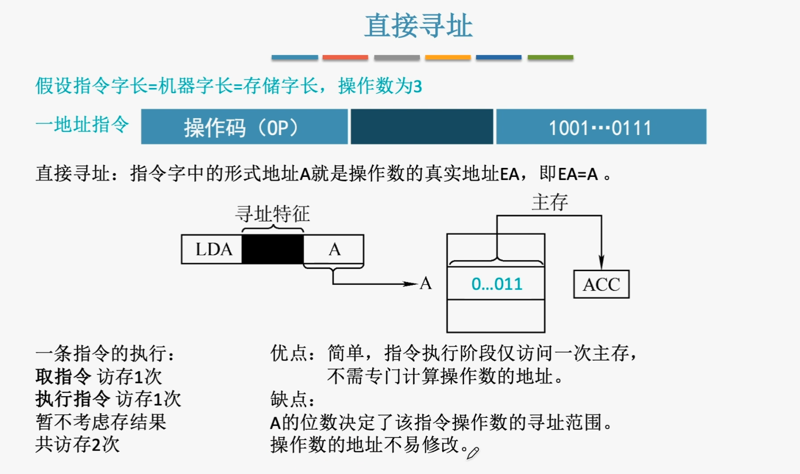
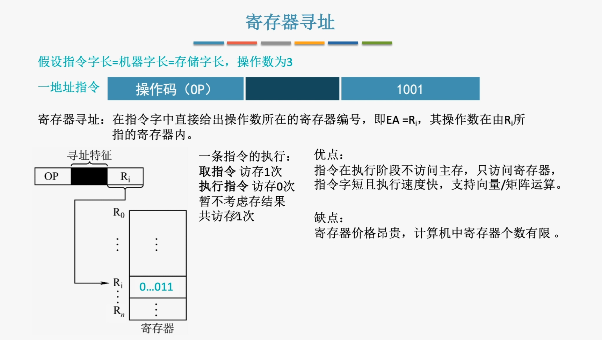
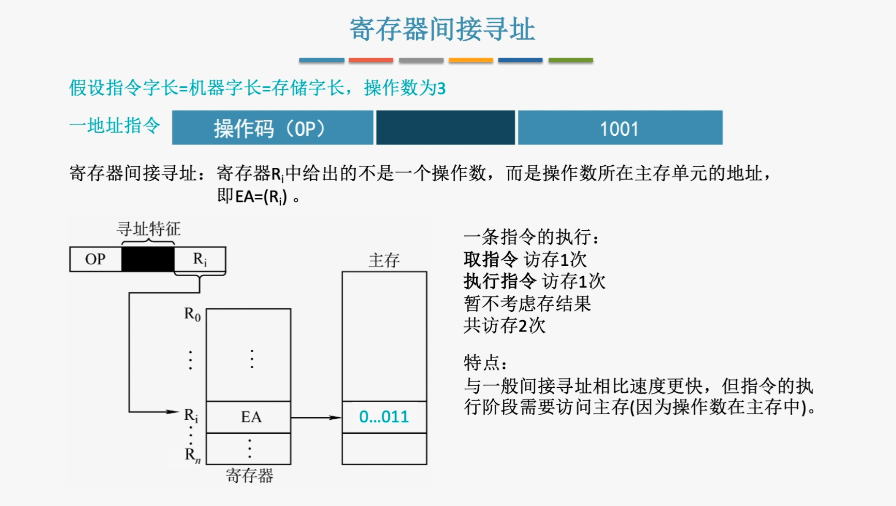
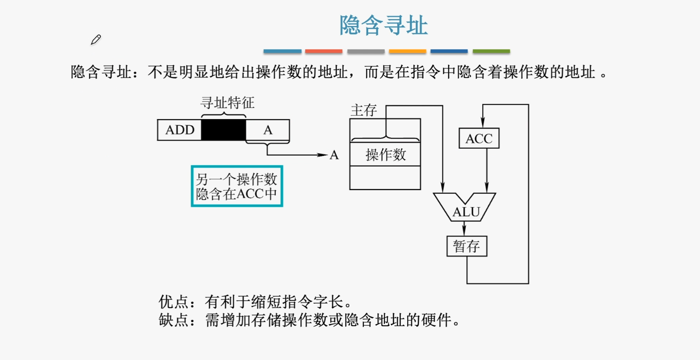
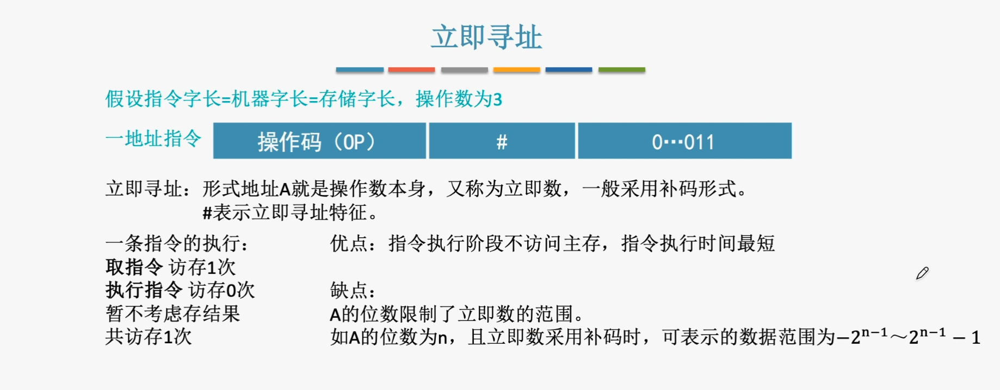
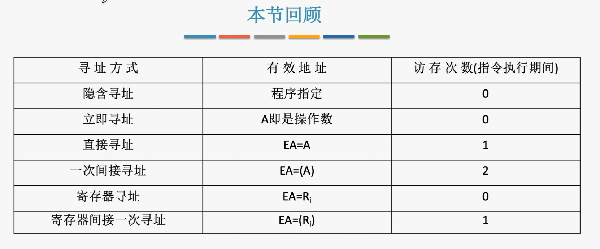

#4.1指令格式
##4.1.1指令的基本格式

**指令字长：**一条指令的总长度(可能会改变)。
**机器字长：**CPU一次整数运算所能处理的二进制数据位数(通常与ALU直接相关)
**储存字长：**一个存储单元中的二进制代码位数。

半字长指令、单字长指令、双字长指令$\qquad$————指令长度是机器字长的多少倍

指令长度会影响取指令的所需时间。

###1、零地址指令
**1)不需要操作数，如空操作、停机等。**
**2)堆栈计算机中的零地址运算，通常将两个操作数隐含地从栈顶和次栈顶弹出，运算结果压回栈顶。**
###2、一地址指令

**1)只需要单操作数，如加1、减1等。**

如$OP(A1)\rightarrow A1$
完成一条指令需要3次访存：取值$\rightarrow$读$A_1\rightarrow$写$A_1$

**1)需要两个操作数，但其中一个操作数隐含在某个寄存器内**
如$(ACC)OP(A_1)\rightarrow ACC$
完成一条指令需要2次访存：取值$\rightarrow$读$A_1$.

###3、二地址指令

**常用于需要两个操作数的算术运算、逻辑运算相关指令**
$(A_1)OP(A_2)\rightarrow A_1$

完成一条指令需要4次访存：取值$\rightarrow$读$A_1\rightarrow $读$A_2\rightarrow$写$A_1$

###4、三地址指令

**常用于需要三个操作数的算术运算、逻辑运算相关指令**
$(A_1)OP(A_2)\rightarrow A_3$

完成一条指令需要4次访存：取值$\rightarrow$读$A_1\rightarrow $读$A_2\rightarrow$写$A_3$

###4、三地址指令

$(A_1)OP(A_2)\rightarrow A_3 ，A_4=$下一条要执行指令的地址

完成一条指令需要4次访存：取值$\rightarrow$读$A_1\rightarrow $读$A_2\rightarrow$写$A_3$

##小结

##4.1.2扩展操作码

在设计扩展操作码指令格式时，必须注意以下两点:

1)==不允许短码是长码的前缀==，短码操作码不能与长操作码的前面部分代码相同。
2)各指令的操作码一定不能重复。

#4.2指令的寻址方式

##4.2.1指令寻址和数据寻址

###1、指令寻址
**寻址下一条要执行的指令地址称为指令寻址。**
1)顺序寻址可通过PC加1(一个指令字长)，自动形成下一个指令的地址。
1)跳跃寻址通过转移类指令实现，强行修改PC的值。

###2、指令寻址
**确定本条指令的地址码指明的真实地址**

##4.2.2常见的数据寻址方式

###1、直接寻址

###2、间接寻址

###3、寄存器寻址

###4、寄存器间接寻址

###5、隐含寻址

###6、立即寻址

###小结
