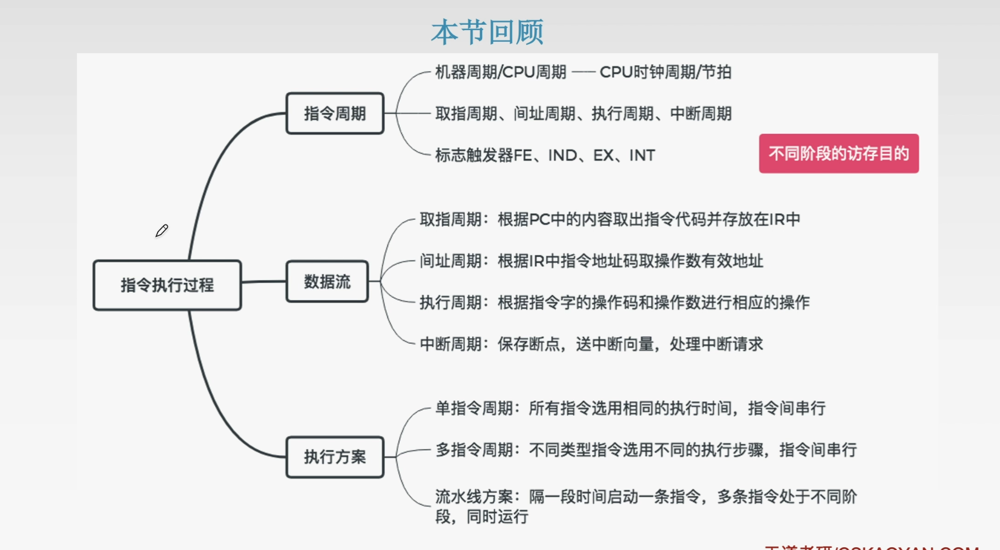

# 5.1CPU的功能和基本结构

## 5.1.1CPU的功能

### 1、指令控制
完成取指令、分析指令和执行指令的操作，即对程序的顺序控制。

### 2、操作控制
一条指令的功能往往由若干个操作信号来实现。CPU管理并产生由内存取出的每条指令的操作信号，把各种操作信号送往相应的部件，从而控制这些部件按指令的要求进行动作。

### 3、时间控制。对各种操作加以时间上的控制。时间控制要求每条指令按时间顺序提供应有的控制信号。

### 4、数据加工
对数据进行算术和逻辑运算。

### 5、中断处理
对计算机运算过程中出现的异常情况和特殊请求进行处理。

## 5.1.2CPU的基本结构

### 1、运算器的基本结构

### 2、控制器的基本结构

## 小结

# 5.2指令执行过程

## 5.2.1指令周期

**指令周期：** CPU从主存中每取出并执行一条指令所需要的全部时间。
**指令周期：** 通常由若干个**机器周期**来表示，机器周期又叫**CPU周期**。
**机器周期：** 包含若干个时钟周期(也称节拍、T周期、CPU时钟周期，CPU操作最基本的单位)。

## 5.2.2指令周期的数据流

### 1、取指周期

### 2、间址周期

### 3、执行周期
没有统一的数据流向。

### 4、中断周期

## 5.2.3指令执行方案

### 1、单指令周期
**对所有指令都选用相同的执行时间来完成**。
$\qquad$指令之间串行执行，指令周期取决于执行时间最长的执行时间。
$\qquad$对于那些本身可以在更短时间内完成的指令，要使用这个较长的周期来完成，会降低整个系统的运行速度。

### 2、多指令周期
**允许不同类型的指令选用不同的执行步骤来完成**。
$\qquad$指令之间串行执行，可选用不同个数的时钟周期来完成不同的指令的执行过程。$\rightarrow$需要设计更复杂的电路。

### 3、流水线方案
在每一个时钟周期启动一条指令，尽量让多条指令同时运行，但各自处在不同的执行步骤中。
指令之间并行执行。

## 小结

# 5.3数据通路的功能和基本结构

## 5.3.1数据通路的基本结构

**CPU内部单总线方式**
结构简单，但是数据传输存在较多的冲突现象，性能低。

**CPU内部三总线方式**
有多个公共通路，提高效率。

**专用数据通路方式**
硬件之间有专用的数据通路，性能较高，但硬件量大。

**内部总线：**是指同一部件，如CPU内部连接寄存器以及运算器之间的总线。

**系统总线：**是一台计算机系统的各部件互相连接的总线。

### 1、寄存器之间的数据传送
**重要的是描述清楚数据流向**
比如把PC内容送至MAR，实现传送操作的流程及控制信号为：
(PC)$\rightarrow$Bus$\qquad$ PCout有效,PC内容送总线。
Bus$\rightarrow$MAR$\rightarrow$MARin有效,总线内容送MAR。

### 2、主存与CPU之间的数据传送
比如CPU从主存读取指令，实现传送操作的流程及控制信号为：
(PC)$\rightarrow$Bus$\rightarrow$MAR$\qquad$PCout和MARin有效，现行指令地址$\rightarrow$MAR
1$\rightarrow$MAR$\qquad$CU发出读命令(通过控制总线发出，图中未画出)
MEM(MAR)$\rightarrow$MDR$\qquad$MDRinE有效(从外部总线流入)

### 3、执行算术或逻辑运算
比如一条加法指令，微操作序列及控制信号为：
Ad(IR)$\rightarrow$Bus$\rightarrow$MAR$\qquad$MDRout和MARin有效
1$\rightarrow$R$\qquad$CU发出读命令
MEM(MAR)$\rightarrow$数据线$\rightarrow$MDR$\qquad$MDRinE有效
MDR$\rightarrow$Bus$\rightarrow$Y$\qquad$MDRout和Yin有效，操作数$\rightarrow$Y
(ACC)+(Y)$\rightarrow$Z$\qquad$ACCout和ALUin有效，CU向ALU发送加命令
Z$\rightarrow$ACC$\qquad$Zout和ACCin有效，计算结果$\rightarrow$ACC

# 5.4控制器的功能和工作原理
CU会在每一个时钟周期(节拍)发出一个**微命令**(也可以发出多个不冲突的)。
每发出一个**微命令**(PC$_{out}$有效也就是控制信号) 就会完成一个与之对应的**微操作**((PC)$\rightarrow$MAR)。

## 5.4.1硬布线控制器

### 1、硬布线控制单元图

### 2、硬布线控制器的设计

**1.分析每个阶段的微操作序列(取值、间址、执行、中断)**
确定那些指令用在什么阶段、在什么条件下会使用到的微操作。

**2.选择CPU的控制方式**
采用定长机器周期还是不定长机器周期？每个机器周期安排几个节拍？
**3.安排微操作时序**
如何用安排的节拍完成整个机器周期的所有微操作。

**4.电路设计**
确定每个微命令的逻辑表达式，并用电路实现。

**硬布线控制器的特点：**
指令越多，设计和实现就越复杂，因此一般用于RISC。
如果扩充一条新的指令，则控制器的设计就要大改，因此扩充指令比较困难。
由于使用纯硬件实现控制，因此执行速度很快。微操作控制信号由组合逻辑电路即时产生。

****

## 5.4.3微程序控制器

###1、微程序控制器的基本原理

###小结

###2、微指令的设计

微指令的编码方式又称为微指令的控制方式，它是指如何对微指令的控制字段进行编码，以形成控制信息号。编码的目标是在保证速度的情况下，尽量缩短指令字长。

**1.水平型微指令**

一条微指令能定义多个可并行的微命令。

👍优点:微程序短，执行速度快。
👎缺点:微指令长，编写微程序比较麻烦。

**(1)直接编码方式**
在微指令的操作控制字段中，每一位代表一个微操作命令。
某位为"1"表示该控制信号有效。

👍优点:简单、直观，执行速度快，操作并行性好。
👎缺点:微指令字长过长，n个微命令就要求微指令的操作字段有n位，造成控存容量极大。

**(2)字段直接编码方式**

将微指令的控制字段分成若干"段"，每段经译码后发出控制信号
微命令字段分段的原则:
1️⃣互斥性微命令分在同一段内，相容性微命令分在不同段。
2️⃣每个小段中包含的信息位不能太多，否则将增加译码线路的复杂性和译码时间
3️⃣一般每个小段还要留出一个状态，表示本字段不发出任何微命令。因此，当字段的长度为3位时，最多只能表示7个互斥的微命令，通常用000表示不操作。

👍优点:可以缩短微指令字长
👎缺点:要通过译码电路后再发出微命令。因此比直接编码方式慢。

****

**(3)字段间接编码方式**
一个字段的某些微命令需由另一个字段中的某些微命令来解释。又称隐式编码。

👍优点:可进一步缩短微指令字长。
👍缺点:削弱了微指令的并行控制能力，故通常作为字段直接编码方式的一种辅助手段。

****
**2.垂直型微指令**
一条微指令只能定义一个微指令，由微操作码字段规定具体功能。
👍优点:微指令短，简单、规整，便于编写微程序。
👎缺点:微程序长，执行速度慢，工作效率低。

****
**3.混合型指令**
在垂直的基础上增加一些不太复杂的并行操作。
微指令较短，仍便于编写，微程序也不长，执行速度加快。

###3、微指令的地址形成方式
**1️⃣:微指令的下地址字段指出 🔥**

**2️⃣:根据机器指令的操作码形成**
当机器指令取至指令寄存器后，微指令的地址由操作码经微地址形成部件形成。

**3️⃣:增量计数器法 🔥**
(CMAR)+1$\rightarrow$CMAR

**4️⃣:分支转移**

转移方式:指明判别条件

**5️⃣:通过测试网络 ❌**

**6️⃣:由硬件产生微程序入口地址**
==第一条微指令地址==由专门的硬件产生
中断周期由硬件产生中断周期微程序首地址

###小结

###4、微程序控制单元的设计
设计步骤:
**1.分析每个阶段的微操作序列**

**2.写出对应机器指令的微操作命令及节拍安排**
**1️⃣**写出每个周期所需的微操作(参考硬布线)
**2️⃣**补充微程序控制器特有的微操作
🅰️取指周期
Ad(CMDR)$\rightarrow$CMAR(每条微指令结束后都需要进行)
OP(IR)$\rightarrow$微地址形成部件$\rightarrow$CMAR
🅱️执行周期
Ad(CMDR)$\rightarrow$CMAR(每条微指令结束后都需要进行)

**3.确定微指令特点**
根据微操作的个数决定采用何种编码方式，以确定微指令的操作控制字段的位数。
根据CM中存储的微指令总数，确定微指令的顺序控制字段(==下地址==)的位数。
最后按操作控制字段位数和顺序控制字段位数就可确定微指令字长。
**4.编写微指令码点**
根据操作控制字段每一位代表的微操作命令，编写每一条微指令的码点。

###5、微程序设计分类
**1️⃣静态微程序设计和动态微程序设计**
==静态==微程序无需改变，采用ROM
==动态==通过改变微指令和微程序改变机器指令有利于仿真，采用EPROM

###6、硬布线与微程序的比较

##小结

#5.5指令流水线

##5.5.1指令流水线的基本概念

###1、流水线的表示方法

###2、流水线的性能指标

**1️⃣.吞吐量**
吞吐量是指在单位时间内流水线所完成的任务数量，或是输出结果的数量。

设任务数为$n$
处理完成$n$个任务所用时间为$T_k$
则计算流水线吞吐率(TP)的最基本的公式$TP=\displaystyle\frac{n}{T_k}$

一条指令的执行分$k$个阶段，每个阶段耗时$\Delta t$,一般取$\Delta t=$一个时间周期。
$T_k=(k+n-1)\Delta t$
流水线的实际吞吐率为：
$TP=\displaystyle \frac{n}{(k+n-1)\Delta t}$

**2️⃣.加速比**
完成同一批任务，不使用流水线所用的时间与使用流水线所用的时间之比。

设$T_0$表示不使用流水线时的执行时间，即顺序执行所用的时间
$T_k$表示使用流水线时的执行时间
则计算流水线加速比(S)的基本公式为$S=\displaystyle \frac{T_0}{T_k}$
单独完成一个任务耗时为$k\Delta t$，则顺序完成n个任务时$T_0=nk\Delta t$
$T_k=(k+n-1)\Delta t$
实际加速比为：
$S=\displaystyle \frac{kn\Delta t}{(k+n-1)\Delta t}=\frac{kn}{k+n -1}$

**3️⃣.效率**
流水线的设备利用率称为流水线的效率。
在时空图上，流水线的效率定义为$\color{red}{完成n个任务占用的时空区有效面积}$与$\color{blue}{n个任务所用的时间与k个流水段所围成的时空区总面积}$之比
则流水线效率(E)的一般公式为：
$E=\displaystyle \frac{n个任务占用k时空区有效面积}{n个任务所用的时间与k个流水段所围成的时空区总面积}=\displaystyle \frac{T_0}{kT_k}$

##5.5.2流水线的分类

###1、根据流水线使用级别的不同分类
**部件功能级流水线:** 将复杂的算术逻辑运算组成流水线工作方式。例如，可将浮点加法操作分为求阶差、对阶、尾数相加以及结果规格化等4个子过程。

**处理机级流水线:** 把一条指令解释过程分成多个子过程，如取指、译码、执行、访存以及写回个子过程。

**处理机间流水线** 一种宏流水线，其中每一个处理机完成某一专门任务，各个处理机所得到的结果存放在与下一个处理机所共享的存储器中。

###2、按照流水线可以完成的功能分类

**单功能流水线:** 只能实现一种固定的专门功能的流水线。

**多功能流水线:** 通过各段间的不同连接方式可以同时或不同时地实现多种功能的流水线。

###3、按照同一时间内各段之间的连接方式分类

**静态流水线:** 在同一时间内，流水线的各段只能按同一种功能的连接方式工作。

**动态流水线:** 当某些段正在实现某种运算时，另一些段正在进行其他的运算。这样对提高流水线的效率很有好处，但会使流水线控制变得很复杂。

###4、按照各个功能段之间是否有反馈信号分类
**线性流水线:** 从输入到输出每个功能段只允许经过一次，不存在反馈回路。

**非线性流水线:** 存在反馈回路，从输入到输出过程中。某些功能段将数次通过流水线，这种流水线适合进行线性递归的运算。

##5.5.3影响流水线的因素

###1、结构相关(资源冲突)
由于多条指令在同一时刻争用同一资源形成的冲突称为资源冲突。

###2、数据相关(数据冲突) ⚠️常考！
数据相关指在一个程序中，存在必须等前一条指令执行完才能执行后一条指令的情况，则这两条指令即为数据冲突。

###3、控制相关(控制冲突)
当流水线遇到转移指令和其他改变PC值的指令而造成断流时，会引起控制冲突。

##小结

##5.5.4流水线的多发技术

###1、超标量技术

###2、超流水技术

###3、超长指令字

##小结

##五段式指令流水线

