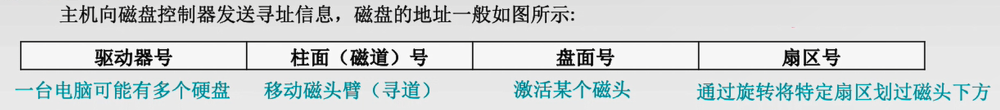
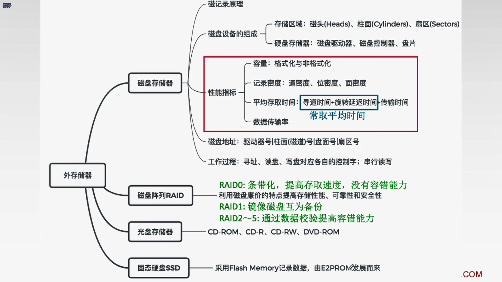

#7.1 I/O系统基本概念
##7.1.1输入/输出系统
1. 外部设备
2. 接口：协调主机与外设之间的数据传输
3. 输入设备
4. 输出设备
5. 外存设备
6. I/O软件：包括驱动程序、用户程序、管理程序、实际补丁等。
7. I/O硬件：包括外部设备、I/O接口、I/O总线等

##I/O控制方式
**1. 程序查询方式：CPU不停的查询I/O设备是否准备好，从而控制I/O设备与主机进行交换信息
2. 程序中断方式：I/O设备准备好时向CPU发出一个中断请求
3. DMA方式：主存与I/O设备之间有一条直接数据通路(DMA总线)
4. 通道方式：** 

#7.2 外部设备

##7.2.2输出设备
###1、显示器

**显示存储器(VRAM)：** 也称刷新存储器，为了不断提高刷新图像的信号，必须把一桢图像信息存储在刷新存储器中。

**VRAM容量$=$分辨率$\times$灰度级位数 🔥
VRAM带宽$=$分辨率$\times$灰度级位数$\times$桢频(刷新率)🔥**

##7.23外存储器

###1、磁盘存储器
1. 磁盘设备的组成
   1. 存储区域：一块硬盘有若干个记录面，每个记录面划分为若干条磁道，而每条磁道又划分为若干个扇区(也称块)是磁盘读写的**最小单位**。
      - 磁头数：即记录面数，表示硬盘总共有多少磁头，磁头用于读取/写入盘片上记录面的信息，一个记录面对应一个磁头。
      - 柱面数：表示硬盘每一面盘片上有多少条磁道。在一个盘组中不同记录面的相同编号(位置)的诸磁道构成一个圆柱面。
      - 扇区数：表示每一条磁道上有多少个扇区。
   2. 硬盘存储器：由磁盘驱动器、磁盘控制器和盘片组成。
      - 磁盘驱动器：核心部件是磁头组件。
      - 磁盘控制器：是硬盘存储器和主机的接口。
2. 磁盘的性能指标
   1. 磁盘的容量：有格式化与非格式化容量之分。
      - 非格式化容量：磁记录表面可以利用的磁化单位总数。
      - 格式化容量：按照某种特定的记录格式所能存储信息的总量，容量小
   2. 记录密度：盘片单位面积上记录的二进制的信息量
      - 道密度：磁盘半径方向单位长度上的磁道数。
      - 位密度：磁道单位长度上能记录的二进制位数。
      - 面密度：位密度$\times$道密度
      - ⚠️磁盘所有磁道记录信息量一定是相等的，并不是是圆越大信息越多，所以每个磁道的位密度都不同，越在里面越大。 
   3. 平均存取时间$=$寻道时间$+$旋转延迟时间$+$传输时间(转一个扇区的时间) 🔥
   4. 数据传输率：单位时间内向主机传送数据的字节数。
3. 磁盘地址
   

***
##小结
