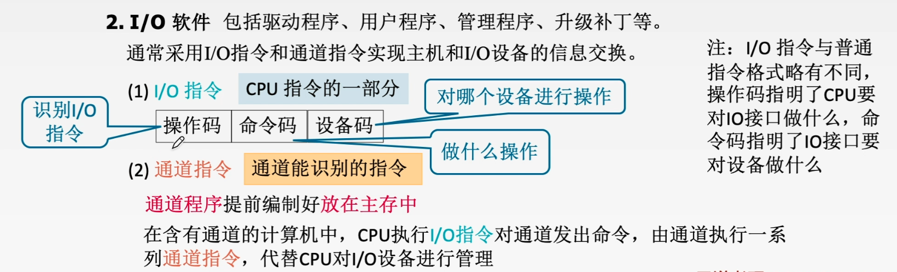
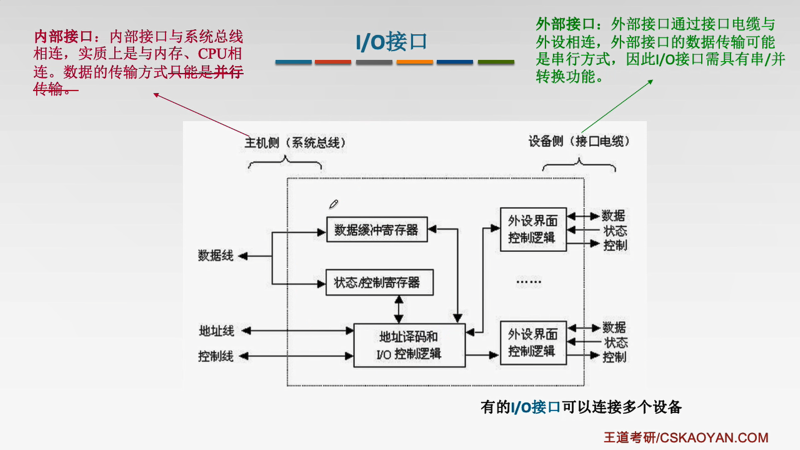
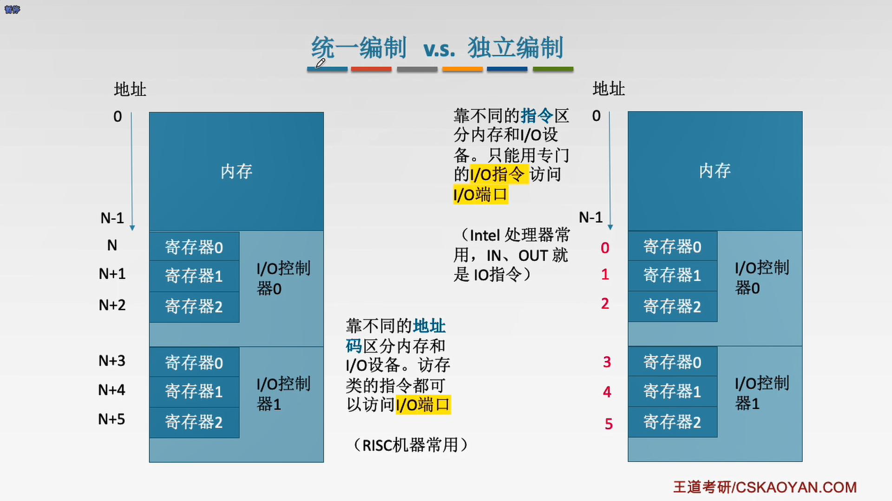
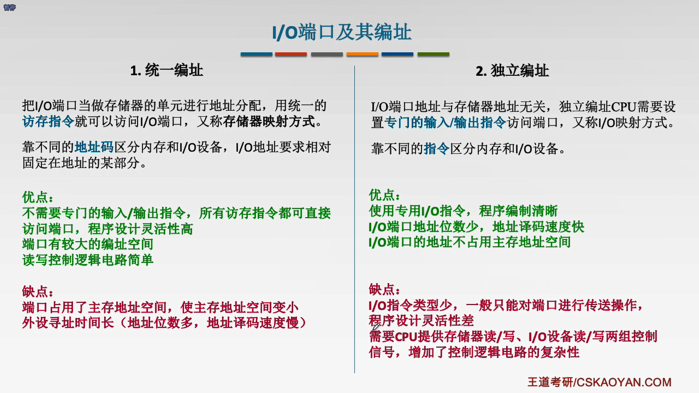
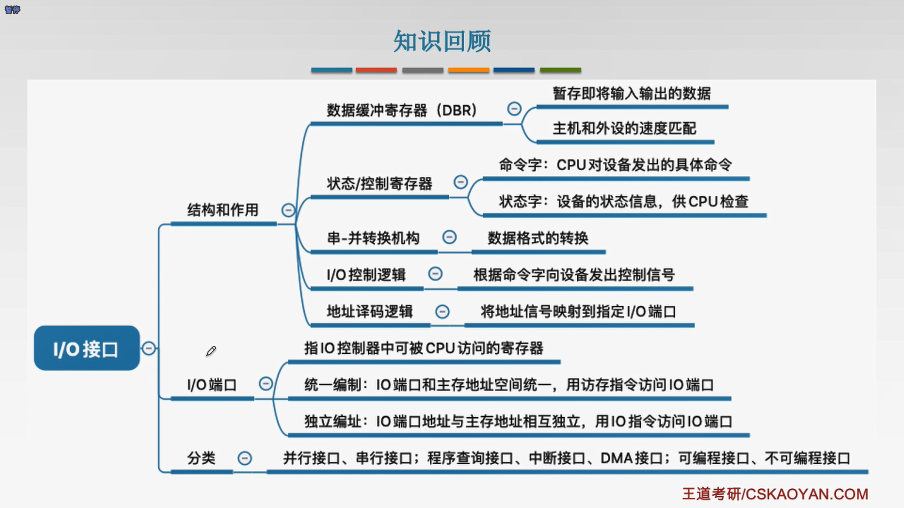
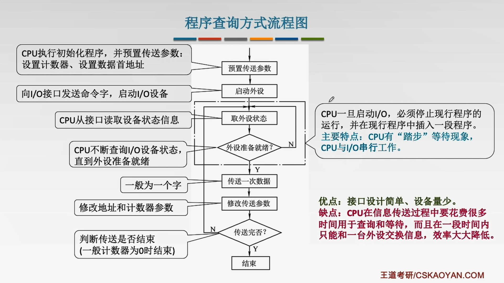
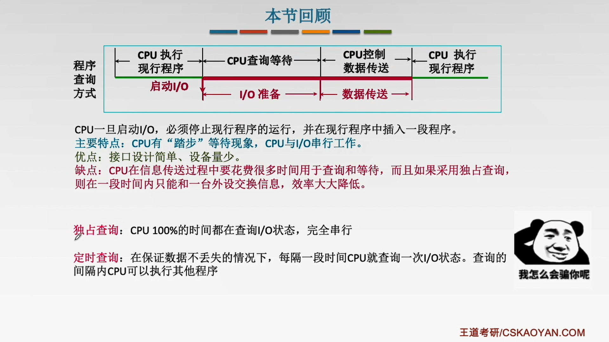
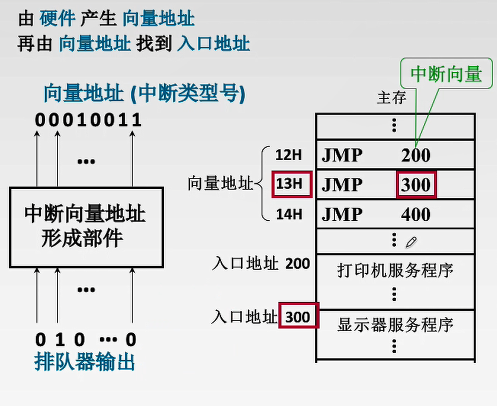

#7.1 I/O系统基本概念
##7.1.1输入/输出系统
1. 外部设备
2. 接口：协调主机与外设之间的数据传输
3. 输入设备
4. 输出设备
5. 外存设备
6. I/O软件：包括驱动程序、用户程序、管理程序、实际补丁等。
7. I/O硬件：包括外部设备、I/O接口、I/O总线等

##7.1.2 I/O控制方式
**1. 程序查询方式：CPU不停的查询I/O设备是否准备好，从而控制I/O设备与主机进行交换信息
2. 程序中断方式：I/O设备准备好时向CPU发出一个中断请求
3. DMA方式：主存与I/O设备之间有一条直接数据通路(DMA总线)
4. 通道方式：** 

#7.2 外部设备

##7.2.2 输出设备
###1、显示器

**显示存储器(VRAM)：** 也称刷新存储器，为了不断提高刷新图像的信号，必须把一桢图像信息存储在刷新存储器中。

**VRAM容量$=$分辨率$\times$灰度级位数 🔥
VRAM带宽$=$分辨率$\times$灰度级位数$\times$桢频(刷新率)🔥**

##7.2.3 外存储器

###1、磁盘存储器
1. 磁盘设备的组成
   1. 存储区域：一块硬盘有若干个记录面，每个记录面划分为若干条磁道，而每条磁道又划分为若干个扇区(也称块)是磁盘读写的**最小单位**。
      - 磁头数：即记录面数，表示硬盘总共有多少磁头，磁头用于读取/写入盘片上记录面的信息，一个记录面对应一个磁头。
      - 柱面数：表示硬盘每一面盘片上有多少条磁道。在一个盘组中不同记录面的相同编号(位置)的诸磁道构成一个圆柱面。
      - 扇区数：表示每一条磁道上有多少个扇区。
   2. 硬盘存储器：由磁盘驱动器、磁盘控制器和盘片组成。
      - 磁盘驱动器：核心部件是磁头组件。
      - 磁盘控制器：是硬盘存储器和主机的接口。
2. 磁盘的性能指标
   1. 磁盘的容量：有格式化与非格式化容量之分。
      - 非格式化容量：磁记录表面可以利用的磁化单位总数。
      - 格式化容量：按照某种特定的记录格式所能存储信息的总量，容量小
   2. 记录密度：盘片单位面积上记录的二进制的信息量
      - 道密度：磁盘半径方向单位长度上的磁道数。
      - 位密度：磁道单位长度上能记录的二进制位数。
      - 面密度：位密度$\times$道密度
      - ⚠️磁盘所有磁道记录信息量一定是相等的，并不是是圆越大信息越多，所以每个磁道的位密度都不同，越在里面越大。 
   3. 平均存取时间$=$寻道时间$+$旋转延迟时间$+$传输时间(转一个扇区的时间) 🔥
   4. 数据传输率：单位时间内向主机传送数据的字节数。
3. 磁盘地址
   

***
##小结

#7.3 I/O接口
##7.3.1 I/O接口的主要功能
I/O接口的主要功能如下：
1. **与主机和设备通信：** 实现主机-I/O接口-I/O设备之间的通信
2. **进行地址译码和设备选择**
3. **控制和定时：** 接收从控制总线发来的控制信号、时钟信信号。
4. **实现数据缓冲**
   - 数据缓冲：通过数据缓冲器(DBR)达到主机和外设工作速度的匹配
5. **信号格式的转换：** 串-并、并-串等格式转换
6. **错误或状态信息检测：** 通过状态寄存器反馈设备的各种错误、状态信息，供CPU查用 

##7.3.2 I/O接口的基本结构

1. **发命令：** 发送命令字到I/O控制寄存器，向设备发送命令(需要驱动程序的协助)
2. **读状态：** 从状态寄存器读取状态字，获得设备或I/O控制器的状态信息
3. **读/写数据：** 从数据缓冲寄存器发送或读取数据，完成主机与外设的数据交换
**状态寄存器和控制寄存器在使用时间上是错开的，因此有的I/O接口中将二者和二为一。**
**I/O端口：** I/O控制器中的各种寄存器
**数据线：** 读写数据、状态字、控制字、中断类型号
**地址线：** 指明I/O端口
**控制线：** 读/写端口的信号、中断请求信号
***
##7.3.3 I/O接口的类型
1. 按数据传送方式：
   1. 并行接口：一个字节或一个字所有位同时传送
   2. 串行接口：一位一位地传送
2. 按主机访问I/O设备的控制方式可分为：
   1. 程序查询接口
   2. 中断接口
   3. DMA接口
3. 按功能选择的灵活性可分为：
   1. 可编程接口
   2. 不可编程接口 

***
##7.3.4 I/O端口及其编址

##小结

***
#7.4I/O方式
##7.4.1程序查询方式

##7.4.2程序中断方式

###1、中断的基本概念
计算机在执行现行程序的过程中，出现某些急需处理的异常情况或特殊请求，CPU暂时中止现行程序，去对这些异常情况或特殊请求进行处理，处理完成后CPU返回到现行程序的断点处继续执行原程序。

**关中断的作用：** 实现原子操作
**非屏蔽中断：** 关中断时也会被响应(如：掉电)
**可屏蔽中断：** 关中断时不会被响应
**外中断：** 是指来自CPU外部、与CPU执行指令无关的事情引起的中断。
**内中断皆为非屏蔽中断**
###2、程序中断方式工作流程
1. **中断请求**
   每个中断源向CPU发出中断请求的时间是随机的。
   中断系统对每个中断源设置**中断请求标志触发器INTR**
   - 当其状态为"1"时，表示中断源有请求
   - 这些触发器可组成中断请求标准寄存器，该寄存器可集中在CPU内，也可分散在各个中断源内。
2. **中断判优**
   可以用硬件实现也可以用软件实现。
   -  硬件实现是通过硬件排队器实现的，他既可以设置在CPU中，也可以分散在各个中断源中。
   -  软件实现是通过查询程序实现的。
  
   优先级设置
   - 硬件故障属于最高级，其次是软件中断
   - 非屏蔽优于可屏蔽
   - DMA请求优于I/O设备传送的中断请求
   - 高速设备优于低速设备
   - 输入优于输出
   - 实时优于普通
3. **CPU响应中断的条件**
   - 中断源有中断请求
   - CPU允许中断以及开中断
   - 一条指令执行完毕，且没有更紧迫的任务
4. **中断响应**
   中断隐指令：保存原程序的PC值，并让PC指向中断服务的第一条指令。
   中断隐指令的主要任务：
      1. **关中断**，在中断服务程序中，为了保护中断现场(即CPU主要寄存器中的内容)期间不被新的中断所打断，必须关中断，从而保证中断的程序在中断服务程序执行完毕之后能继续执行。
      2. **保存断点**，保证能正确的返回到原来的程序中,可以将PC存入堆栈或指定单元。
      3. **引出中断服务程序**，引出中断服务程序的实质就是取出中断服务程序的入口地址并传送给PC，有两种方法找到入口地址：
         1. **软件向量法**
         2. **硬件向量法：**由**硬件**产生**向量地址**再由**向量地址**找到**入口地址**
      4. **执行中断服务程序：**
         1. **保护现场：**保存通用寄存器和状态寄存器的内容，可以使用堆栈或指定单元
         2. **中断服务(设备服务)：** 主体部分
         3. **恢复现场**
         4. **中断返回：** 回到原程序断点处。
5. 中断向量