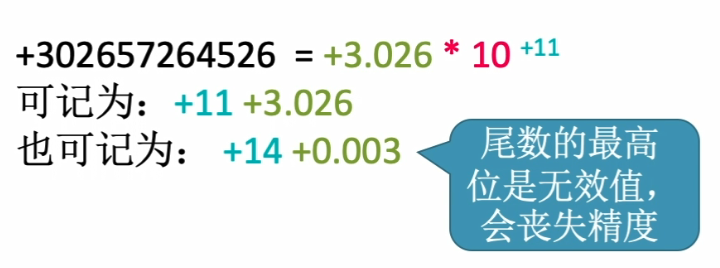
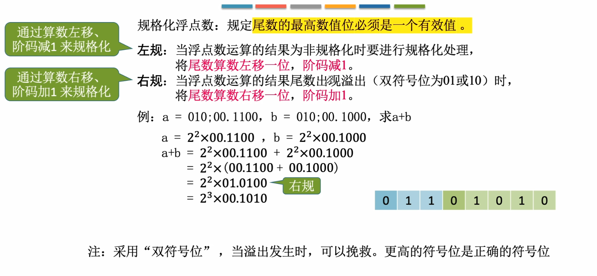
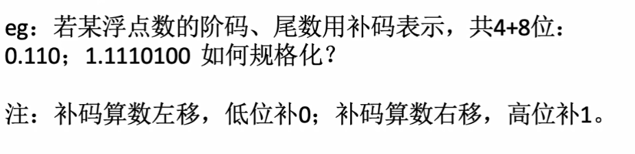

#2.3 浮点数的表示
##2.3.1浮点数的表示
###1、浮点数的表示格式
**阶码为定点整数，尾数为定点小数**
如：a=0,01;1.001$\rightarrow$阶符,阶码的数值部分;尾数的符号.尾数的数值部分
阶符为阶码的符号位。
a的阶码对应二进制真值：+1
a的尾数对应二进制真值：-0.0111
a的二进制真值=2^1$\times$(-0.0111)=-0.111；

****
###2、浮点数的规格化
尾数的最高位必须是一个有效值，否则会丢失精度。

***

###3、规格化浮点数
**左规：当浮点数运算的结果为非规格化时要进行规格化处理。尾数算术左移一位，阶码减一。**
**右规：当浮点数运算结果尾数出现溢出时，将尾数算术右移一位，阶码加一**

**规格化后**
原码的特征：
正数为：0.1XXXX的形式
负数为：1.1XXXX的形式
补码的特征：
正数为：0.1XXXX的形式
==负数为：1.0XXXX的形式==

如果尾数是负的补码
如：1.1110100
则将尾数进行算术左移直到第一位为0(1.0100000)。

###小结

###4、IEEE 754 标准
