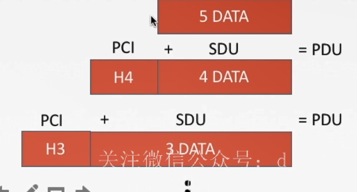

# 1.1 计算机网络概述

## 1.1.1 计算机网络的概念
计算机网络是将分散的、具有独立功能的**计算机系统**，通过**通信设备与线路**连接起来，由功能完善的**软件**实现**资源共享和信息传递**的系统。

## 1.1.2 计算机网络的组成

1. **从组成部分上看**
   1. 硬件
   2. 软件
   3. 协议
2. **从工作方式上看**
   1. 边缘部分
      - 连接到网络的电脑、主机
   2. 核心部分
      - 大量的网络、和连接这些网络的路由器
3. **从功能组成上看** 
   1. 通信子网
      - 实现数据通信
   2. 资源子网
      - 实现资源共享、数据处理
## 1.1.3 计算机网络的功能

1. 数据通信
   - 用来实现联网计算机之间各种信息的传递
2. 资源共享
   - 软件共享、数据共享、硬件共享。提高资源利用率
3. 分布式处理
   - 多台计算机各自承担同一工作的不同部分
4. 提高可靠性
   - 网络中的各台计算机课通过网络互为替代机
5. 负载均衡
   - 将工作均衡的分配给计算机网络中的各台计算机

## 1.1.4 计算机网络的分类

1. **按分布范围分类**
   1. 广域网(WAN)
   2. 域域网(MAN)
   3. 局域网(LAN)
   4. 个人区域网(PAN)
2. **按传输技术分类**
   1. 广播式网络
   2. 点对点网络
3. **按拓扑结构分类**
   1. 总线网络
   2. 星形网络
   3. 环形网络
   4. 网状网络
4. **按使用者分类**
   1. 公用网
   2. 专用网
5. **按交换技术分类**
   1. 电路交换网络
      - 会独占资源
   2. 报文交换网络
   3. 分组交换网络
6. **按传输介质分类**
   1. 有线
   2. 无线

## 计算机网络性能指标
1. 速率
2. 带宽
   1. 单位时间内的最高数据率(理想值)
3. 吞吐量
   1. 单位时间内通过网络的数据量
4. 时延
   1. 从一端传输到另一端所需的时间
   2. 发送时延
      1. 从第一个比特到最后一个比特发送完成所需的时间
      2. $\frac{数据长度}{信道带宽(发送速率)}$
   3. 传播时延
      1. 取决于电磁波传播速度和链路长度
      2. $\frac{信道长度}{电磁波传输速率}$
   4. 排队时延
      1. 等待出/入链路可用
   5. 处理时延
      1. 检错、找出口
5. 时延带宽积
   1. 链路有多少比特
   2. 传播时延*带宽
6. 往返时延RTT
   1. 从发送方发送数据开始，到发送方收到接收方的确认总共经历的时延
   2. 转播时延*2+末端处理时间
   3. RTT越大，在收到确认之前，可以发送的数据越多
7. 利用率
   1. 信道利用率
      1. $\frac{有数据通过的时间}{总时间}$
   2. 网络利用率
      1. 信道利用率的加权平均值

# 1.2 计算机网络体系结构与参考模型

## 1.2.1 计算机网络分层结构

**分层的基本原则**
1. 各层之间相互独立，每层只实现一种相对独立的功能。
2. 每层之间界面自然清晰，易于理解，相互交流尽可能的少。
3. 结构上可分割开。每层都采用最合适的技术来实现。
4. 保持下层对上层的独立性，上层单向使用下层提供的服务。
5. 整个分层结构应该能促进标准化工作

**正式认识分层结构**
1. **实体**：第n层中的活动元素称为n层实体。同一层的实体叫对等实体
2. **协议**：为进行网络中的**对等实体**数据交换而建立的规则、标准或约定称为网络协议
   1. 语法：规定传输数据的格式
   2. 语义：规定所要完成的功能
   3. 同步：规定各种操作的顺序
3. **接口(访问服务点SAP)**：上层使用下层服务的入口
4. **服务**：下层为邻近层提供的功能调用

SDU服务数据单元：为完成用户所要求的功能而传送的数据
PCI协议控制信息：控制协议操作的信息
PDU协议数据单元：对等层次之间传送的数据单位

**概念总结**
1. 网络体系结构是从**功能**上描述计算机网络结构
2. 计算机网络体系结构简称网络体系结构是**分层结构**
3. 每次遵循某些**网络协议**以完成本层功能
4. **计算机网络体系结构**是计算机网络的**各层及其协议**的集合
5. 第n层在向n+1层提供服务时，此服务不仅包含第n层本身的功能，还包含由下层服务提供的功能
6. 仅在**相邻层间有接口**，且所提供服务的具体实现细节对上一层完全屏蔽
7. 体系结构是抽象的，而实现是指能运行的一些软件和硬件

## 1.2.2 ISO/OSI参考模型

**至下而上**

数据链路层除了添加头部以外还会添加尾部

1. 物理层
   1. 在物理媒体上实现比特流的透明传输
   2. 功能
      1. 定义接口特性
      2. 定义传输模式
      3. 定义传输速率
      4. 比特同步
      5. 比特编码
2. 数据链路层
   1. 把网络层传下来的数报**组装成帧(数据链路层的传输单位)**
   2. 功能
      1. 成帧(定义帧的开始和结束)
      2. 差错控制
      3. 流量控制
      4. 访问控制(控制对信道的访问)
3. 网络层
   1. 主要任务是把**分组**从源端传到目的端，为分组交换网上的不同主机提供通信服务，传输单位是**数据报**。
   2. 功能
      1. 路由选择
      2. 流量控制
      3. 差错控制
      4. 拥塞控制
4. 传输层
   1. 负责主机中两个进程的通信，即端到端的通信。传输单位是报文段或用户数据报
   2. 功能
      1. 可靠传输、不可靠传输
      2. 差错控制
      3. 流量控制
      4. 复用分用
5. 会话层
   1. 向表示层实体(用户进程)提供**建立连接**并在连接上有序地传输数据，这是会话，也叫**建立同步**(SYN)，会话间是彼此独立的
   2. 功能
      1. 建立、管理、终止会话
      2. 使用校验点可使会话在通信失效时从校验点继续恢复通信，实现数据同步。
6. 表示层
   1. 用于处理在两个通信系统中交换信息的表述方式
   2. 功能
      1. 数据格式变换
      2. 数据加密解密
      3. 数据压缩和恢复
7. 应用层
   1. 所有能和用户交互产生网络流量的程序

## 1.2.3 TCP/IP的参考协议

1. 网络接口层
2. 网际层
3. 传输层
4. 应用层

