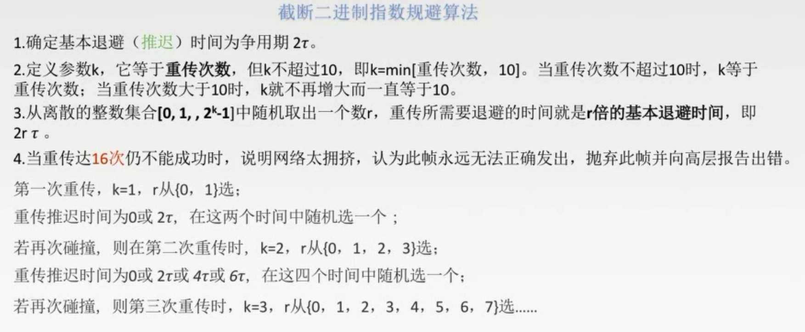
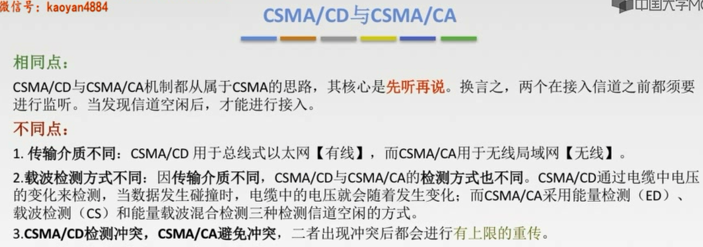
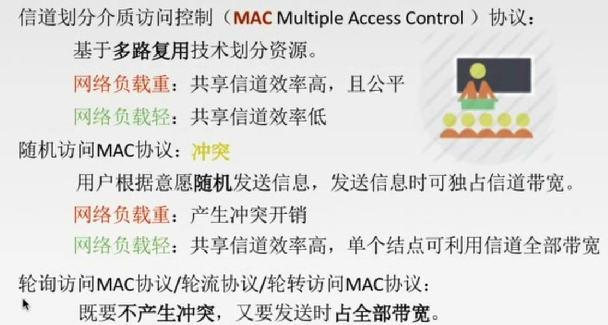
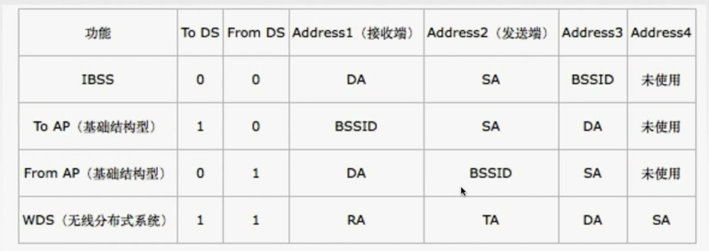
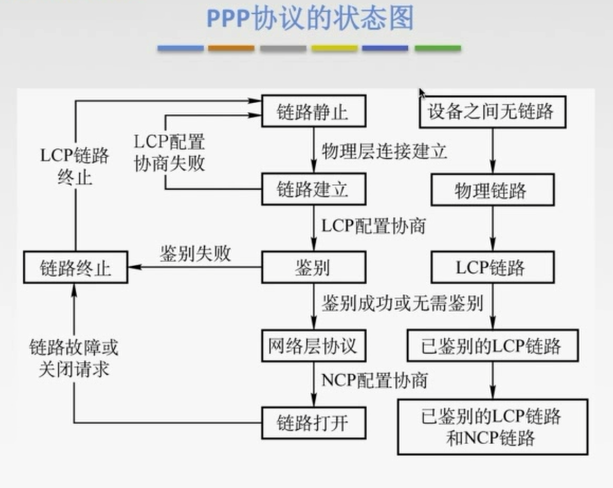
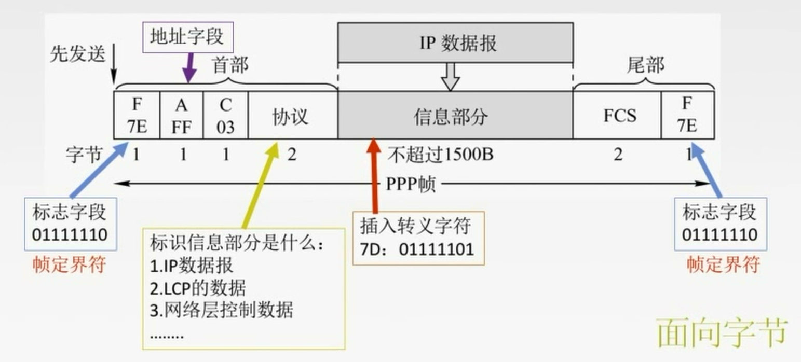
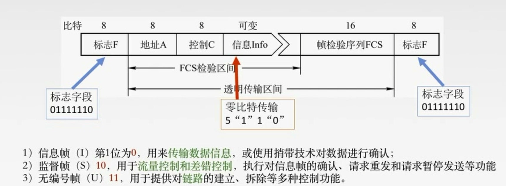
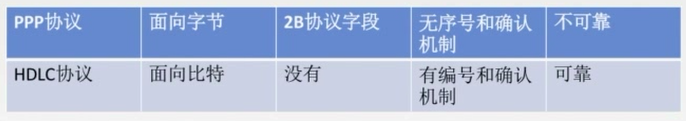

# 3.1 数据链路层的功能

## 3.1.1 数据链路层的基本概念

1. 结点：主机、路由器
2. 链路：两个结点之间的物理通道
3. 数据链路：网络中两个结点之间的逻辑通道
4. 帧：链路层的协议数据单位，封装网络层数据报

## 3.1.2 为网络提供服务

1. 无确认的无连接服务
   1. 发送方无需建立链路连接，接收方无需发送确认
2. 有确认的无连接服务
   1. 发送方无需建立链路连接，接收方必须发送确认
3. 有确认的面向连接服务
   1. 传输过程分为三个阶段
      1. 建立数据链路
      2. 传输帧
      3. 释放数据链路

⚠️有连接就一定要确认，所以不存在 无确认的面向连接服务

## 3.1.3 链路管理

数据链路层连接的建立、维持、释放过程称为链路管理。
主要用于面向连接的服务

## 3.1.4 帧定界、帧同步与透明传输

**封装成帧**：在一段数据的前后部分添加首部和尾部。接收端在收到物理层上交的比特流后，就能根据首部和尾部的标记，从收到的比特流中识别帧的开始和接收。

**帧同步**：接收方应当能从接收到的二进制比特流中区分处帧的起始和终止。

**透明传输**：不管所传数据是什么样的比特组合，都应当能过在链路上传送。

# 3.2 组帧

## 3.2.1 字符计数法

帧首部使用第一个字符作为计算字段来表明帧内字符数(包括自身)

## 3.2.2 字符填充法

利用控制字符SOH放在帧的最前面表示开始、EOT放在末尾表示结束。同时如果原始数据里有编码与控制字符一样的数据在其前面插入转义字符ESC来区分，接收方收到后会删除自己插入的转义字符

## 3.2.3 零比特填充法

在首部和尾部使用0111110来表示帧的开始与结束，同时在发送端扫描整个信息字段，如果发现5个1就在后面填入一个0，在接收方，先通过标志端确定帧，然后同样扫面整个信息字段，发现5个1就删除后面的一个0.

## 3.2.4 违规编码法

使用信息编码方式中不会使用到的编码来表示开始与结束。

# 3.3 差错控制

1. 随机噪声：提高信噪比
2. 冲击噪声：差错控制

**差错**
1. 位错
   1. 1变成0、0变成1
2. 帧错
   1. 丢失
   2. 重复
   3. 失序

## 3.3.1 检错编码

### 1. 奇偶校验码

添加1位校验元。

奇校验码：添加后，码字中"1"有奇数个
偶校验码：添加后，码字中"1"有偶数个

只能检测奇数位比特位出错，检测不了偶数位出错。

### 2. 循环冗余码(CRC)

1. 在原数据后面加上r个0(r为多项式的阶)
2. 使用加0后的数据对多项式做除法
3. 得到的余数就是冗余码(FCS)，用冗余码取代之前添加的0

**检错**：接收方使用接收到的数据除以多项式为0则无错

FCS的生成以及接收端CRC检验都是由硬件实现，处理很迅速，因此不会延误数据的传输。

## 3.3.2 纠错编码

两个合法编码的对应比特取值不同的数量称为这两个码字的**海明距离(码距)**，一个有效编码集忠，任何两个合法编码的海明距离的最小值为该编码集的**海明距离**。

如果可以检测出**n位比特出错**的话，海明距离位**n+1位**
如果可以纠正出**n位比特出错**的话，海明距离位**2n+1位**

### 海明码的工作流程

1. **确定校验码位数**：$2^r\geq m+r+1$(其中r位校验码位数，m位信息位数)
2. **确定校验码和数据的位置**：将校验码放在$2^n$的位置上。自低位向高位
3. **求出校验码的值**：根据所在位置的二进制位中的1找出负责校验的比特位有哪些，根据奇偶校验求值
4. **检错并纠错**：略

# 3.4流量控制与可靠传输机制

## 3.4.1 流量控制、可靠传输与滑动窗口机制

**可靠传输**：发送端发什么，接收端收什么。
**流量控制**：控制发送速率，使接收方有足够的缓冲空间来接收每一帧。

1. 停止-等待协议：发送窗口大小=1，接收窗口大小=1
2. 后退N帧协议：发送窗口大小为>1，接收窗口大小=1
3. 选择重传协议：发送窗口大小>1，接收窗口大小>1

## 3.4.2 停止-等待协议

发完一个帧后必须保留它的副本。
数据帧和确认帧必须编号

1. 数据帧丢失或检测到帧出错：每次发送后会启动超时计时器，超时后会重传一帧
2. ACK丢失：接收方收到超时重传的帧后会丢弃重复的帧，并且重新确认帧
3. ACK迟到：发送方收到重复确认后丢弃

👍优点：简单
👎缺点：信道利用率低

信道利用率=$\displaystyle \frac{\displaystyle \frac{发送周期内发送的比特数据}{发送方数据传输率}}{发送周期(从发送数据开到接收完第一个确认帧为止)}$

## 3.4.3 后退$N$帧协议(GBN)

发送方收到确认会滑动窗口
接收方每收到一帧便会滑动一格

发送窗口最大为$2^{n}-1$

**GBN发送方必须要相应的三件事**
1. 上层的调用
   - 上层要发送数据时，发送方先检查发送窗口是否已满，如果**未满**，则产生一个帧并将其发送；如果窗口**已满**，只需将数据返回给上层。
2. 收到了一个ACK
   - GBN协议中，对n号帧的确认采用**累计确认**的方式，表明接收方已经收到n号帧和它之前的全部帧。
3. 超时事件
   - 发送方会重传所有已发送但未被确认的帧。

**接收方要做的事情**
1. 如果正确收到n号帧，并且按序，那么接收方为n帧发送一个ACK，并将该帧中的数据部分交付给上层
2. 其余情况都丢帧，并且为最近按序接收的帧重新发送ACK

👍优点：因连续发送数据帧而提高了信道利用率
👎缺点：在重传时必须把原来已经正确传送的数据帧重传，传送效率低。

## 3.4.4 选择重传协议(SR)

**发送方必须相应的三件事**

1. 上层的调用
   1. 从上层收到数据后，发送方检查下一个可用于该帧的序号，如果序号位于发送窗口内，者发送数据帧；否则就像GBN一样，要么将数据缓存，要么返回给上层之后再传输
2. 收到了一个ACK
   1. 如果收到了ACK，该帧序号在窗口内，者发送方将那个被确认的帧标记为已接受，如果该帧序号是窗口的下界，者窗口向前移动到具有最小序号的未确认帧处，如果窗口移动了并且有序号在窗口内的未发送帧，则发送这些帧。
3. 超时事件
   1. 每个帧都有一个计时器，一个事件发生后只重传一个帧。

**接收方要做的事**
$\color{Red}{来者不拒}$(窗口内的帧)
接收方将确认一个正确接收的帧而不管其是否按序。失序的帧将被缓存，并返回给发送方一个该帧的确认帧，直到所有帧皆被收到为止，这时才可以将一批帧按序交付给上层，然后向前移动滑动窗口。

如果收到了窗口序号外的帧，就返回一个ACK(可能是之前发送的ACK丢失了，发送了超时重传)
其它情况忽视该帧

**滑动窗口大小**
发送窗口最好等于接收窗口(大了会溢出，小了没意义)
$W_{max}=2^{n-1}$
$W_发+W_收\leq 2^n$

# 3.5 介质访问控制

## 3.5.1 信道划分介质访问控制

### 1.频分多路复用(FDM)

1. 用户在分配到一定的频带后，在通信过程中自**始至终都占用**这个频带，**所有用户在同样的时间占用不同的带宽(频率带宽)资源**
2. 👍优点
   1. 充分利用传输介质带宽，系统**效率较高**
   2. 实现比较简单

### 2.时分多路复用(TDM)

1. 每一个用户在每一个TDM帧(一个周期)中占用**固定的时间**，所用用户轮流占用信道。

### 3.波分多路复用(WDM)

根据光的波长来划分信道

### 4.码分多路复用(CDM)

用不同编码来区分

## 3.5.2 随机访问介质访问控制

**冲突**：在总线型网络中，当有多个用户同时发送信息时，就会产生帧的冲突(互相干扰)，导致所有冲突的用户发送均失败，
**协议**：为了解决随机接入发生的冲突，每个用户需要按照一定的规则反复地重传它帧，直到该帧无冲突地通过。

### 1.ALOHA协议

1. 纯ALOHA协议
   1. 思想：不监听信道，不按时间槽发送，随机重发。($\color{Red}{想发就发}$)
   2. 检测冲突：如果发生冲突，接收方就会检测出错，然后不予确认，发送方在一定时间内收不到就判断发生冲突。
   3. 解决冲突：超时后等一随机时间后重传。
2. 时隙ALOHA协议
   1. 思想：把时间分成若干个相同的时间片，所有用户在时间片开始时刻同步接入网络信道，若发生冲突，则必须等到下一个时间片**开始时刻**再发送。$\color{Red}{控制想发就发的随意性}$
3. 对比
   1. 纯ALOHA吞吐量更低，效率更低
   2. 纯ALOHA想发就发，时隙ALOHA只有在时间片段开始时才能发

### 2.CSMA协议

**协议思想**：发送之前先监听信道。

1. 1-坚持CSMA
   1. 思想：空闲则直接传送，不必等待。忙则一直监听，直到空闲马上传输
   2. 如果有冲突(一段时间内未收到肯定回复)，则等待一个随机长的时间再监听。
   3. 👍优点：只要媒体空闲，站点就马上发送，避免了媒体利用率的损失。
   4. 👎缺点：如果有两个或两个以上的站点有数据要发送，冲突就不可避免。
2. 非坚持CSMA
   1. 思想：忙则等待一个随机时间后再监听.
   2. 👍优点：采用随机的重发延迟时间可以减少冲突发生的可能性。
   3. 👎缺点：可能存在大家都在延迟等待过程中，使得媒体仍可能处于空闲状态，媒体使用率降低。
3. p-坚持CSMA
   1. 思想：空闲则以p概率直接传输，不必等待；忙则持续监听直到信道空闲再以p概率发送
   2. 若发生冲突则等到下一个时间槽开始再监听。
   3. 👍优点：既能像非坚持算法那样减少冲突，又能像1-坚持算法那样减少媒体空闲时间的这种方案。

上述三种协议在发生冲突后还是要坚持把数据帧发生完，造成了浪费。

### 3.CSMA/CD协议

1. 适配器从网络层获得一个分组，封装成以太帧，放入适配器的缓存，准备发送
2. 如果适配器侦听到信道空闲，那么它开始发送该帧。如果侦听到信道忙，那么它持续侦听直到信道上没有信号能量，然后开始发送该帧
3. 在发送过程中，适配器持续检测信道。若一直未检测到冲突，则顺利把这个帧发送完毕。若检测到冲突，则中止数据的发送，并发送一个拥塞信号，让所有用户都直到。
4. 在中止发送后，适配器就执行指数退避算法，等待一段随机事件后返回到步骤2

只要经过$2\tau$时间还没有检测到碰撞，就能肯定这次发送不会发生碰撞。

最小帧长=总线传播时延$\times$数据传输速率$\times$2

### 4.CSM/CA协议

CD主要应用于有线局域网，无线局域网环境下，主要使用CA

1. 思想：
   1. 发送数据前先，检测信道是否空闲
   2. 空闲则发出RTS，RTS包括发射端的地址、接收端的地址、下一份数据将持续发送的时间等信息；信道忙则等待。
   3. 接收端收到RTS后，将响应CTS
   4. 发送端收到CTS后，开始发送数据帧(同时预约信道：发送方告知其他站点自己要传多级数据)
   5. 接收端收到数据帧后，将用CRC来检验数据是否正确，正确则响应ACK帧。
   6. 发送方收到ACK就可以进行下一个数据帧的发送，若没有 则一直重传至规定重发次数为止(采用二进制指数退避算法)

## 3.5.3 轮询访问介质访问控制：令牌传递协议

### 1.轮询协议

由集中控制的监控站，以循环方式轮询每个结点。再决定信道的分配。

👎缺点：
1. 轮询开销
2. 等待延迟
3. 单点故障(集中控制监控站故障)

### 2.令牌传递协议

令牌：
1. 一个特殊格式的MAC控制帧，不含任何信息
2. 控制信道的使用，确保同一时刻只有一个结点独占信道。

思想：
1. 当没有用户需要发送数据时，令牌在环形网上循环，直到有用户发送信息
2. 发送端将令牌的标志位更改为忙，同时将数据修改，让令牌循环一周
3. 接收端检测到数据是发送给自己的会将数据复制一份
4. 令牌再次循环到发送端后将信息重置后继续循环

👎缺点：
1. 令牌开销
2. 等待延迟
3. 单点故障

逻辑上一定是要环形的

常用于负载较大、通信量较大的网络中

## 3.6 局域网

### 3.6.1 局域网的基本概念和体系结构

**特点：**

1. 覆盖的地理范围较小，只在一个相对对立的局部范围内联，如一座或集中的建筑群内
2. 使用专门铺设的传输介质进行联网，数据传输率高(10Mb/s~10Gb/s)
3. 通信延迟时间短，误码率低。可靠性较高
4. 各站为平等关系，共享传输信道
5. 多采用分布式控制和广播式通信，能进行广播和组播

**决定局域网的主要因素**：

1. 网络拓扑
2. 传输介质
3. 介质访问控制的方法

**局域网介质访问控制方法**

1. CSMA/CD：常用于总线型网络
2. 令牌总线：常用于总线型网络
3. 令牌环：常用于环形型网络

**局域网的分类**

1. 以太网：802.3 逻辑上总线，物理上星形或拓扑星形
2. 令牌环：802.5 逻辑上是环形，物理上是星形
3. FDDI(光纤分布数字接口)：802.8 逻辑上环形，物理上是双环
4. 无线局域网：802.11

MAC子层往上
LLC子层往下

## 3.6.2 以太网与 IEEE 802.3

使用CSMA/CD
提供无连接不可靠服务
主要负责物理层与链路层

**MAC地址**：在网卡中的ROM上，48位二进制地址，前24位代表厂家(由IEEE规定)，后24位厂家自己指定。

### 以太网的MAC帧

地址：通常使用6字节地址(目的地址和源地址各6字节)
类型：2字节
数据：46~1500字节(46是因为最小帧长)
FCS：4字节
### 高速以太网

速率大于100Mb/s的以太网

1. 10BASE-T以太网
   1. 10BASE-T是传送**基带信号**的双绞线以太网，T表示采用双绞线，传输速率是10Mb/s
   2. **物理上采用星型拓扑，逻辑上总线型**，每段双绞线最长为100m
   3. 采用曼彻斯特编码
   4. 采用CSMA/CD
   5. 支持全双工和半双工，可在全双工方式下工作无冲突
2. 吉比特以太网
   1. 在**光纤或双绞线**上传输**1Gb/s**信号
   2. 支持全双工和半双工，可在全双工方式下工作无冲突
3. 吉比特以太网
   1. 在**光纤**上传输**10Gb/s**信号
   2. 只支持全双工

## 3.6.3 IEEE 802.11

### 1.有固定基础设施无线局域网

通过基站(基站之间可以通过线缆连接)转发

### 1.无固定基础设施无线局域网的自主网络

只有主机构成网络

## 3.7 广域网

### 3.7.1 广域网的基本概念

广域网的通信子网主要使用**分组交换**技术。广域网的通信子网可以利用公用分组交换网、卫星通信网和无线分组交换网，它将分布在不同地区的**局域网或计算机系统**互连起来，达到**资源共享**的目的。

### 3.7.2 PPP(点对点)协议

采用全双工

**PPP协议需要满足的要求：**
1. 简单：对于链路层的帧，无需纠错，无需序号，无需流量控制
2. 封装成帧：
3. 透明传输
4. 多种网络层协议
5. 多种类型链路
6. 差错检测：错就丢
7. 检测连接状态：链路是否能正常工作
8. 最大传送单元：数据部分最大长度MTU
9. 网络层地址协商：知道通信双方的网络层地址
10. 数据压缩协商

**三个组成部分**
1. 一个将IP数据报封装到串行链路的方法
2. 链路控制协议LCP：建立并维护数据链路连接(身份验证)
3. 网络控制协议NCP：PPP可支持多种网络层协议，每个不同的网络层协议都要一个相应的NCP来配置，为网络层协议建立和配置逻辑连接。

### 3.7.3 HDLC协议

采用全双工
所有帧采用CRC检验，对信息帧进行顺序编号，可防止漏收或重份，传输可靠性高。

#### 1.站

1. 主站：控制链路操作，发出的帧称为命令帧
2. 从站：按主站的命令进行操作，发出的帧称为响应帧
3. 复合站：主、从站的功能都有

#### 2.数据操作方式

1. 正常响应方式：非平衡结构操作方式。主站向从站传输数据，从站响应传输，但从站只有收到主站的许可后，才可进行响应。
2. 异步平衡方式：平衡结构操作方式。每个复合站都可以进行对另一站的数据传输。
3. 异步响应方式：非平衡操作方式。从站未受到命令也可以进行传输。

#### 3.HDLC帧

## 3.8 数据链路层设备

**冲突域**：同一时间内只能有一台设备发送信息的范围。

**广播域**：简单的说如果站点发出一个广播信号，所有能接收到这个信号的设备范围
称为一个广播域
### 3.8.1 网桥的概念及其基本原理

**网桥**：根据MAC帧的目的地址对帧进行转发和过滤。当网桥收到一个帧时，并不向所有接口转发此帧，而是先检查此帧的目的MAC地址，然后再确定将该帧转发到哪一个接口，或者是把它丢弃(即过滤)。

**网段**：一般指一个计算机网络中使用同一物理层设备(传输介质、中继器、集线器)能够直接通讯的那一部分。

**网桥的优点**
1. 过滤通信量，增大吞吐量
2. 扩大了物理范围
3. 提高了可靠性
4. 可互连不同物理层、不同MAC子层和不同速率的以太网。

#### 1.透明网桥

指以太网上的站点并不知道所发送的帧将经过哪几个网桥，是一种即插即用设备(自学习)

**选择的不是最佳路由**

#### 2.源路由网桥

在发送帧时，把详细的最佳路由信息(路由最少/时间最短)放在帧的首部中。

**选择的是最佳路由**

### 3.8.2 局域网交换机及其工作原理

#### 特点
1. 每一个端口都划分一个冲突域
2. 独占传输媒体的带宽

#### 两种交换方式

1. 直通式交换机
   1. 查完目的地址(6B)就立刻转发
   2. **延迟小**，可靠性低，无法支持具有不同速率端口的交换
2. 存储转发式交换机
   1. 将帧放入高速缓存，并检查是否正确。正确则转发，错误则丢弃
   2. 延迟大，可靠性高，可以支持具有不同速率端口的交换