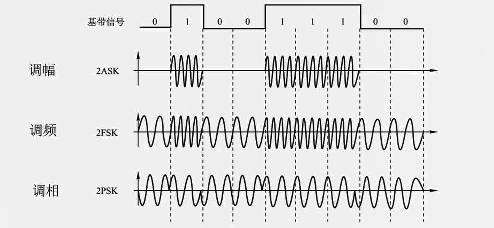
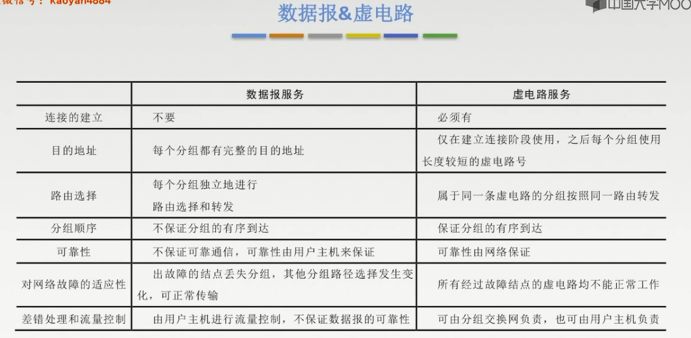

# 2.1 通信基础

## 2.1.1 基本概念

1. 数据：传送信息的实体，通常是有意义的符号序列
2. 信号：数据的电气/电磁的表现，是数据在传输过程中的**存在形式**
3. 信源：产生和发送数据的源头
4. 信道：信号的传输媒介。一般用来表示向某一个方向传送信息的介质，因此一条通信线路往往包括一条发送信道和一条接收信道
5. 信宿：接收数据的终点
6. 码元：用一个**固定时长**的**信号波形(数字脉冲)**，代表不同离散数值的基本波形，这个时长内的信号称为K进制码元，而该时长为码元的宽度。码元是数字通信种数字信号的计量单位。

**三种通信方式**

1. 单向通信
   1. 只能发送或接收，一条信道
2. 半双工通信
   1. 不能同时发送和接收，两条信道
3. 全双工通信
   1. 两条信道

**传输方式**

1. 串行传输
   1. 适合远距离，速度慢、价格低
2. 并行传输
   1. 适合近距离，速度块、价格高

**实现同步传输的方式**

1. 同步传输
   - 数据的传送是以一个数据区块为单位，因此同步传输又称为区块传输。在传送数据是，先送出一个或多个同步字符，再送出整批的数据。接收方在收到同步字符时，开始准备接收数据。
2. 异步传输
   - 将比特分成小组进行传送，小组可以是8位的一个字符或更长，传送数据时，加一个支付起始位和一个字符终止位。发送方可以在任何时刻发送这些比特组，二接收方不知道它们会在什么时候到达。

**速率的两种表示方法**

1. 码元传输速率
   1. 表示单位时间内数字通信系统所传输的马原个数(脉冲个数、信号变化次数)，单位是波特(Baud)。1波特表示每秒传输一个码元
   2. 码元速率与进制数无关，只与码元长度T有关
   3. $R_B=\frac{1}{T}(B)$
2. 信息传输速率：
   1. 单位时间内数字通信系统传输二进制码元个数(即比特数)，单位是b/s

## 2.1.2 奈奎斯特定理与香农定理

### 失真

**影响失真程度的因素**
1. 码元传输速率
2. 信号传输距离
3. 噪声干扰
4. 传输媒体质量

**码间串扰**：接收端收到的信号波形失去了码元之间清晰界限的**现象**

***
### 奈奎斯特定理(奈氏准则)
在理想低通(无噪声，带宽受限)条件下，为了避免码间串扰，极限码元传输速率为**2W Baud**，W是信道带宽，**单位是Hz**

理想低通信道下的极限数据传输率**2W$\log_2$V**(b/s)其中V是指几种码元

**根据奈氏准则得出的结论**

1. 在任何信道中，码元传输的速率是有上限的。若传输速率超过此上限，就会出现严重的码间串扰问题，是接收端对码元的完全正确识别成为不可能。
2. 信道的频带越宽(即能通过的信号高频分量越多)，就可以用更高的速率进行码元的有效传输，
3. 奈氏准则给出了码元传输速率的限制，但并没有对信息传输速率给出限制，
4. 由于码元的传输速率受奈氏准则的制约，所以要提高数据的传输速率，就必须设使每个码元能携带更多比特的信息量，这就需要采用多元制的调制方法

### 香农定理
在带宽受限且有噪声的信道中，为了不产生误差，信息的数据传输速率有上限值

$\displaystyle 信噪比=\frac{信号的平均功率}{噪声的平均功率}(S/N)$
如果是以分贝(dB)为单位
$信噪比=10\log_{10}(S/N)$

信道的极限数据传输速率=**W$\log_2(1+S/N)$(b/s)**

**根据香农定理得出的推论**
1. 信道的带宽或信道中的信噪比越大，则信息的极限传输速率就越高
2. 对一定的传输带宽和一定的信噪比，信息传输速率的上限就确定了
3. 只要信息的传输速率低于信道的极限传输速率，就一定能找到某种方法来实现**无差错的传输**。
4. 香农定理得出的为极限信息传输速率，实际信道能达到的传输速率要比它低不少

### 如何选使用哪种择定理

如果题目只给了码元的个数就使用奈氏准则
如果题目只给了信噪比就使用香农定理
都给了的话两种都使用取其最小值

## 2.1.3 编码与调制

### 基带信号与宽度信号

1. **基带信号**：直接将数字信号用两种不同的电压表示，在**数字信道**上传输($\color{red}{基带传输}$)
2. **宽带信号**：将基带信号进行调制后形成的频分复用模拟信号，在传送到**模拟信道**上去传输($\color{red}{宽带传输}$)
***
3. 距离比较近时使用**基带传输**
4. 距离比较远时使用**宽带传输**

***
### 编码与调制
**编码**：数据$\rightarrow$**数字**信号
数字数据$\xrightarrow{\textbf{数字发生器}}$**数字**信号
模拟数据$\xrightarrow{\textbf{PCM编码器}}$**数字**信号

**调制**：数据$\rightarrow$**模拟**信号
数字数据$\xrightarrow{\textbf{调制器}}$**模拟**信号
模拟数据$\xrightarrow{\textbf{放大器调制器}}$**模拟**信号

#### 1. 数字数据编码为数字信号

1. 非归零编码(NRZ)
   1. 高1低0
   2. 👍优点：编码容易实现
   3. 👎缺点：没有检错功能，且无法判断一个码元的开始和结束，以至于收发双方**难以保持同步**,需要另一个信道传输时钟周期。
2. 归零编码(RZ)
   1. 信号电平在一个码元之内都要恢复到零的这种编码成编码方式
3. 反向不归零编码(NRZI)
   1. 信号电平翻转表示0，不变表示1
4. 曼彻斯特编码
   1. 从低到高表示1，相反时表示0(也可以反过来)
   2. 每一个码元的中间出现电平跳变，位中间的跳变既作时钟信号，有作数据信号但它所占的平带宽度是原始基带宽度的两倍。
   3. 数据传输速率只有调制速率的$\frac{1}{2}$
5. 差分曼彻斯特编码
   1. 同1异0
   2. 抗干扰性强于曼彻斯特编码
6. 4B/5B编码
   1. 用5个比特来传输4比特的数据
   2. 其他16种作为控制码或保留
   3. 编码效率是80%

#### 2. 数字数据调制为模拟信号

#### 3. 模拟信号编码为数字信号

1. 抽样
   1. 对模拟信号周期性扫描，把时间上连续的信号变成时间上离散的信号(点)。
   2. $f_{\textbf{采样频率}}\geq 2f_{\textbf{信号最高频率}}$
2. 量化
   1. 把抽样取得的电平幅值按照一定的分级标度转化为对应的数字值并**取整数**。
3. 编码
   1. 转化为对应的二进制编码

#### 4. 模拟信号编码为模拟信号
略

## 2.1.4 数据交换方式

### 1. 电路交换
#### 电路交换的原理
在数据传输期间，源节点与目的结点之间有一条由中间结点构成的专用物理连接线路，在数据传输结束之前，这条线路一直保持。

#### 电路交换的阶段
1. 建立连接
2. 数据传输
3. 释放连接

#### 电路交换的优缺点
**👍优点：**
1. 传输时延小
2. 数据顺序传送，无失序问题
3. 实时性强，双方一旦建立物理通路，便可以实时通信适用于交互式会话类通信
4. 全双工通信，没用冲突，通信双方有不同的信道，不会争用物理信道
5. 适用于模拟信号和数字信号
6. 电路的交互设备及控制简单

**👎缺点：**
1. 建立连接时间长
2. 线路独占，即使通信线路空闲，也不能供其他用户使用，信道使用效率低。
3. 灵活性差，双方连接通路种的任何一点除了故障，必须重新拨号建立新连接，不适应突发性通信
4. 无数据存储能力，难以平滑通信量
5. 电路交换时，数据直达，不同类型、不同规格、不同速率的终端很难相互进行通信
6. 无法发现纠正传输差错，难以在通信过程中进行差错控制

#### 特点
独占资源，用户始终占用端到端的固定传输带宽。适用于远程批处理信息传输或系统间实时要求高的大量数据传输的情况。

### 2. 报文交换

**报文**
报文是网络种交换与传输的数据单元，即站点一次性要发送的数据块。报文包含了将要发送的完整数据信息，其长短很不一致，长度不限且可变。

#### 报文交换的原理
无需在两个站点之间建立一条专用通路，其数据传输的单位是报文，传送过程采用存储转发方式。

#### 优缺点

**👍优点**
1. 无需建立连接时延，用户可随时发送报文
2. 动态分配线路，动态选择报文通过的最佳路径，可以平滑通信量
3. 提高线路可靠性，某条传输路径发生故障，可重新选择另一条路径传输
4. 提高线路利用率，通信双方在不同的时间一段一段地部分占有这条物理通道，多个报文可共享信道。
5. 提供多目标服务：一个报文可同时发往多个目的地址
6. 在存储转发种容易实现代码转换和速率匹配，甚至手法双方可以不同时处于可用状态，这样就便于类型、规格和速度不同的计算机之间进行通信。

**👎缺点：**
1. 实时性差，不适合传送实时或交互式业务的数据。数据进入交换结点后要经历存储转发过程，从而引起转发时延，
2. 只适用于数字信号
3. 由于报文长度没有限制，这就要求网络的中间结点有较大的缓冲区。

### 3. 分组交换

**分组**
大多数计算机网络都不能连续地传送任意长的数据，所以实际上网络系统把数据分割成小块，然后逐块地发送，这种小块就称作分组。

#### 分组交换的原理
分组交换网络种要限制说传输的数据单位的长度，发送结点将报文划分成一定长度的分组，并且以分组为单位进行传输和交换。接收结点将收到的分组组装成信息或报文。

#### 优缺点

**👍优点：**
1. 无需建立时延，无需为通信双方预先建立一条专用通信线路，用户可用随时发送分组
2. 线路利用率高，通信双方在不同的时间段一段一段的部分占有这条物理通道多个分组可共享信道。
3. 简化了存储管理。因为分组的长度固定，相应的缓冲区的大小也固定。
4. 加速传输，中间结点可用并行操作
5. 减少出错几率和重发数据量，提高可靠性，减少传输时延
6. 分组短小，适用于计算机之间突发式数据通信

**👎缺点：**
1. 仍然存在存在转发时延，而且其结点交换机必须具有更强的处理能力
2. 每个分组都要加控制信息，一定程度上降低了通信效率，增加了处理时间
3. 当分组交换采用数据报服务时，可能出现失序，丢失或重复分组，分组达到目的结点时，要对分组按编号进行排序工作，增加了麻烦。

### 4. 数据交换方式的选择

1. 传送数据量大，且传送时间远大于呼叫时，选择**电路交换**。电路交换传输时延最小
2. 当端到端的通路有很多段链路组成时采用分组交换
3. 从信道利用率上看，报文交换和分组交换优于电路交换，其中分组交换比报文交换的时延小，尤其适合于计算机之间的突发式的数据通信

## 2.1.5 数据报与虚电路

### 1.数据报

#### 数据报的工作原理
1. 源主机将报文分成多个分组，依次发送到直接相连的第一个结点
2. 第一个结点收到分组后，对每个分组差错检测和路由选择，不同分组的下一个结点可能不同
3. 后一个结点收到分组后，对该分组进行差错检测，若正确则向上一个结点发送确认信息，上一个结点收到确认后丢弃该分组的副本

#### 数据报的特点
1. 数据报方式为网络层提供无连接服务(不需要确定传输路径)。发送方可随时发送分组，网络种的结点可随时接收分组。
2. 同一报文的不同分组达到目的结点时可能发送乱序、重复与丢失
3. 每个分组在传输过程中都必须携带地址和目的地址，以及分组号
4. 分组在交换结点存储转发时，需要排队等候处理，这会带来一定的时延。当通过交换结点的通信量较大或网络发送拥塞时，这种时延会大大增加，交换结点还可根据情况丢弃部分分组
5. 网络具有冗余路径，当某一交换结点或一段链路出现故障时，可相应地更新转发表，寻找另一条路径转发分组，对故障的适应能力强，适用于突发性通信，不适于长报文、会话式通信。

### 2. 虚电路

**虚电路**
源主机和目标主机之间有一条类似于电路的路径(逻辑链接)，路径上所有结点都要维持这条虚电路的建立，都维持一张虚电路表，每一项记录了一个打开的虚电路的信息。

#### 虚电路的工作原理
1. 建立连接(虚电路建立)
   1. 源主机发送"呼叫请求"分组并且收到"呼叫应答"分组后才算建立连接
2. 数据传输
   1. 每个分组携带虚电路号、分组号、检验和控制等信息
3. 释放连接

#### 虚电路的特点

1. 虚电路方式为网络层提供连接服务。源节点与目的结点之间建立一条逻辑连接而非实际物理连接
2. 传送的分组不需要携带源地址、目的地址等信息，减少开销
3. 同一报文的不同分组到达目的结点时不会乱序、重复丢失
4. 分组通过虚电路上的每个节点时，节点只会进行差错检测，不需进行路由选择
5. 每个节点可能与多个节点之间建立多条虚电路，每条虚电路支持特定的两个端系统之间的数据传输，可以对两个数据端点的流量进行控制，两个端系统之间也可以有多条虚电路为不同的进程服务
6. **致命弱点**：当网络中的某个结点或某条链路出故障而彻底失效时，则所有经过该结点或该链路的虚电路将遭到破环，

