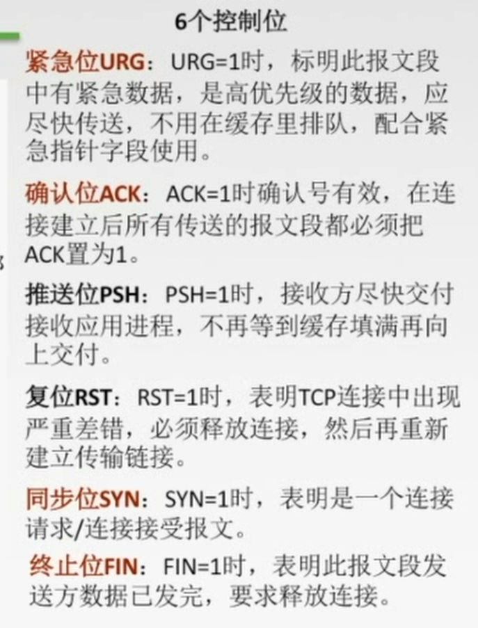

# 5.1 传输层提供的服务

## 5.1.1 传输层的功能

1. 提供进程和进程之间的逻辑通信
2. 复用和分用
   1. 复用：发送方不同的应用进程都可以使用同一个传输层协议传送数据
   2. 分用：接收方的传送层在剥去报文的首部后能够把这些数据正确交付到目的应用进程
3. 传送层对收到的报文进行差错检验
4. 提供两种协议

## 5.1.2 传输层的寻址与端口

端口号长度为16bit

1. 服务端使用的端口号
   1. 熟知端口号(0~1023)：给TCP/IP的一些应用程序
   2. 登记端口号(1024~49151):为没有熟知端口号的应用程序使用
2. 客户端使用的端口号(49152~65535):仅在客户端进程运行时才动态选择

# 5.2 UDP协议

## 5.2.1 UDP数据报

### 1. UDP概述

UDP只在IP数据报服务之上增加了很少功能,即复用分用和差错检测功能

UDP的主要特点:
1. 无连接的,减少开销和发送数据之前的时延.
2. 使用最大努力交付,即不保证可靠交付
3. 面向报文,适合一次性传输少量数据的网络应用
4. 无拥塞控制,适合很多实时应用
5. 首部开销小 8B

### 2. UDP的首部格式

分用时,找不到对应的目的端口号, 就丢弃报文,并给发送方发送ICMP"端口不可达"差错报告报文

### 3. UDP校验

**在发送端**
1. 填上伪首部
2. 全0填充校验和字段
3. 全0填充数据部分(UDP数据报要看成许多4B的字串接起来)
4. 伪首部+首部+数据部分采用二进制反码求和
5. 把求和反码填入校验和字段
6. 去掉伪首部,发送

**在接收端**
1. 填上伪首部
2. 伪首部+首部+数据部分采用二进制反码求和
3. 结果全为1则无差错,否则丢弃数据报或者交给应用层附上出错的警告

# 5.3 TCP协议

## 5.3.1 TCP协议的特点

1. TCP是面向连接(虚连接)的传输层协议
2. 每条TCP连接只能有两个端点,每一条TCP连接只能是点对点的
3. TCP提供可靠交付的服务,无差错、不丢失、不重复、按需到达.
4. 提供全双工通信
   1. 发送缓存:准备发送的数据&已发送但未收到确认的数据
   2. 接收缓存:按序到达但尚未被接收应用程序读取的数据&不按序到达的数据
5. 面向字节流:把应用程序交下来的数据看成仅仅是一连串的无结构的字节流(流:流入到进程或从进程流出的字节序列)

## 5.3.2 TCP报文段

## 5.3.3 TCP连接管理

### 1.TCP连接的建立

1. ROUND 1:
   1. 客户端发送**连接请求报文段**,无应用层数据
   2. SYN=1,seq=x(随机)
2. ROUND 2:
   1. 服务器端为该TCP连接分配缓存和变量,并向客户端返回确认报文段,允许连接,无应用层数据.
   2. SYN=1,ACK=1,seq=y(随机),ack=x+1
3. ROUND 3
   1. 客户端为该TCP连接分配缓存和变量,并向服务器返回确认的确认,可以携带数据.
   2. SYN=0,ACK=1,seq=x+1,ack=y+1
### 2.TCP连接的释放

参加一条TCP连接的两个进程中的任何一个都能终止该连接,连接结束后,主机中的"资源"(缓存和变量)将被释放

1. RUOND 1:
   1. 客户端发送连接释放报文段,停止发送数据,主动关闭连接
2. ROUND 2:
   1. 服务器端回送一个确认报文段,客户到服务器这个方向的连接就释放了--**半关闭状态**
3. ROUND 3:
   1. 服务器端发完数据,就发出连接释放报文段,主动关闭TCP连接
4. ROUND 4:
   1. 客户端回送一个确认报文段,在等到时间等待计时器设置的2MSL后,连接彻底关闭

## 5.3.4 TCP可靠传输

### 1.序号
一个字节占一个序号
**序号字段**指本报文段所发送的数据的第一个字节的序号 

### 2.确认

确认号是期待收到对方的下一个报文段序号的值
TCP默认使用累计确认,即只确认数据流中至第一个丢失字节为止的字节.
例如:
接收方已经收到了0~2和5~8,此时还在等待字节3,所以下一个报文段的确认号字段为3

### 3.重传

#### 超时

TCP的发送方在规定时间内没有收到确认,就要重传已发送的报文段

#### 冗余ACK

每当比期望序号大的失序报文段到达时,发送一个冗余ACK,指明下一个期待字节的序号

当发送方收到3个冗余ACK时,它就可以任务报文段丢失,重传报文段

## 5.3.5 TCP流量控制

TCP利用滑动窗口机制实现流量控制

在通信过程中，接收方根据自己接收**缓存的大小**，动态地调整发送方的发送窗口大小，即接收窗口rwnd(接收方设置确认报文段的窗口字段来将rwnd通知给发送方),发送方的**发送窗口取接收窗口rwnd和拥塞窗口cwnd 的最小值**

## 5.3.6 TCP拥塞控制

**接收窗口**:接收方根据接受缓存设置的指,并告知给发送方,反映接收方容量
**拥塞窗口**:发送方根据自己估算的网络拥塞程度而设置的窗口值,反映网络当前容量

发送窗口$=min${接受窗口,拥塞窗口}

**一个传输轮次**:发送了一批报文段并收到它们的确认的时间.