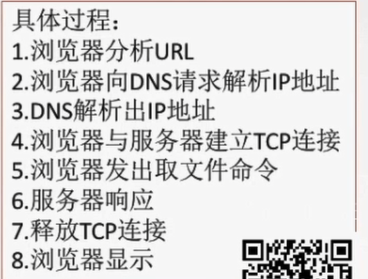
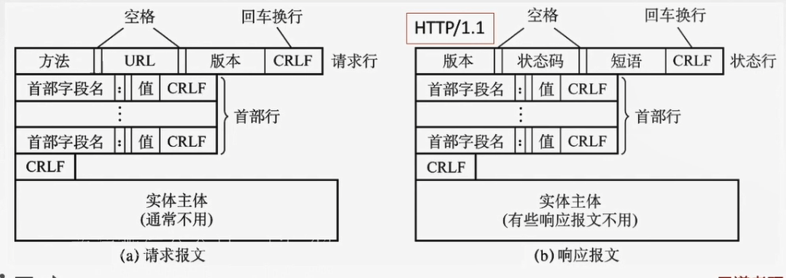

# 6.1 网络应用模型

## 6.1.1 客户/服务器模型

服务器:**提供计算服务**的设备
1. 永久提供服务
2. 永久性访问地址/域名

客户机:**请求计算服务**的主机
1. 与服务器通信,使用服务器提供的服务
2. 间歇性接入网络
3. 可能使用动态IP地址
4. 不与其他客户机直接通信

## 6.1.2 P2P模型

不存在永远在线的服务器
每个主机既可以提供服务,也可以请求服务
任意端系统/节点之间可以直接通讯
节点间歇性接入网络
节点可能改变IP
可扩展性好
网络健壮性强

# 6.2 域名系统

## 6.2.1 层次域名空间

标号:
1. 英文不区分大小写
2. 符号只能使用-
3. 每个标号不超过63个字符,完整域名不超过255个字符

顶级域名:
1. 国家顶级域名
2. 通用顶级域名
3. 基础结构域名/反向域名

二级域名:
1. 类别域名
2. 行政域名

## 6.2.2 域名服务器

1. 根域名服务器
   1. 通常它并不直接把查询的域名直接转换成IP地址,而是告诉本地域名服务器下一步应该找哪个顶级域名服务器进行查询
2. 顶级域名服务器
   1. 管理域名服务器注册的所有二级域名.收到DNS查询请求时,就会给出相应的回答(可能是最后的结果,也可能是下一步应该查找的域名服务器的IP地址)
3. 权限域名服务器
   1. 负责一个区的域名服务器,授权域名服务器总能将其管辖的主机名转换为该主机的IP地址
4. 本地域名服务器
   1. 当一个主机发出DNS查询请求时,这个查询请求报文就发给本地域名服务器

## 6.2.3 域名解析过程

1. 递归查询
2. 迭代查询

# 6.3 文件传输协议

## 6.3.1 FTP的工作流程

允许客户指定文件的类型与格式
基于C/S的协议
提供不同种类主机系统之间的文件传输能力
使用TCP实现可靠传输

**服务器进程:**
1. 主进程:负责接收新的请求
2. 若干从属进程:负责处理单个请求

**工作流程**
1. 打开熟知端口21(控制端口),使客户进程能够连接上
2. 等待客户进程发连接请求
3. 启动从属进程来处理客户进程发来的请求.主进程与从属进程并发执行,从属进程对客户进程的的请求处理完毕后即终止
4. 回到等待状态,继续接收其他客户进程的请求

## 6.3.2 控制连接与数据连接

1. 控制连接:用来传输控制信息
   1. 服务器监听21号端口,等待客户链接,建立在这个端口上的连接称为控制连接.
   2. FTP客户发出的传送请求,通过控制连接发送给服务器端的控制进程,但控制连接并不用来传送文件.
   3. 控制连接一直保持打开
2. 数据连接
   1. 主动模式:使用TCP 20端口
   2. 被动模式:有服务器和客户端自行协商决定

# 6.4 电子邮件

## 6.4.1 电子邮件系统的组成结构

使用TCP连接

1. 用户代理:用户与电子邮件系统的接口
   1. 撰写、显示、邮件处理、通信的功能
2. 邮件服务器
   1. 发送、接收邮件
   2. 向发件人报告邮件的传送结果
3. 协议
   1. SMTP：发送
   2. POP3、IMPA:收

## 6.4.2 电子邮件格式与MIME

### 1. 电子邮件格式

1. 信封
2. 内容
   1. 首部
      1. "To:":发给谁
      2. "Subject:" 标题
   2. 主体

## 2. MIME

扩充信息
## 6.4.3 SMTP和POP3

### 1. SMTP

TCP连接 端口号25 C/S

**通信流程**
1. 连接建立
   1. 发送方将邮件发送到发送方邮件服务器的邮件缓存。
   2. SMTP客户就每隔一段时间对邮件进行扫描。
   3. 发现有邮件，就使用熟知端口号25与接收方建立TCP连
2. 邮件发送
3. 连接释放

**SMTP的缺点**
1. 不能传送可执行文件或者其他二进制对象
2. 仅限于传送7位ASCII码，不能传送其他非英语国家的文字
3. 服务器会拒绝超过一定长度的邮件

### 2. POP3

TCP连接 端口号110 C/S

**工作方式**
1. 下载并保留
2. 下载并删除

### 3. IMAP

更加复杂，可以看到更多信息

# 6.5 万维网

## 6.5.1 WWW的概念与组成结构

## 6.5.2 HTTP

### 1. 操作流程

### 2. HTTP的特点

1. 无状态的(每一次访问服务器都与第一次访问相同)
2. 采用TCP,但HTTP本身是无连接的(通信双方在交换HTTP报文之前不需要先建立HTTP连接)

**HTTP的连接方式**
1. 持久连接
   1. 流水线
   2. 非流水线
2. 非持久连接

### 3. HTTP的报文结构

HTTP报文是面向文本的,在报文中每一个字段都是一些ASCII码串

 