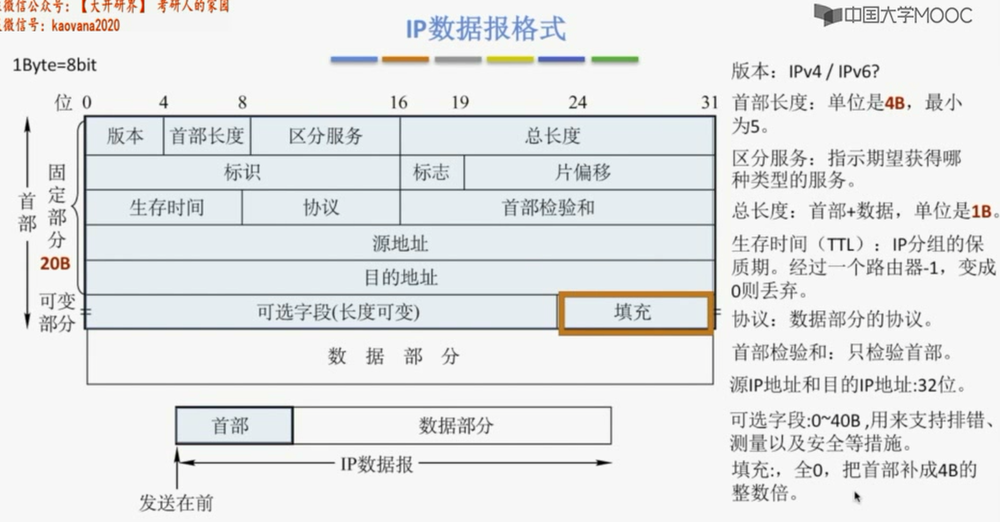
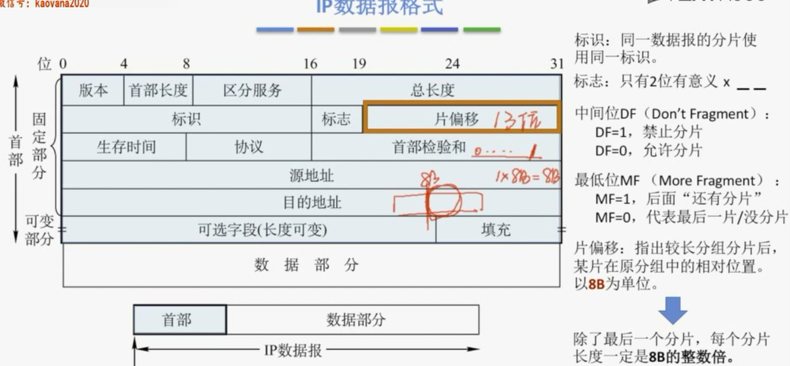
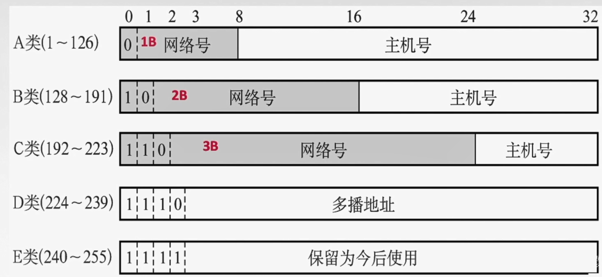
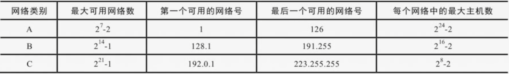
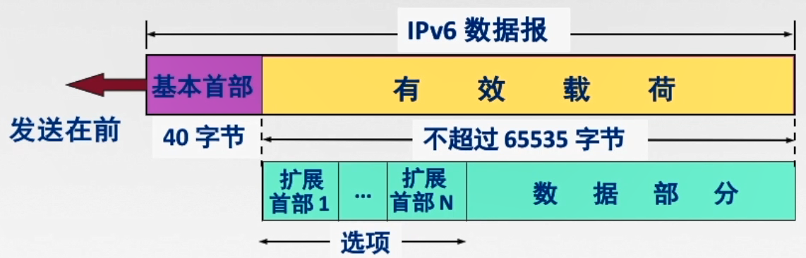
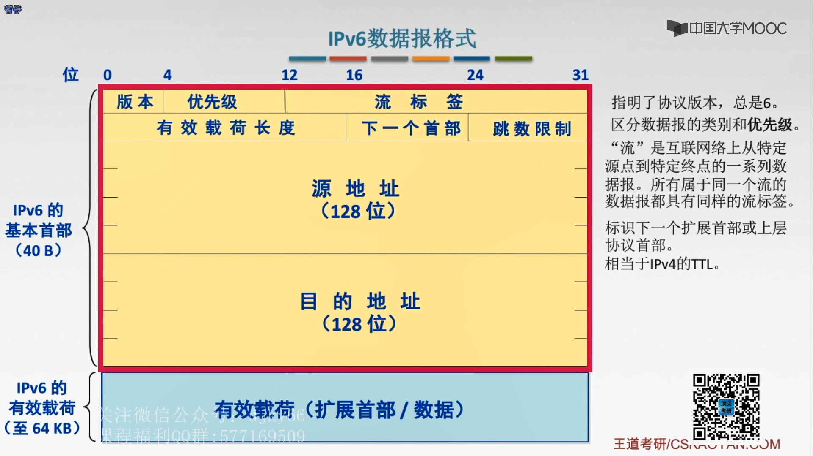
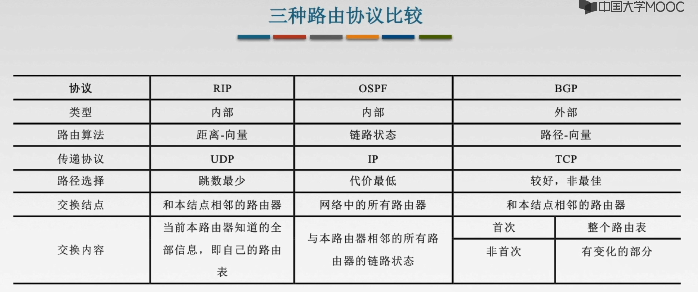
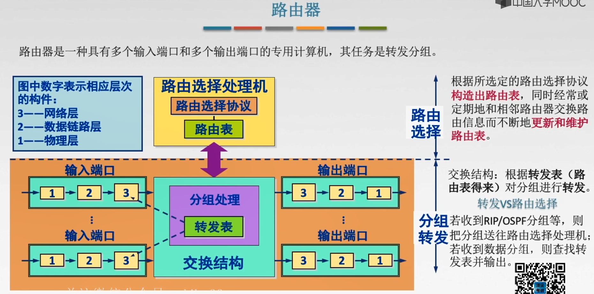
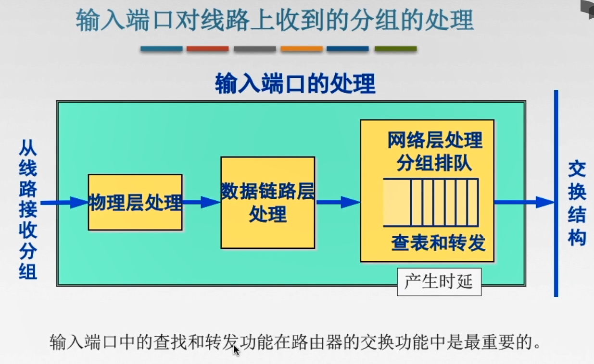
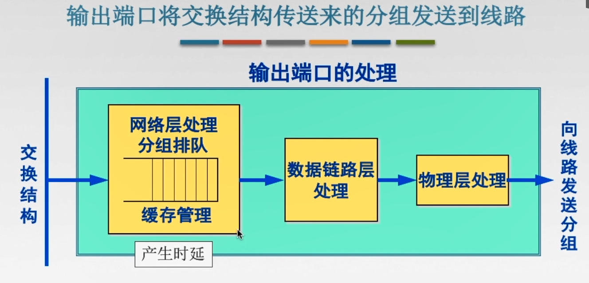

# 4.2 路由算法

## 4.2.1 静态路由与动态路由

1. 静态路由算法(非自适应)：管理员手工配置路由信息
   1. 👍优点：简单、可靠
   2. 👎缺点：路由更新慢，不适用大型网络
2. 动态路由算法(自适应)：路由之间互相交换信息并且优化出最佳路由
   1. 👍优点：路由更新快使，适用大型网络，及时响应链路费用或网络拓扑变化
   2. 👎缺点：算法复杂，增加网络负担

## 4.2.4 分层次的路由选择协议

因特网将整个互联网划分为许多较小的自治系统AS，每个自治系统有权自主地决定本系统内应采用何种路由选择协议
外部看不见内部使用何种协议
# 4.3 IPv4

## 4.3.1 IPv4分组

### 1.IPv4分组的格式

### 2.IP数据报分片

**最大传输单元(MTU)**：数据链路层数据报能承载的最大数据量(以太网是1500字节)

## 4.2.2 IPv4地址与NAT

### 1.IPv4地址

IP地址：全世界唯一的32位/4字节标识符，标识路由器主机的接口
IP地址::=网络号，主机号

**特殊IP地址**
1. 主机号全0表示网络本身
2. 主机号全为1表示网络的广播地址，对特定网络上的所有主机进行广播
3. 127.0.0.0保留位环环自检地址，此地址表示任意主机本身，目的地址位环地址的IP数据包永远不会出现在任何网络上
4. 32位全0，本网络上的本主机
5. 32位全1表示整个TCP/IP网络的广播地址，又称受限广播地址。

### 2.网络地址转换

网络地址转换NAT：在**专用网**连接到**因特网**的路由器上安装NAT软件，安装了NAT软件的路由器将**NAT路由器**，它至少有一个有效的**外部全球IP地址**。

⚠️普通路由器在转发IP数据报时，不改变其源IP地址和目的IP地址。而NAT路由器在转发IP数据报时，一定要更换其IP地址。

## 4.3.3 子网划分与子网掩码、CIDR

### 1.子网划分

1. 子网划分纯属一个单位内部的事情。单位对外部仍然表现为没有划分子网的网络
2. 从主机号借若干比特作为子网号，当然主机号也就相应减少了相同的比特。(主机号至少两位，因为不能全0或全1)

### 2.子网掩码
1对于网络号和子网号，0对应主机号
用子网掩码与IP地址相与，就得到子网网络地址

### 3.无分类域间路由选择(CIDR)

1. 消除了传统的A、B、C类地址以及划分子网的概念
2. 融合了子网地址与子网掩码，方便子网划分
3. CIDR记法：IP地址后加上"/"，然后写上网络前缀的位数。

**构成超网**

将多个子网聚合成一个较大的子网，叫做构成超网，或路由聚合。
将网络前缀取交集

**最长前缀匹配**

从匹配结果中选择具有最长网络前缀的路由

## 4.3.4 ARP、DHCP与ICMP

### 1.IP地址与硬件地址

在网络层及网络层之上使用的是IP地址
硬件地址是数据链路层使用的地址

路由器有多个IP地址和多个硬件地址

### 2.地址解析协议(ARP)

在实际网络的链路上传送数据帧时，最终必须使用物理地址

**ARP协议**：完成主机或路由器IP地址到MAC地址的映射

**ARP协议使用过程**：检查ARP高速缓存，有对应表项则写入MAC帧，没有则用目的MAC地址为全1的帧封装并**广播请求分组**。目的主机收到请求后就会向源主机**单播一个ARP响应分组**，源主机收到后将此映射写入**ARP缓存**

**ARP协议4中典型情况**：
1. 主机A发给本网络上的主机B：用ARP找到主机B的硬件地址
2. 主机A发给另一网络的主机B：用ARP找到本网络上的一个路由器的硬件地址
3. 路由器发给本网络的主机A：用ARP找到主机A的硬件地址
4. 路由器发给另一网络的主机B：用ARP找到本网络上的一个路由器的硬件地址

### 3.动态主机配置协议(DHCP)

DHCP是**应用层**协议，使用**客户/服务器**方式，客户端和服务端通过**广播**方式进行交互，基于**UDP**

DHCP提供即插即用联网的机制，主机可以从服务器动态获取IP地址、子网掩码、默认网关、DNS服务器名称与IP地址，允许**地址重用**，支持**移动用户加入网络**，支持**在用地址续租**

**工作流程**
1. 主机广播DHCP发现报文：试图找到网络中的服务器，服务器获得一个IP地址
2. DHCP服务器广播DHCP提供报文：服务器拟分配给主机一个IP地址及相关配置，先到先得
3. 主机广播DHCP请求报文：主机向服务器请求提供IP地址
4. DHCP服务器广播DHCP确认报文：正式将IP地址分配给主机

### 4.网络控制报文协议(ICMP)

支持主机或路由器报告差错和异常情况

**差错报文**
1. 终点不可达：无法交付报文
2. 源点抑制：拥塞丢数据
3. 时间超过：生存时间(TTL)为0
4. 参数问题：首部字段有问题
5. 改变路由：可通过更好的路由

**不应该发送差错报文的情况**
1. 不会对ICMP的差错发送差错报文
2. 对第一个分片的数据报片的所有后序数据报片都不发送ICMP差错报告报文
3. 对具有组播地址(1点到多点-不是要求所有)的数据报都不发生ICMP差错报告报文
4. 对特殊地址(127.0.0.0)

**询问报文**
1. 回答请求和回答报文：测试目的站是否可达以及了解其相关状态
2. 时间戳请求和回答报文：用来进行时钟同步和测量时间

# 4.4 IPv6

## 4.4.1 IPv6的主要特点

1. IPv6将地址扩大倒128位
2. 将校验和字段彻底移除，以减少每跳的处理时间
3. 将可选 字段移出首部变成了扩展首部
4. 支持即插即用，不需要DHCP协议
5. 首部长度必须是**8B的整数倍**
6. 只能在主机处分片

## 4.4.2 IPv6地址

使用冒号十六进制记法4个为一组

1. 单播：一对一通信 可做源地址和目的地址
2. 多播：一对多通信 可做目的地址
3. 任播： 一对多中的一个通信 可做目的地址

**过渡策略**
1. 双栈协议：在一台设备上同时启用IPv4协议栈和IPv6协议栈
2. 隧道协议：重新封装

# 4.5 路由协议

## 4.2.2 路由信息协议(RIP)

RIP是一种分布式的基于**距离向量**的路由选择协议，是因特网的协议标准，最大优点是**简单**。
要求网络中每一个路由器都维护**从它自己到其他每一个目的的网路的唯一最佳距离记录**(一组距离)

距离：跳数，经过一个路由器+1(RIP要求一条路由最多只能包含15个路由器，距离16表示网络不可达)

**RIP的特点**
1. 仅和相邻路由器交换信息
2. 路由器交换的信息是自己的路由表
3. **每30秒**交换一次路由信息，然后路由器根据新信息更新路由表，若超过180秒没收到邻居路由器的通告，则判定邻居没了，并更新自己路由表。
4. 当网络出现故障时，要经过比较长的时间才能将此信息传送到所用路由器

经过若干次更新后，所有路由器最终都会知道到达本自治系统任何一个网络的最短距离和下一跳的地址。

**距离向量算法**
1. 修改相邻路由器X发来的RIP报文中所**有表项**：把"下一跳"字段中的地址改为X，并把所有的"距离"字段+1
2. 对修改后的RIP报文中的每一个项目，进行以下步骤
   1. 自己路由表中没有目的网络N时，把该项目添加到路由表中
   2. 自己的路由表中有目的网络N，且下一跳路由器是X时，用收到的项目替换自己路由表中的项目
   3. 自己的路由表中有目的网络N，且下一跳路由器不是X，如果收到的项目中距离小于自己的路由表中的距离时，就用收到的项目替换自己路由表中那个的项目，否则不做处理
3. 若180秒还没收到相邻路由器X更新路由表，则把X记为不可达的路由器，即把距离设置为16
4. 返回

RIP是应用层协议，它使用UDP传送数据。
RIP选择的路径不一定是时间最短的，但一定是具有最少路由器的路径。

## 开放最短路径优先协议(OSPF)

使用了分布式的链路状态协议
## OSPF协议的特点
1. 使用洪泛法向自治系统内**所有路由器**发送信息，即路由器通过输出端口向所有相邻的路由器发送信息，而每一个相邻路由器又再次将此信息发往其所有的相邻路由器。
2. 发送信息就是与本路由器**相邻的所有路由器的链路状态**。
3. 只有当链路状态发生变化时，路由器才向所有路由器洪泛发送此信息。

最后所有路由器都能建立一个链路状态数据库，即全网拓扑图。

## 链路状态路由算法
1. 每个路由器发现它的邻居节点【HELLO问候分组】，并了解邻居节点的网络地址
2. 设置到它的每个邻居的成本度量metric
3. 构造【DD数据库描述分组】，向邻站给出自己的链路状态数据库中的所有链路项目的摘要信息。
4. 如果DD分组中的摘要自己都有，则邻站不做处理；如果有没有的或者是更新的，则发送【LSR链路状态请求分组】请求自己没有的和比自己更新的信息。
5. 收到邻站的LSR分组后，发送【LSU链路状态更新分组】进行更新。
6. 更新完毕后，邻站返回一个【LSAck链路状态确认分组】进行确认。

**只要一个路由器的链路状态发生变化：**

1. 洪泛发送【LSU链路状态更新分组】进行更新
2. 更新完毕后，其他站返回一个【LSAck链路状态确认分组】进行确认
3. 使用dijkstra根据自己链路状态数据库构造到其他节点间的最短路径

OSPF直接使用**IP数据报**传送

## 边界网关协议(BGP)

BGP发言人：由管理员设置的路由器，每个AS中至少一个
由BGP发言人与其他BGP发言人来交换路由信息
## BGP的特点
1. BGP**支持CIDR**，因此BGP的路由表也就应当包括目的网络前缀、下一跳路由器，以及到达该目的网络所要经过的各个自治系统序列。
2. 在BGP刚刚运行时，BGP的邻站是交换整个的BGP路由表。但以后只需要在发生变化时更新有变化的部分。

## BGP-4的四种报文
1. OPEN(打开)报文：用来与相邻的另一个BGP发言人建立关系，并认证发送方
2. UPDATE(更新)报文：通告新路径或撤销原路径
3. KEEPALIVE(保活)报文：在无UPDATE时，周期性证实邻站的连通性；也作为OPEN的确认。
4. NOTIFICATION(通知)报文：报告先前报文的差错；也被用于关闭连接。

# 4.6 IP组播

## 4.6.1 组播的概念

组播数据发送者仅发送一次数据，借助组播路由器协议为组播数据包建立组播分发树，被传递的数据到达距离用户端尽可能近的节点后才开始复制和分发(如下一跳就到目标局域网)。

## 4.6.2 IP组播地址

IP组播地址让源设备能够将分组发送给一组设备。属于多播组的设备将被分配**一个组播组IP地址**。

一个D类地址表示一个组播组。只能用于作为分组的目标地址。源地址总是为单播地址。

1. 组播数据报也是"尽最大努力交付"，不提供可靠交付，应用于UDP。
2. 对组播数据包不产生ICMP差错报文
3. 并非所有D类地址都可以作为组播地址。

**硬件组播**

mac地址统一由**01-00-5E**开头，后面地址由IP组播地址后**23**位映射

由于组播IP地址与以太网硬件地址的映射关系不是唯一的，因此收到组播数据报的主机，还要在IP层利用软件进行过滤。

## 4.6.3 IGMP与组播路由器算法

IGMP协议让路由器知道本局域网上是否由主机(的进程)参加或退出了某个组播组

**IGMP工作的两个阶段**
1. ROUND 1：
   1. 某主机要加入组播组时，该主机向组播组的组播地址发送一个IGMP报文，声明自己要称为该租的成员。
   2. 本地组播路由器收到IGMP报文后，要利用组播路由选择协议把这组成员关系发给因特网上的其他组播路由器。
2. ROUND 2：
   1. 本地组播路由器周期性探询本地局域网上的主机，以便知道这些主机是否还是组播组的成员。
   2. 只要有一个主机对某个组响应，那么组播路由器就认为这个组是活跃的；如果经过几次探询后没有一个主机响应，组播路由器就认为本网络上的没有此组播组的主机，因此就不再把这组成员关系发给其他的组播路由器。

组播路由器知道的成员关系至少所连接的局域网中有无组播组的成员

**组播路由选择协议**

组播路由协议目的是找出以源主机为根节点的组播转发树。
构造树可以避免在路由器之间兜圈子。
对不同的多播组对应不同的多播转发树；同一个多播组，对不同的源点也会有不同的多播转发树。

常使用的三种算法：
1. 基于链路状态的路由选择
2. 基于距离-向量的路由选择
3. 协议无关的组播(稀疏/密集)

# 4.7 移动IP

## 4.7.1 移动IP的概念

移动IP技术是移动结点以**固定的网络IP地址**,实现跨越不同网段的**漫游**功能,并保证了基于网络IP的网络权限在漫游过程中不发生任何改变.

1. 移动结点:具有永久IP地址的移动设备
2. 归属代理(本地代理):一个移动结点的永久"居所"称为归属网络,在归属网络中代表移动节点执行移动管理功能的实体叫做归属代理.
3. 永久地址(归属地址/主地址):移动站点在归属网络中的原始地址
4. 外部代理(外地代理):在外部网络中帮助移动节点完成移动管理功能的实体称为外部代理
5. 转交地址(辅地址):可以是外部代理的地址或动态配置的一个地址

## 4.7.2 移动IP通信过程

1. 刚进入外部网络
   1. 获得外部代理的转交地址
   2. 移动节点通过外部代理发送注册报文给归属代理
   3. 归属代理接收请求,并将移动节点的永久地址和转交地址绑定,并返回一注册响应报文
   4. 外部代理接收注册响应,并转发给移动节点
2. 移动到了一个新的网络
   1. 在新的外部代理登记注册一个转交地址
   2. 新外部代理给本地代理发送新的转交地址(覆盖旧的)
   3. 通信
3. 回到了归属网络
   1. 向本地代理注销转交地址
   2. 按原始方式通信

# 4.8 网络层设备

