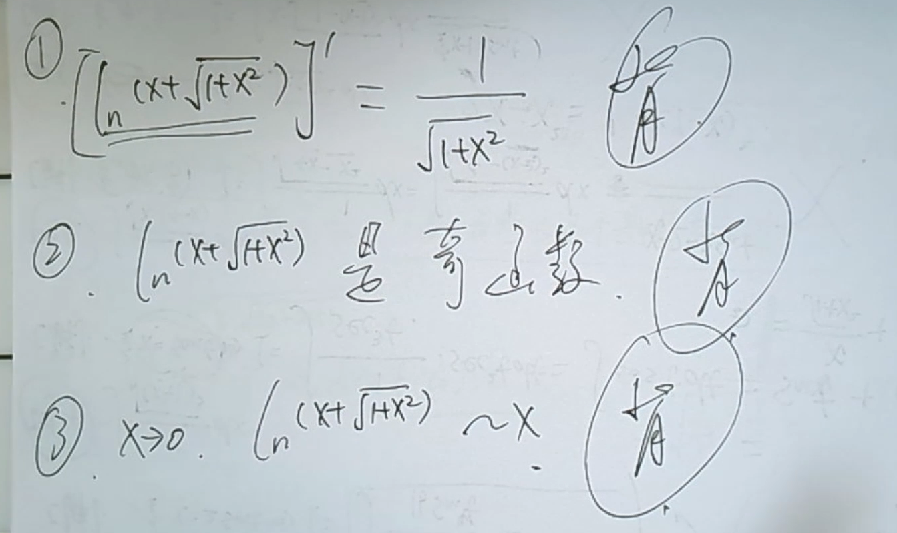

#有理函数的积分
##一、通用方法
**1️⃣、将真分式的分母进行因式分解(一直分解到无法再分解为止)**
**2️⃣、然后进行裂项，裂项原则如下：**
①只要分母中含有$(x-a)^k$,则裂项后的式子中一定含有$\displaystyle \frac{A_1}{x-a}+\displaystyle \frac{A_2}{(x-a)^2}+\cdots+\displaystyle \frac{A_k}{(x-a)^k}$
②只要分母中含有$(x^2+px+q)^k$ 🚩(已经无法分解了,所以$p^2-4q<0$)，则裂项后的式子中一定含有$\displaystyle \frac{B_1x+C_1}{x^2+px+q}+\displaystyle \frac{B_2x+C_2}{(x^2+px+q)^2}+\cdots+\displaystyle \frac{B_kx+C_k}{(x^2+px+q)^k}$
**3️⃣、将裂项后的所有项进行同分，根据"通分后的分子与原被积函数的分子应该相等"的原则，列出待定系数所满足的方程，解出待定系数。**
**4️⃣、对于①中所得的一系列基本分式$\displaystyle \frac{A}{(x-a)^k}$，它们的积分十分容易
$\qquad$对于②中所得的一系列基本分式$\displaystyle \frac{Bx+C}{(x^2+px+q)^k}$在考研中k一般为1或2**

$\displaystyle \int \displaystyle \frac{Bx+C}{x^2+px+q}dx \rightrightarrows$**改造分子，拆分为两个积分，其中第一个积分直接凑微分，第二个积分配方后套公式即可**。

**例题**
$\displaystyle \int \frac{x^2}{(a^2+x^2)^2} dx$

**法1：** 三角换元

**法2：** 使用分部积分降低分母次数 🔥🔥🔥🔥

$\displaystyle \frac{1}{2} \int \frac{x}{(a^2+x^2)^2} dx^2 \rightrightarrows \displaystyle -\frac{1}{2}\int x d(\frac{1}{a^2+x^2}) \rightrightarrows -\frac{1}{2}\cdot x \cdot \frac{1}{a^2+x^2}+\frac{1}{2}\int \frac{1}{a^2+x^2}dx=-\frac{1}{2}\cdot \frac{x}{a^2+x^2}+\frac{1}{2}\cdot \frac{1}{a} \arctan \frac{x}{a}+C$

**例题：**

$\displaystyle \int \frac{1}{1+x^3}dx\rightrightarrows \int \frac{1}{(1+x)(1-x+x^2)}dx$立法和公式$(a^3+b^3)\rightrightarrows(a+b)(a^2-ab+b^2)$

**例题：**
若不定积分$\displaystyle \int \frac{x^2+ax+2}{(x+1)(x^2+1)}dx$的结果中不含反正切函数，求a。

**待定系数法**

$\displaystyle \int \frac{A}{x+1}+\frac{Bx+C}{x^2+1}dx\rightrightarrows C=0$

##二、特殊解法
**具体问题具体分析**

$\displaystyle \int \frac{1}{1-x^4}dx$

$\displaystyle \int \frac{1+x^4}{1+x^6}dx$ ⚠️

$\displaystyle \int \frac{1+x^2}{1+x^4}dx$可以推广到所有$\displaystyle \int \frac{1+x^2}{1+kx^2+x^4}dx$

#三角函数积分
##万能公式
次方太高不建议使用，能用其他的不用。
##特殊解法
###缩分母
1. 对于分母为$1+\cos x$或$1+\sin x$的积分，分子分母同时乘以共轭表达式。
2. 可以使用二倍角公式
3. 辅助角公式$\\\begin{cases}
\sin x+\cos x=\sqrt{2}\sin(x+\frac{\pi}{4}) \\
   \sin x-\cos x=\sqrt{2}\sin(x-\frac{\pi}{4})
\end{cases}$
##$R(\sin x,-\cos x)=-R(\sin x,\cos x)$
想办法把$\cos x$凑到$dx$里。

##$R(-\sin x,\cos x)=-R(\sin x,\cos x)$
想办法把$\sin x$凑到$dx$里。

##$R(-\sin x,-\cos x)=R(\sin x,\cos x)$
想办法把$\sec^2 x$凑到$d\tan x$里。

## $\displaystyle \int\frac{A\sin x+B\cos x}{C\sin x+D\cos x}dx$
假设$分子=P分母+Q(分母)'$

## 当被积函数出现不同角度
先同一角度

## $\displaystyle \int\sin Ax\cos Bxdx$
积化和差

# 换元法

1. 整体换元
   1. 根号整体换元
2. 三角换元
   1. 视情况而定
      1. $\int\frac{1}{(x+d)^2\sqrt{ax^2+bx+c}}dx$或者$\int\frac{1}{(x+d)\sqrt{ax^2+bx+c}}dx$令$x+d=\frac{1}{t}$
      2. 

# 分部积分法