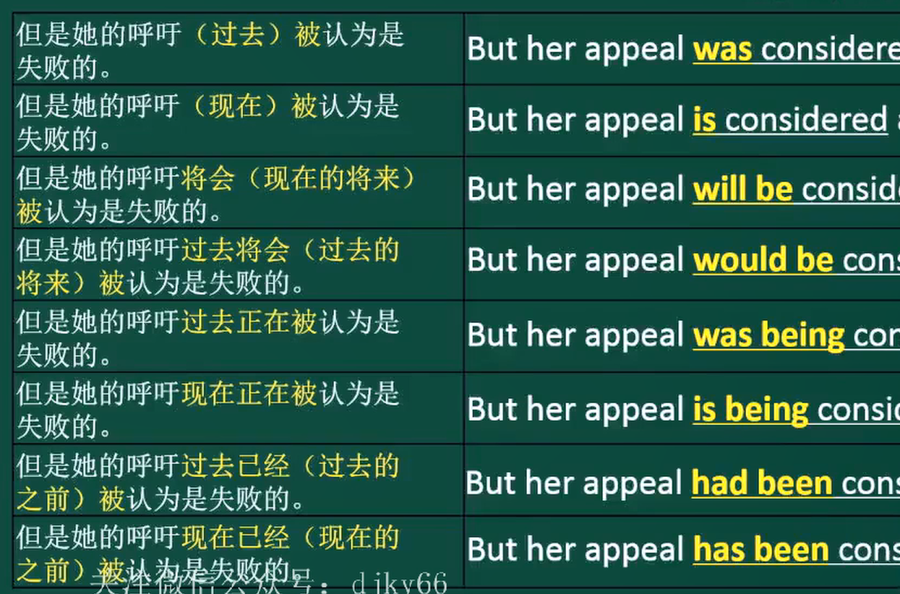

# 第一章简单句的核心
## 第一节 简单句的核心变化
- 谓语v.类
  1. 有实义
     1. 不及物动词vi
        1. 主谓
     2. 及物动词vt
        1. 主谓宾
        2. 主谓双宾
           1. v+人+物
           2. v+物+介词+人
        3. 主谓宾补(在宾语和补语之间加上一个"是"能够完整的连成一个意思)
  2. 无实义
     1. (连)系动词$\Rightarrow$主系表
        1. be动词(单独使用)
        2. get becom turn go grow(变得)
        3. look sound smell taste feel(感官动词)
        4. seem appear(似乎是)keep remain(保持是)
## 用法
1. 简化句子 (不及物动词)
   I $\color{red}{despaired}$ at the singular lack of imagination about girls lives and interests.
   句子的核心到主谓就以及结束了，不及物动词后面的都是额外的补充说明**可以先不看**。
2. 找到分裂结构 (及物动词)
   I $\color{red}{found}$, as Hacker oberved years before,that .....
   没说完被","打断了，有可能出现了插入语，**可以先不看**。
3. 判断从句
   1. 宾语从句-及物动词后
   2. 表语从句-系动词后

## 第二节 简单句的核心变化

谓语无论怎么变都是一个整体
1. **谓语的时态**
   1. 一般：**不强调进行也不强调完成**
      1. 一般过去时 ⚠️
         - did
      2. 一般现在时(可以表示永恒) ⚠️
         - do/dose(可数名词单数和不可数也要用三单)
      3. 一般将来时 ⚠️
         - will do
         - is/am/are going to do
      4. 过去将来时 ⚠️
         -  would do
         -  was/were going to do
   2. 进行：**强调正在进行**
      1. 过去进行时 ⚠️
         - was/were doing
      2. 现在进行时 ⚠️
         - is/am/are doing 
      3. 将来进行时(更加确定会发生) 
         - will be(这个be不能变) doing
   3. 完成：**强调结果(做没做完都可以)，搭配延续的动作可以表示一个时间段**
      1. 过去完成时：**过去的之前发生的事情**，过去完成时发生在前一般过去时发生在后。 ⚠️
         - had done
      2. 现在完成时：**现在的之前** ⚠️
         - have/has (long/just/ever...强调多久时间) done
         - 区别一般过去时
           1. 现在全部完成，可以换成过去时
           2. 现在部分完成，不能换成过去时
      3. 将来完成时：**将来的之前** 
         - will have done
   4. 完成进行：**比起完成时更强调过程** ❌
      1. 过去完成进行时
         - had been doing
      2. 现在完成进行时
         - have/has been doing
      3. 将来完成进行时
         -  will have been doing
2. **谓语的情态：**
   1. **情态动词+动词原型** ⚠️
   2. 情态动词的时态变化有限
      1. 只有现在时与过去时(在口语中还可以表示客气委婉)
   3. 情态动词没有人称变化
   4. 情态动词表示**情态**
      1. must--必须
      2. can/could--能够/可以
      3. will/would--将要/愿意
      4. may/might--可以/可能
      5. should--应该
   5. 情态动词表示**推测** ❌
      1. 情态动词+do：推测现在
      2. 情态动词+doing：推测现在进行
      3. 情态动词+have done：推测过去
3. **谓语的语态**
   1. 被动语态:**be+done**
      1. be:被动的时间(各种时态)
      2. done：被动的动作
      3. 主语的单复数
      4. **强调被谁做的+by** ⚠️
      5. 
4. **谓语的否定 ❌**
   1. 实义动词变否定:**加助动词**
      1. **do/does/did+not+动词原形**
   2. 助动词和情态动词变否定
      1. +not
      2. 出现多个优先处理第一个

主/宾/表的成分
1.  名词/代词
2.  非谓语动词
    1.  doing
    2. to do
       - 作**主语**时通常放在句末，用it作形式主语
       - 作**宾语**时不能放在介词后，(宾语也可以用it当作形式宾语)
3. 并列多个

# 简单句的扩展
## 词性角度的扩展
1. **限定词(不用重点掌握)**
   1. 表示分数
      1. 数(1,2,3,4,5)+序数词(第1，第2，第3)
         1. 例如：
         2. one third
         3. two thirds当分子大于1时分母加s
2. **形容词、副词**
   1. 作修饰成分
      1. 形容词修饰名词
         1. 在名词旁边$\rightarrow$定语
         2. 系动词后$\rightarrow$表语
      2. 副词修饰动词、句子、其他的形容词副词
         1. 作状语
   2. 比较级别
      1. 原级比较
         - as + 形容词/副词原形 + as + 比较对象
      2. 比较级
         1. 形容词/副词的比较级 (+ than + 比较对象)
         2. 通常指两者之间的比较
      3. 最高级
         1. the + 形容词/副词的最高级 + (介词短语表示比较范围)
         2. 通常是三者以上的比较
3. **介词短语**(后面只能接 名词 代词 doing)
   1. 表示时间的介词
      1. at/on/in
         - 在$\cdots $时间点/时间上/时间内
      2. before/after
         - 在$\cdots $时间之前/之后
      3. form/since
         - 自从$\cdots $时间
      4. by/until
         - 截止到$\cdots $时间
      5. for
         - 持续$\cdots $时间
      6. during
         - 在$\cdots $期间
   2. 表示地点和范围 
      1. at/in
         - 在$\cdots $地点/在$\cdots $里面
      2. on,above,over/under,below
         - 在$\cdots $上面/下面
      3. in front of/behind
         - 在$\cdots $之前/之后
      4. near,by,beside
         - 在$\cdots $旁边
      5. between,among
         - 在$\cdots $之间
   3. 其他用法
      1. of
         1. $\cdots $的$\cdots $表示属性
         2. A of B翻译为B的A
      2. about
         1. 关于
      3. with/without
         1. 伴随着有$\cdots $/没有$\cdots $
      4. for
         1. 为了$\cdots $
            1. 表目的
         2. 因为$\cdots $
            1. 表原因
         3. 对于$\cdots $
            1. 表对象
      5. by
         1. 通过$\cdots $方式或方法
         2. 被$\cdots $做(被动语态)
         3. 相差了$\cdots $
            1. 表示变化的差额
      6. as
         1. 作为
         2. 像$\cdots $一样，如同$\cdots $
      7. like
         1. 像$\cdots $一样
      8. despite
         1. 尽管$\cdots $