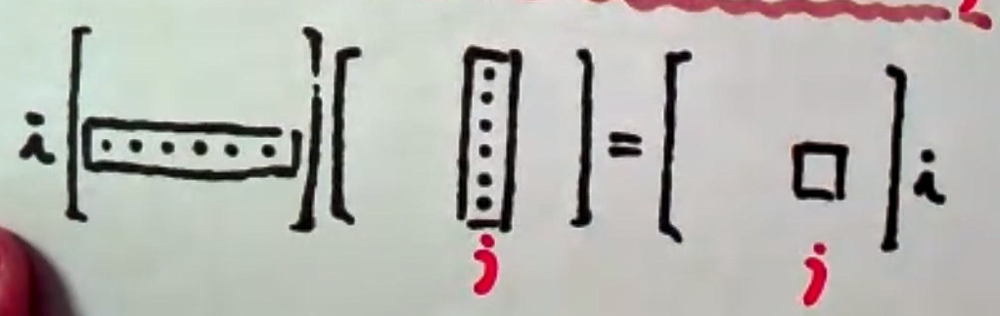

# 一、矩阵的概念与运算

## 1、矩阵的概念

**定义:** 

$\qquad$$m\times n$个数排列成m行n列的一个表格称为是一个$m\times n$**矩阵**，当m=n时，矩阵A称为**n阶矩阵**或**n阶方阵**。

$\qquad$如果一个矩阵的所有元素都是**0**，则称这个矩阵是**零矩
阵**，可简记成$0$。

$\qquad$如果A和B都是$m\times n$矩阵称A和B是**同型矩阵**。

$\qquad$如果两个同型矩阵A,B对应元素都相等，则**A与B相等**。

$\qquad$n阶方阵A的元素构成的行列式称为n阶矩阵A的行列式，记作|**A**| 或者 **detA**

****

## 2、矩阵的运算

$\color{green}{定义:}$

$\qquad$ **加法：** 两个同型矩阵可以相加，且$A+B=[a_{ij}]_{m\times n}+[b_{ij}]_{m\times n}=[a_{ij}+b_{ij}]_{m\times n}$

$\qquad$ **数乘：** $kA=k[a_{ij}]_{m\times n}=[ka_{ij}]_{m\times n}$

$\qquad$ **乘法：** $A[a_{ij}]_{m\times s},B[b_{ij}]_{s\times n}\rightarrow AB=C=[c_{ij}]_{m\times n}$，其中$C$的第$i$

行、第$j$列元素$c_{ij}$是$A$的第$i$行和$B$的第$j$列对于元素乘积之和。

$\qquad$ **转置：** 将$m\times n$型矩阵$A=[a_{ij}]_{m\times n}$的行列互换得到的$n\times m$型矩阵$[a_{ij}]_{m\times n}$称
为A的转置矩阵，记为$A^T$

****

**运算法则**

转置：

$(A+B)^T=A^T+B^T$

$(kA)^T=kA^T$

$(AB)^T=B^TA^T$  ⚠️注意要换位置

$(A^T)^T=A$

****

⚠️⚠️⚠️⚠️⚠️**易错点**⚠️⚠️⚠️⚠️

🥇$AB\ne BA$

🥈$AB=0 \nrightarrow A=0或B=0$

🥉$AB=AC,A\ne 0\nrightarrow B=C$

****

**对角矩阵**
$\begin{bmatrix}a_1&0&0\\0&a_2&0\\0&0&a_3\end{bmatrix}\begin{bmatrix}b_1&0&0\\0&b_2&0\\0&0&b_3\end{bmatrix}=\begin{bmatrix}a_1b_1&0&0\\0&a_2b_2&0\\0&0&a_3b_3\end{bmatrix}$

🥇$\Lambda_1\Lambda_2=\Lambda_2\Lambda_1$

🥈$\begin{bmatrix}a_1&0&0\\0&a_2&0\\0&0&a_3\end{bmatrix}^n=\begin{bmatrix}a_1^n&0&0\\0&a_2^n&0\\0&0&a_3^n\end{bmatrix}$

🥉$\begin{bmatrix}a_1&0&0\\0&a_2&0\\0&0&a_3\end{bmatrix}^{-1}=\begin{bmatrix}\frac{1}{a}&0&0\\0&\frac{1}{a}&0\\0&0&\frac{1}{a}\end{bmatrix}$

# 二、伴随矩阵、可逆矩阵

## 1.伴随矩阵的概念与公式

$\color{green}{伴随矩阵：}$

$\qquad$由矩阵A的行列式|**A**|所有的代数余子式所构成的矩阵称为矩阵A的伴随矩阵记为$A^*$
$$
\displaystyle\begin{bmatrix}A_{11}&A_{21}&\cdots &A_{n1}\\A_{12}&A_{22}&\cdots &A_{n_2}\\\vdots&\vdots&&\vdots\\A_{1n}&A_{2n}&\cdots&A_{nn}\end{bmatrix}
$$

$\color{green}{伴随矩阵的公式:}$
$$
AA^*=A^*A=|A|E
$$
$$
(A^*)^{-1}=(A^{-1})^*=\frac{1}{|A|}A(|A|\ne 0)
$$
$$
(kA)^*=K^{n-1}A^*
$$
$$
(A^*)^T=(A^T)^*
$$
$$
|A^*|=|A|^{n-1}
$$
$$
(A^*)^*=|A|^{n-2}A(n\geq 2)
$$

**二阶矩阵的伴随矩阵：** 主对角线互换，副对角线
## 2.可逆矩阵的概念与定理
$\color{green}{定义}$

$\qquad$设$A$是$n$阶矩阵，如果存在$n$阶矩阵$B$使得
$$
AB=BA=E(单位矩阵)
$$
成立，则称$A$是**可逆矩阵**或**非奇异矩阵**，$B$是$A$的逆矩阵，记成$A^{-1}=B$

$\color{green}{定理}$

1. 若$A$可逆，则$A$的逆矩阵唯一
    - 证明：
    1. 设B，C都是A的逆矩阵
    2. 即AB=BA=E，AC=CA=E
    3. B=BE=B(AC)=(BA)C=EC=C
2. $A$可逆$\rightleftarrows$$|A|\ne 0$ 
3. 设$A$和$B$是$n$阶矩阵且$AB=E$，则$BA=E$

## 3.n阶矩阵可逆的充分必要条件
1. 存在$n$阶矩阵$B$，使$AB=E$或$BA=E$
2. $|A|$，或秩$r(A)=n$，或$A$的列(行)向量线性无关
3. 齐次方程组$Ax=0$只有零解
4. 对于所有$b$，非齐次方程组$Ax=b$总有唯一解
5. 矩阵$A$的特征值全不为0

## 4.逆矩阵的运算性质 
1. 若$A$可逆$A^{-1}$也可逆
   - $(A^{-1})^{-1}=A$
2. 若$A$可逆且$k\ne 0$
   - $(kA)^{-1}=\displaystyle\frac{1}{K}A^{-1}$
3. 若$A，B$可逆
   - $(AB)^{-1}=B^{-1}A^{-1}$,特别的$(A^2)^{-1}=(A^{-1})^2$
4. 若$A^T$可逆
   - $(A^T)^{-1}=(A^{-1})^T$
   - $|A^{-1}|=\displaystyle\frac{1}{|A|}$

## 5.求逆矩阵的方法
1. 定义法
   1. AB=E
2. 用伴随：⚠️2阶最好，3阶也能用
   1. $A^{-1}=\frac{1}{|A|}A^*$
3. 初等变换
4. 分块矩阵
   1. $\begin{bmatrix}A&0\\0&B\end{bmatrix}^{-1}=\begin{bmatrix}A^{-1}&0\\0&B^{-1}\end{bmatrix}$
   2. $\begin{bmatrix}0&A\\B&0\end{bmatrix}^{-1}=$$\begin{bmatrix}0&B^{-1}\\A^{-1}&0\end{bmatrix}$

# 三、初等变换、初等矩阵

## 1. 初等变换与初等矩阵的概念
$\color{green}{定义}$(初等变换)$\qquad$设$A$是$m\times n$矩阵
1. 用某个非零常数k乘A的某行(列)的每个元素
2. 互换A的某两行(列)的位置
3. 将A的某行(列)元素的k倍加到另一行(列)

$\color{green}{定义}$(初等矩阵)$\qquad$由单位矩阵经一次初等变换得到的矩阵称为初等矩阵。以三阶为例：
1. 倍乘初等矩阵，E(i(k))
   1. $E(2(k))=\begin{bmatrix}1&0&0\\0&k&0\\0&0&1\end{bmatrix}$
   2. E(2(k))表示由单位矩阵E的第二行(或第二列)乘k倍得到的矩阵
2. 互换初等矩阵，E(i,j)
   1. $E(1,2)=\begin{bmatrix}0&1&0\\1&0&0\\0&0&1\end{bmatrix}$
3. 倍加初等矩阵，E(ij(k))
   1. $E(13(k))=\begin{bmatrix}1&0&0\\0&1&0\\k&0&1\end{bmatrix}$
   2. 看成行变换时：第一行的k倍加到第三行得到的矩阵
   3. 看成列变换，第三列的k倍加到第一列得到的矩阵

## 2.初等矩阵与初等变换的性质
1. 初等矩阵的转置仍是初等矩阵
2. 初等矩阵均是可逆矩阵，且其逆矩阵仍是初等矩阵
   1. $E(i,j)^{-1}=E(i,j)$
   2. $E(i(k))^{-1}=E(i(\frac{1}{k}))$
   3. $E(ij(k))^{-1}=E(ij(-k))$
3. 用初等矩阵P左乘(右乘)A，其结果PA(AP),相当于对于A作相应初等行(列)变换。

$\color{green}{定理}$$\qquad$矩阵A可逆$\rightleftharpoons$它能够表示一些初等矩阵的乘积
$$
P_N\cdots P_2P_1A=E
$$

## 3.行阶梯矩阵，行最简矩阵
**行阶梯矩阵**
1. 如果矩阵中有零行，则零行在矩阵的底部
2. 每个非零的主元(该行最左边的第一个非零元)，它们的所在的列下面都是0

**行最简矩阵**
1. 是阶梯矩阵
2. 非零行的主元都是1，且主元所在的列的其他元素都是0，则称其为**行最简矩阵**

$\qquad$如$A\xrightarrow{行变换}B$，即$P_t\cdots P_2P_1A=B$，记$P=P_t\cdots P_2P_1$有$PA=B$
$\qquad$由$P_t\cdots P_2P_1A=B$和$P_t\cdots P_2P_1E=P$表明当$A$经行变换得到$B$时，$E$在同样的行变换下得到$P$，即$(A┇E)\rightarrow(B┇P)$

$\color{green}{定义}$(等价矩阵)$\qquad$矩阵$A$经过有限次初等变换变成矩阵$B$，则成$A$与$B$等价，记成$A\cong B$。若$A\cong\begin{bmatrix}E_r&0\\0&0\end{bmatrix}$,则后者称为$A$的等价标准形。
$$
A\cong B\rightleftarrows r(A)=r(B)
$$
$\qquad$设A是$m\times n$矩阵，则存在$m$阶可逆矩阵$p$和$n$阶可逆矩阵Q，使

$$
PAQ=\begin{bmatrix}E_r&0\\0&0\end{bmatrix}
$$
即任何一个矩阵经过一系列的行、列变换可以化乘等价标准型

# 四、分块矩阵
$\qquad$将矩阵用若干纵线和横线分成许多小块，每一块称为原矩阵的子矩阵，把子矩阵看成原矩阵的一个元素，则原矩阵叫做分块矩阵。

## 五、方阵的行列式
$\color{orange}{抽象n阶方阵行列式公式}$

若A是n阶矩阵

1. $|A^T|=|A|$
2. $|kA|=k^n|A|$
3. $|AB|=|A||B|$
   1. $特别的|A^2|=|A|^2$
4. $|A^*|=|A|^{n-1}$
5. $|A^{-1}=|A|^{-1}$
6. 设A是n阶矩阵，B是m阶矩阵
   1. $\begin{bmatrix}A&0\\C&B\end{bmatrix}=\begin{bmatrix}A&D\\0&B\end{bmatrix}=|A|\cdot|B|$
   2. $\begin{bmatrix}0&A\\B&C\end{bmatrix}=\begin{bmatrix}D&A\\B&0\end{bmatrix}=(-1)^{nm}|A|\cdot|B|$
7. 如$A\approx B$
   1. $|A|=|B|$
   2. $|A+kE|=|B+kE|$
   3. 一般$|A+B|\neq |A|+|B|$