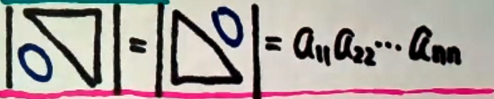
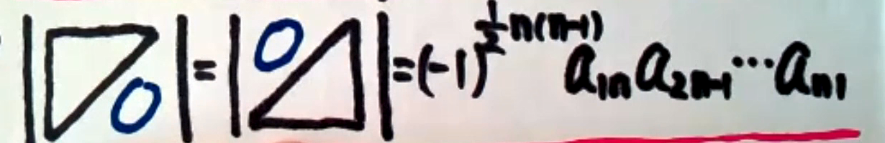

# 第一章 行列式
## 一、行列式的概念
**行列式是一个是==数==，他是不同行不同列元素乘积的代数和。**
主对角线\ - 副对角线/
### 1、排列、逆序、逆序数
$\quad$**由1，2，...n组成的有序数组称为一个n排序.通常用$j_1 j_2 ... j_n$表示为n阶行列式排序。**
例如： 
$\qquad$2413$\Rightarrow$4阶排列
$\qquad$13542$\Rightarrow$5阶排列
**一个排序中，如果一个大的数排在一个小的数的前面，就称这两个数构成一个逆序。**
**一个排序的逆序的总数称为这个排序的逆序数。用$\tau(j_1j_2...j_n)$表示排列$j_1j_2...j_n$的逆序数。**
**如果一个排列的逆序数是偶数，则称这个排列是==偶排列==，否则称为==奇排列==。**
    $\tau(132)=0+1$奇排列
    $\tau(2431)=1+2+1=4$偶排列
    $123...n$自然排列(偶排列，没有逆序数)

### 2、n阶行列式
$\begin{vmatrix}
a_{11}&a_{12}&\cdots&a_{1n}\\
a_{21}&a_{22}&\cdots&a_{2n}\\
\vdots&\vdots&\ddots&\vdots\\
a_{n1}&a_{n2}&\cdots&a_{nn}\\
\end{vmatrix}=\displaystyle\sum_{j_1j_2...j_n}(-1)^{\tau j_1j_2...j_n}a_{1j_1}a_{2j_2}...a_{nj_n}$(奇排列为负，偶排列为正)

**四阶及以上必须用展开公式处理**
##二、行列式的性质
**性质1:** 经过转置的行列式的值保持不变，即$|$**$A$**$^T|=|$**$A$**$|$.

$\begin{vmatrix}a_1&a_2&a_3\\b_1&b_2&b_3\\c_1&c_2&c_3\end{vmatrix}=\begin{vmatrix}a_1&b_1&c_1\\a_2&b_2&c_2\\a_3&b_3&c_3\end{vmatrix}$

**性质2:** 某行如有公因子K,则可把K提出到行列式记号外。
1）如果某行(或列)的元素全为0，行列式的值为0。

**性质3:** 两行互换位置，行列式的值变号。
1）两行相同，行列式的值为0.
2）若两行(或列)的元素对应成比例，行列式的值为0。

**性质4：** 如果行列式某行每一项都是两个数之和，则可以把行列式拆成两个行列式相加。

**性质5:** 把某行的$K$倍加到另一行，行列式的值不变。

## 三、行列式按行(列)展开公式

在行列式D中划去$a_{ij}$所在的第$i$、第$j$列，由剩下的元素按原来的位置排法构成的一个n-1阶的行列式，称为$a_{ij}$的**余子式**，记为$M_{ij}$ ;称$(-1)^{i+j}M_{ij}$为$a_{ij}$的代数余子式，记为$A_{ij}$。

$\color{green}{定理}$: n阶行列式等于它的任一行(列)元素与其对应的代数余子式乘积之和。

**$|A|$** $= a_{i1}A_{i1} + a_{i2}A_{i2} + ...a_{in}A_{in} =\displaystyle\sum_{k=1}^na_{ik}A_{ik},\qquad i=1,2...n$

**$|A|$** $= a_{1j}A_{1j} + a_{2j}A_{2j} + ...a_{nj}A_{nj} =\displaystyle\sum_{k=1}^na_{kj}A_{kj},\qquad j=1,2...n$

$\color{green}{定理}$:行列式的任一行(列)元素与另一行(列)元素的代数余子式乘积之和为0.

**$|A|$** $= a_{i1}A_{j1} + a_{i2}A_{j2} + ...a_{in}A_{jn} =\displaystyle\sum_{k=1}^na_{ik}A_{ik},\qquad i\neq j$

**特殊情况**
1）上(下)三角行列式的值等于主对角线元素的乘积

2）关于副对角线的行列式

3）两个特殊的拉普拉斯展开式
如果**A**和**B**分别是m阶和n阶矩阵，则：
$\displaystyle\begin{vmatrix}A&*\\0&B\end{vmatrix}=\displaystyle\begin{vmatrix}A&0\\*&B\end{vmatrix}=|$**A**$|\times |$**B**$|$

$\displaystyle\begin{vmatrix}0&A\\B&*\end{vmatrix}=\displaystyle\begin{vmatrix}*&A\\B&0\end{vmatrix}=(-1)^{mn}|$**A**$|\times |$**B**$|$

4）范德蒙行列式
$\displaystyle\begin{vmatrix}
1&1&\cdots&1\\
x_1&x_2&\cdots&x_n\\
x_1^2&x_2^2&\cdots&x_n^2\\
\vdots&\vdots&\vdots&\vdots\\
x_1^{n-1}&x_2^{n-1}&\cdots&x_n^{n-1}\\
\end{vmatrix}=\displaystyle\prod_{1\leq j<i\leq n} (x_i-x_j)$

## 四、克拉默法则
$\qquad$若n个方程n个未知量构成的非齐次线性方程的系数行列式|**A**|$\ne0$，则方程有唯一解，且
$$
x=\displaystyle\frac{|A_i|}{|A|},i=1,2,\cdots ,n
$$
其中|**$A_i$**|是|**A**|中的第i列元素替换成方程组右端的常数项$b_1,b_2\cdots b_n$所构成的行列式。

$\color{green}{推论}\qquad$若包含n个方程nge未知量的齐次方程组的系数行列式|**A**|$\ne 0$的充要条件是方程组有唯一零解
$\qquad$反之，若齐次线性方程有非零解，充要条件是其系数行列式|**A**|=0。