#一、现在
#1、一般现在时态
**默认的没有特别指出的动作状态**
+动词原型
+动词原型+s(第三人称单数)
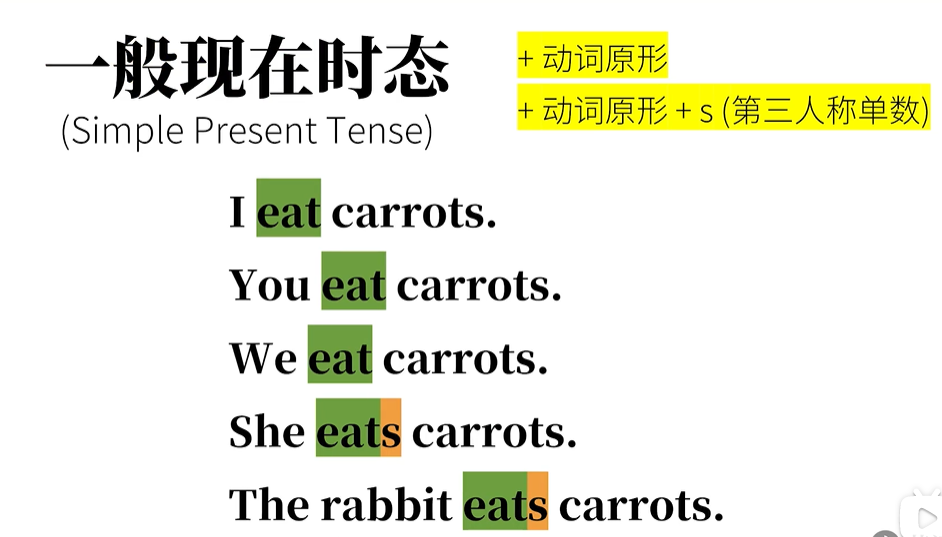
##常见的三种形态
###1.表达事实
**没有状态、时间限制**
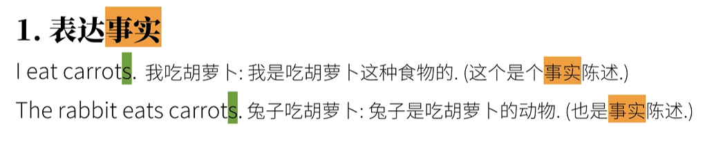
###2.表达习惯/重复动作
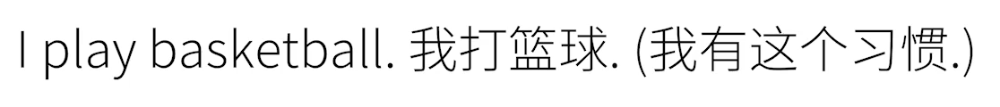
###3.表示预计发生的事

****
#2、一般现在时态
**相当于中文正在做某事**
助动词be的变位 + 动词的现在分词
##be
###1）系动词
将后者赋值给前者
###2）组动词，构成时态（或被动态）
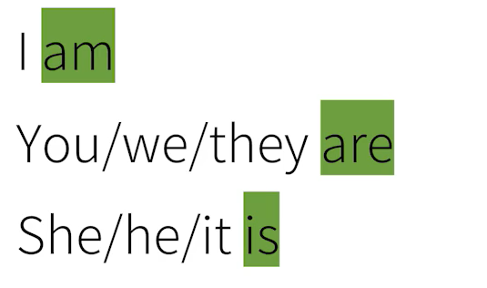
##现在分词
**通常：+ing**
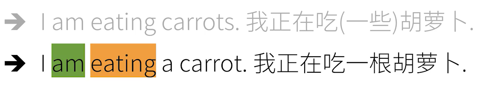
****
#3、现在完成时态
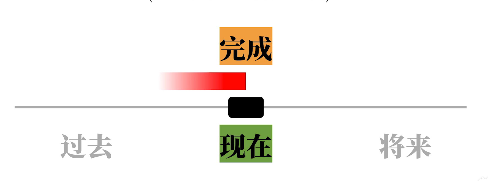
**已经完成的动作，往往还会对现在造成影响**
**助动词have的变位 + 动词的过去分词**
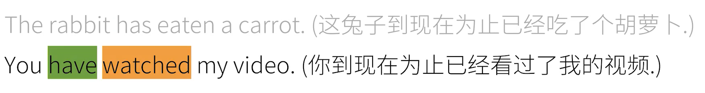
##have
###1）实义动词

###2）助动词，构成时态
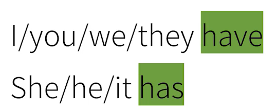

##过去分词
**通常：+ed**
****
#4、现在完成进行时态
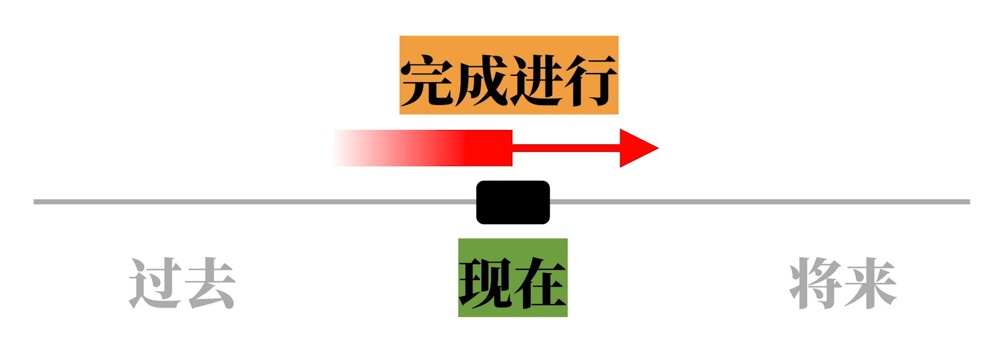
**不但已经完成了动作的一部分，而且还要继续进行**

**have的变位 + been +动词的过去分词**
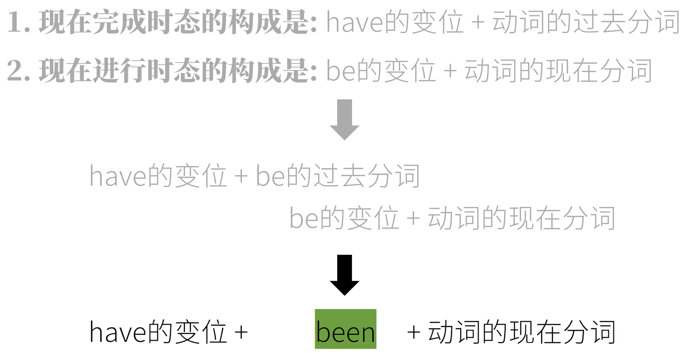
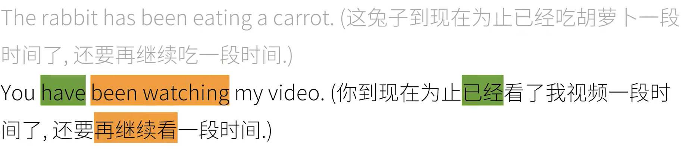

****
#二、过去
#1、一般过去时态
**把一般现在时态往前推一个时间段**

**只知道发生了这一件事情，不一定知道发生的时间，只是单纯强调这件事发生了**

**+ 动词的过去式**
各个人称都一样
==**过去式$\neq$过去分词**==

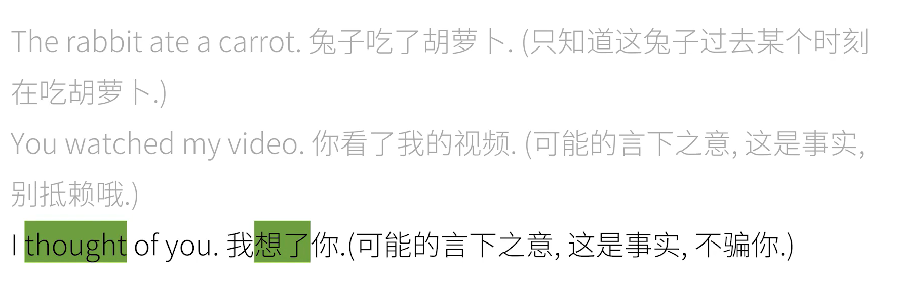
##过去式
通常：+ed

==**不能表示习惯，需要利用其他的词组**==
****

##2、过去进行时态

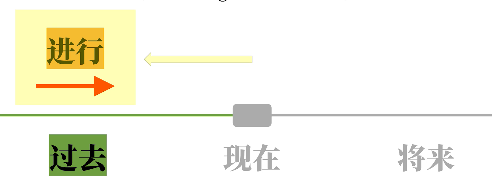
**强调某一件事过去正在进行**

**助动词be的变位(be的过去分词) + 动词的过去分词**
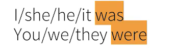

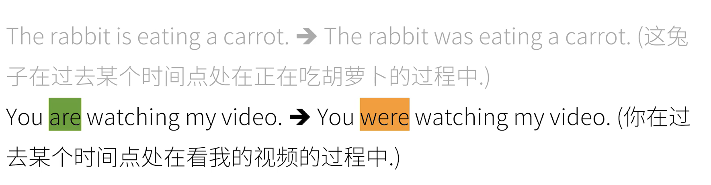

##现在完成时态VS一般过去时态

现在完成时态：
强调动作完成了吗？对现在的影响

一般现在时态：
强调动作发生过了吗？
****
##3、过去完成时态
**现在完成时态往前推一个时间段**
更一点过去对过去的影响

**助动词have的变位 + 动词的过去分词**
全部人称都是had

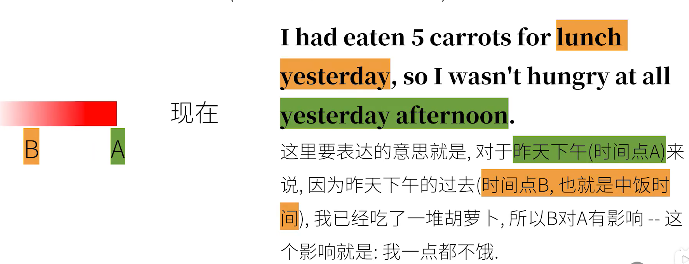
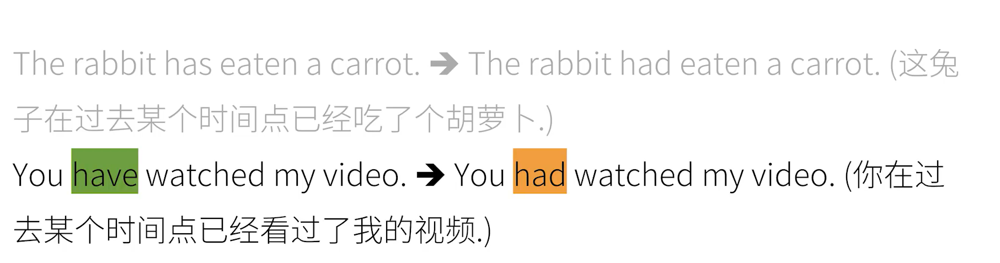

****

##4、过去完成进行时态
**现在完成进行时态往前推一个时间段**
**对于过去某个时间点已经完成了一部分动作而且仍要继续的动作**

**助动词have(全部人称都是had) + been + 动词的现在分词**

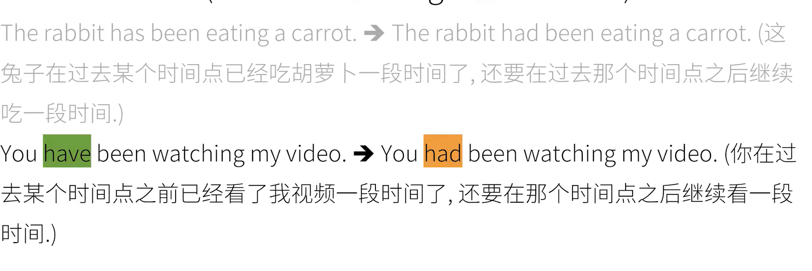

***

#将来
并没有向过去一样+ed的变化,需要助动词的帮助
##1、一般将来时态
**将来某个时间点要发生的动作(说话者==十分确定==的事情)**
如果不太确定，就不能使用，需要借助动词的“语气”

**will(shall) + 动词原型**
所有人称都是will

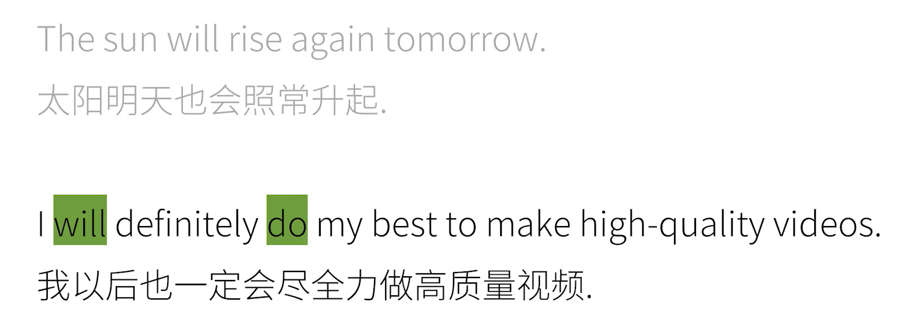
****

##2、将来进行时态
**将来某个时间中，某个动作是在进行的**
特别确定的时候才能使用
**will + be + 动词的现在分词**
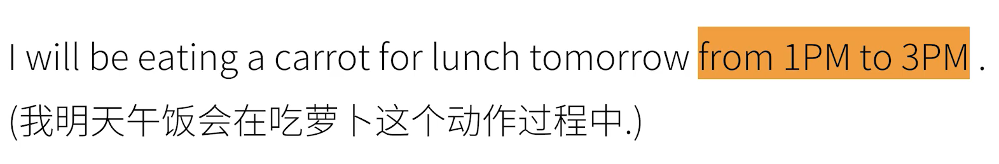
***

##3、将来完成时态
**表达将来某一点A的过去对点A的影响**

**will + have +动词的现在分词**
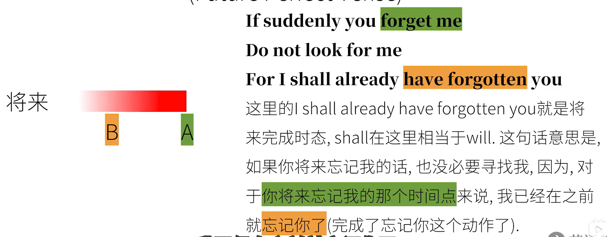

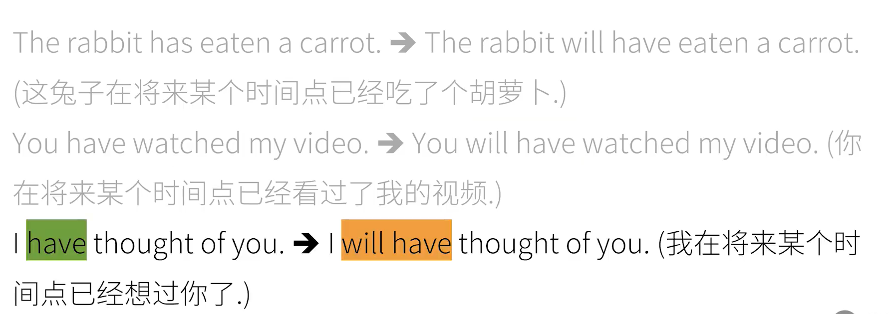

***

##4、将来完成进行时态
用的少可以用一般将来时态和将来完成时态可以表达近视的情况
**对于将来某个点已经完成了一部分而且仍要继续的动作**

**will + have + been + 动词的现在分词**
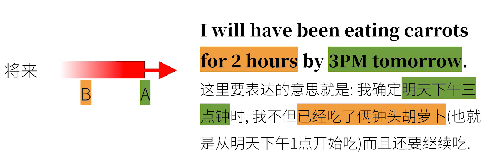

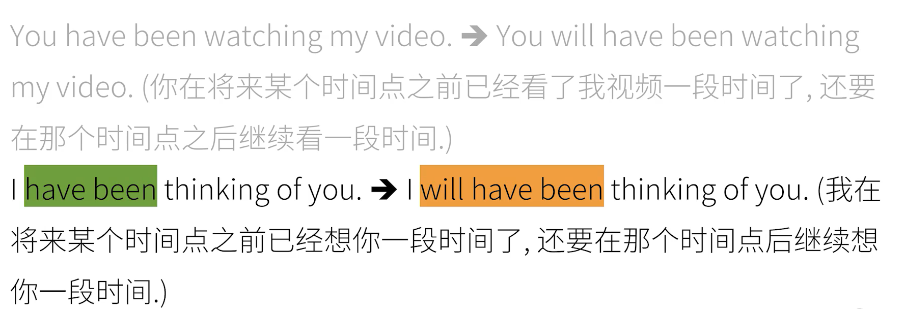
****

#过去将来
**这里的"将来"与现在没有关系**
##1、一般过去将来时态
**would(will的过去式) + 动词原型**
或者
**助动词be的变位 + going + to**
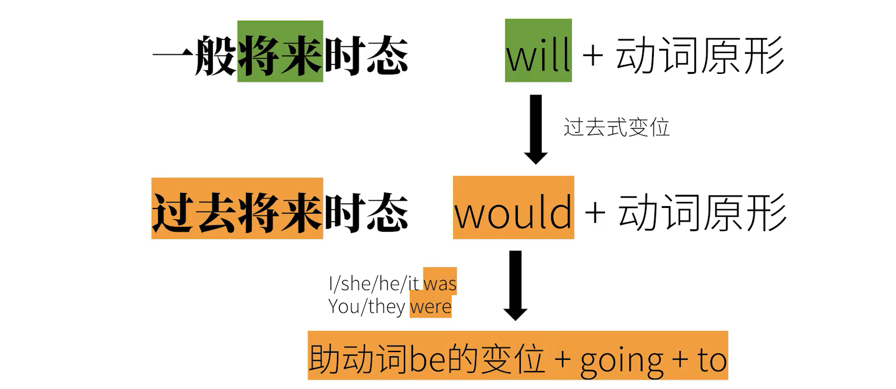

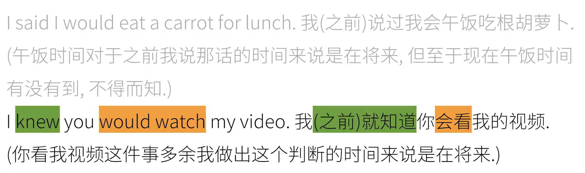
*****

###would的多义
构成时态

虚拟语气

更礼貌

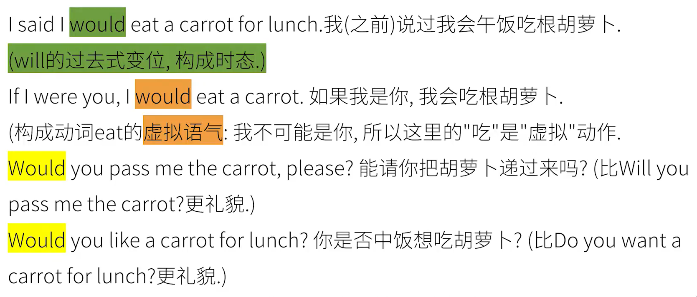

##2、过去将来进行时态

**would + be + 动词的现在分词**

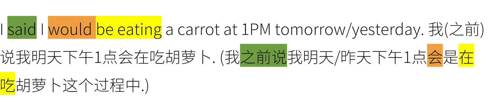

##3、过去将来完成时态

**would + have + 动词的过去分词**

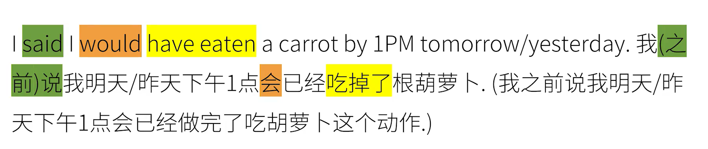

##4、过去将来完成进行时态

**would + have + 动词的过去分词**

#总结

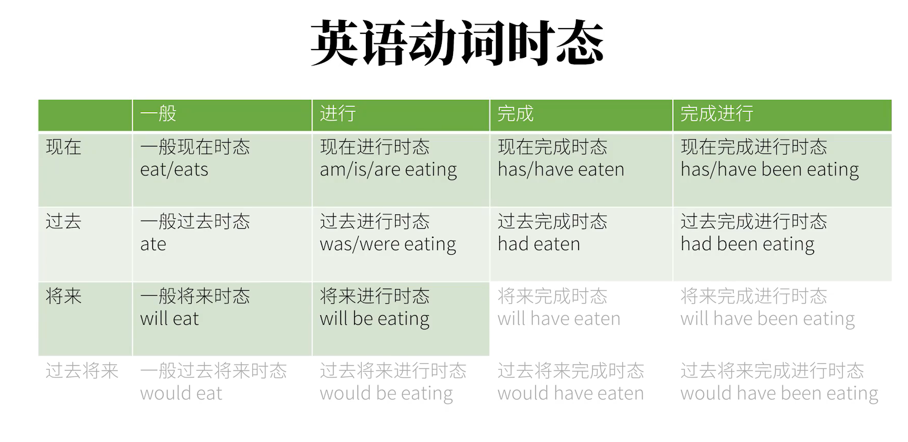
