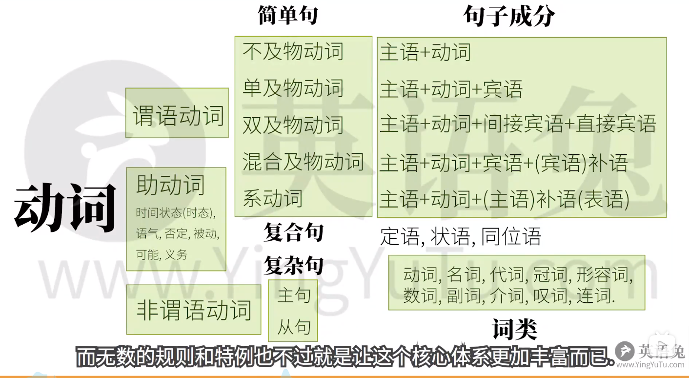

# 英语语法体系
## 基本结构

主语 + 谓语

主语：人或物
谓语：动作(发生了什么事情)

## 动作的类型 5种谓语动词$\rightarrow$5种"基本句型"
*动词语句需要几个对象才能表达意思*
### 1、可以独立完成的动作:**不及物动词**$\qquad$Papa Rabbit ==sleeps==.  
   **主语 + 不及物动词**$\qquad$兔老爹==睡觉==
### 2、有==一个==动作的承受者:**单及物动词**$\qquad$Papa Rabbit ==likes== you.
**主语 + 单及物动词 + 宾语**$\qquad$兔老爹==喜欢==你
### 3、有==两个==动作承受者:**双及物动词**$\qquad$ Papa Rabbit ==teaches== you English.
**主语+双及物动词+间接宾语+直接宾语**$\qquad$兔老爹==教==你英语
### 4、只有一个动作承受者(不同于2):$\qquad$Papa Rabbit ==considers== you smart.
**主语+复杂及物动词+宾语+宾语补语**$\qquad$兔老爹==认为==你聪明
只有一个动词承受者时感觉话没说完，而且宾语后面的你也不是另一个动作的承受者，必须要有个补充承受着的信息才意义完整。
### 5、把这个词后面的信息赋值给前者:(连)系动词$\qquad$Papa Rabbit ==looks==(通过"看"而不是兔老爹看) tall. **相当于** Papa Rabbit ==$\leftarrow$== tall.
**主语+系动词+(主语)补语也叫表语**
把后者信息赋予前者

## 其他句子类型
### 6、定语$\qquad$==The little white== rabbit ate ==a large== carrot.
**主要用来修饰主语和宾语**
### 7、状语$\qquad$The rabbit ate quickly.
**主要用来修饰谓语动词**
### 8、同位语$\qquad$Papa Rabbit,==an English teacher==,eats a carrot.
**把Papa Rabbit用不同方式再是说一遍,在这里和主语同一地位**

## 动词的三大本领
### 1.表示动作的时间
### 2.表示动作的状态
### 3.表示动作的语气(假设、情感)
但是有时候谓语动词不能靠自己完成$\rightarrow$助动词(没有实意只是帮助动词)

# 总结

