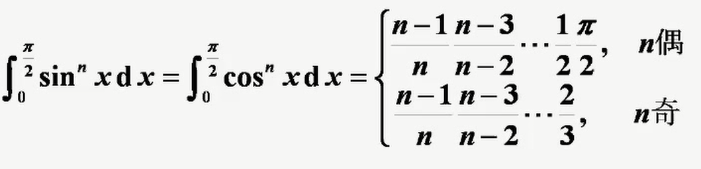
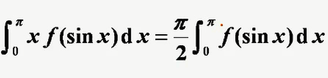

# 第一节 不定积分

## (一)两个基本概念

## (二)原函数的存在性

1. 若$f(x)$在区间$I$上连续，则$f(x)$在区间$I$上必有原函数。
2. 若$f(x)$在区间$I$有**第一类间断点**，则$f(x)$在区间$I$上没有原函数。

## (三)不定积分的性质

## (四)基本积分公式

## (五)三种主要积分法

## (六)三类常见可积函数积分

# 第二节 定积分

## (一)定积分概念

## (二)定积分的几何意义

## (三)可积性

1. 必要条件：$f(x)$有界
2. 充分条件：
   1. $f(x)$在$[a,b]$上连续
   2. $f(x)$在$[a,b]$上有界且只有有限个间断点
   3. $f(x)$在$[a,b]$上仅有有限个第一类间断点

## (四)定积分的计算

1. 牛顿-莱布尼茨公式
2. 换元积分
3. 分部积分
4. 奇偶性
5. 周期性
   1. $\displaystyle \int_a^{a+T}f(x)dx=\int_0^{T}f(x)dx$
6. 利用公式
   1. 
   2. 

## (五)变上限积分

1. 连续性：设$f(x)$在$[a,b]$上可积，则$\displaystyle \int_a^xf(t)dt$在$[a,b]$上连续
2. 可导性：设$f(x)$在$[a,b]$上除$x=x_0\in(a,b)$外均连续，则在点$x=x_0$处
   1. 连续$\rightarrow$可导，且$F'(x)=f(x)$
   2. 可去$\rightarrow$可导，且$F'(x)=\displaystyle \lim_{x \to x_0} f(x)$
   3. 跳跃$\rightarrow$连续但不可导，且$F_-'(x_0)=f(x_0^-)，F_+'(x_0)=f(x_0^+)$
3. 奇偶性
   1. 若$f(x)$为奇函数，则$\displaystyle \int_a^xf(t)dt$为偶函数
   2. 若$f(x)$为偶函数，则$\displaystyle \int_0^xf(t)dt$为奇函数

## (六)定积分的性质

1. 不等式
   1. 若$f(x)\leq g(x)，$则$\displaystyle \int_a^bf(x)dx\leq \int_a^bf(x)dx$
   2. 若$f(x)$在$[a,b]$上连续，则$\displaystyle m(b-a)\leq\int_a^bf(x)dx\leq M(b-a)$
   3. $\displaystyle |\int_a^bf(x)dx|\leq \int_a^b|f(x)|dx$
2. 中值定理
   1. 若$f(x),g(x)$在$[a,b]$上连续，$g(x)$不变号，则$\displaystyle\int_a^bf(x)g(x)dx=f(c)\int_a^bg(x)dx，a\leq c\leq b$

# 第三节 反常积分

## (一)无穷区间上的反常积分

1. 定义
   1. $\displaystyle \int_a^{+\infty}f(x)dx=\lim_{t \to +\infty}\int_a^t f(x)dx$
2. 定理1(比较判别法)
   1. 设$f(x),g(x)在[a,+\infty)$上连续，且$0\leq f(x)\leq g(x)$，则
      1. $\displaystyle \int_a^{+\infty}g(x)dx$收敛$\rightarrow \displaystyle \int_a^{+\infty}f(x)dx$收敛
      2. $\displaystyle \int_a^{+\infty}f(x)dx$发散$\rightarrow \displaystyle \int_a^{+\infty}g(x)dx$发散
   2. 设$f(x),g(x)在[a,+\infty)$非负连续，$\displaystyle \lim_{x \to +\infty}\frac{f(x)}{g(x)}=\lambda $，则
      1. 当$\lambda>0$,，$\displaystyle \int_a^{+\infty}f(x)dx$与$\displaystyle \int_a^{+\infty}g(x)dx$同敛散
      2. 当$\lambda>0$,，$\displaystyle \int_a^{+\infty}f(x)dx$收敛$\rightarrow\displaystyle \int_a^{+\infty}g(x)dx$收敛
      3. 当$\lambda>0$,，$\displaystyle \int_a^{+\infty}f(x)dx$发散$\rightarrow\displaystyle \int_a^{+\infty}g(x)dx$发散
3. 常用结论
   1. $\displaystyle \int_a^{+\infty}\frac{1}{x^P}dx \begin{cases}
   P>1 收敛\\
   P\leq 1 发散\\
   \end{cases}$

## (二)无界函数上的反常积分

1. 定义
   1. 设点$a$为函数$f(x)$的瑕玷：$\displaystyle \int_a^bf(x)dx=\lim_{t \to a^+}\int_t^bf(x)dx $
2. 常用结论：
   1. $\displaystyle\int_a^b \frac{1}{(x-a)^P}a$是无界点
   2. $\displaystyle\int_a^b \frac{1}{(b-x)^P}b$是无界点
   3. $\begin{cases}
   P<1 收敛 \\
   P \geq 1 发散
   \end{cases}$

# 第四节 定积分应用

## (一)几何应用

### 1、平面图形的面积

1.若平面域 $D$ 由曲线 $y=f(x),y=g(x)(f(x)>g(x)),x=a,x=b(a<b)$。

$
S = \displaystyle \int_b^a[f(x)-g(x)]{\rm d}x 
$

2.若平面域$D$ 由曲线$ ρ = ρ(θ),θ=α,θ=β(α<β)$所围成，则

$
S = \displaystyle \int_α^βρ^2(θ){\rm d}θ 
$

### 2、旋转体体积
若平面域$D$由曲线$y=f(x),(f(x)≥0),x=a,x=b(a<b)$所围成，则

1.区域$D$绕$x$轴旋转一周所得的旋转体体积为

$
V_x = π\displaystyle \int_a^bf^2(x){\rm d}x
$

2.区域$D$绕$y$轴旋转一周所得的旋转体体积为

$
V_x = 2π\displaystyle \int_a^bxf(x){\rm d}x
$

$
\text{以上公式不用,使用二重积分解决问题}
$

####通用公式
$
V=2π\quad\iint_{D_{xy}}r(x,y){\rm d}ξ
$ 

$平面直接等于对1的二重积分,极坐标记得乘上\rho$

$
r(x,y)为区域里面的点到转轴的距离
$

$
r(x,y)=\displaystyle\frac{|ax+by-c|}{\sqrt{a^2+b^2}}
$

### 3、弧长公式

$
(1)C：y=y(x), a≤x≤b,s=\displaystyle\int_a^b\sqrt{1+y^{'2}}{\rm d}x
$

$
(2)C：\begin{cases}
 x=x(t) \\
 y=y(t)\\
\end{cases}, α≤t≤β,s=\displaystyle\int_α^β\sqrt{x^{'2}+y^{'2}}{\rm d}t
$

$(3)C:\rho=\rho(\theta),\alpha≤\theta\le\beta,s=\displaystyle\int_\alpha^\beta\sqrt{\rho^2+\rho^{'2}}{\rm d}\theta$

### 4.旋转体的侧面积
$S=2\pi\displaystyle\int_a^bf(x)\sqrt{1+f^{'2}(x)}{\rm d}x$

## (二) 物理应用

1. 压力
2. 变力做功
3. 引力