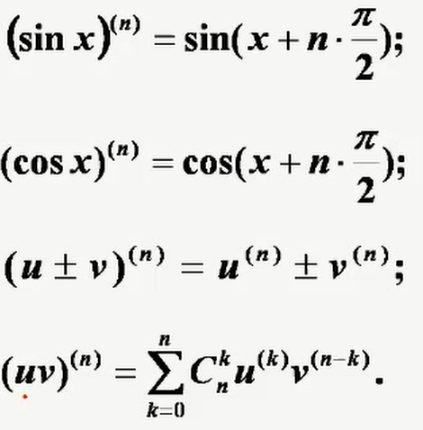

# 第一节 导数与微分

## (一)导数概念

动点$-$定点

函数在一点的变化率

$\displaystyle \lim_{\Delta x \to 0}\frac{f(x+\Delta x)-f(x)}{\Delta x} =\lim_{x \to x_0}\frac{f(x)-f(x_0)}{x-x_0} $

$\color{green}{定理}$ 可导$\rightleftharpoons$左右导数都存在且相等

## (二)微分概念

函数在一点的近视值

## (三)导数与微分的几何意义

导数=切线的斜率=$\tan\alpha$
微分=切线上的增量

## (四)连续、可导、可微之间的关系

可导$\nRightarrow f'(x)$连续
可导$\nRightarrow \lim f'(x)$存在
所以

1. n阶可导$\Rightarrow f^{(n-1)}(x)$连续
2. n阶连续可导$\Rightarrow f^{(n)}(x)$连续

**⚠️洛必达时注意**

## (五) 求导公式

## (六) 求导法则

### 1. 有理运算法则

### 2. 复合函数求导法

### 3. 隐函数求导法

### 4. 反函数的导数

若$x=\phi(y)$在某区间上单调、可导，且$\phi'(y)\neq 0$，则其反函数$y=f(x)$也可导且
$$
f'(x)=\frac{1}{\phi(y)}
$$

### 5. 参数方程求导法

求二阶以上导数要而外乘上一个$t$对$x$的导数

### 6. 高阶导数

**常用公式**

# 第二节 导数应用

## (一) 微分中值定理

## (二) 极值与最值

### 极值第三充分条件
设$f(x)n(n>1)$阶可导，$f'(x)=f‘’(x)=\cdots =f^{(n)}(x)=0$
1. 当$n$为偶数时
   1. 当$f^{(n)}(x_0)<0$时，$f(x)$在$x_0$处取极大值
   2. 当$f^{(n)}(x_0)》0$时，$f(x)$在$x_0$处取极小值
2. 当$n为奇数时没有极值

### 求连续函数$f(x)$在$[a,b]$上的最值
1. 求出$f(x)$在$(a,b)$内的驻点和不可导的点
2. 求出函数值(开区间还包括端点)
3. 比较函数值

## (三) 曲线的凹向与拐点

$f''(x)>0$是凹
$f''(x)<0$是凸

## (四) 曲线的渐近线

1. 水平渐近线：$\displaystyle \lim_{x\to \infty}f(x)=A$
2. 垂直渐近线：$\displaystyle \lim_{x\to A}f(x)=\infty$
3. 斜渐近线：若$\displaystyle \lim_{x\to \infty}\frac{f(x)}{x}=a ,\lim_{x\to \infty}f(x)-ax=b,y=ax+b$
4. 在一侧水平渐近线和斜渐近线不能同时存在(如在$x\to+\infty$不能同时存在)

## (五) 平面曲线的曲率

曲率： $\displaystyle K=\frac{|y''|}{(1+y'^2)^{\frac{3}{2}}}$

曲率半径：$\displaystyle R=\frac{1}{K}$