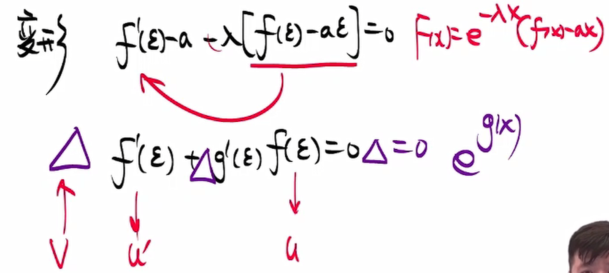
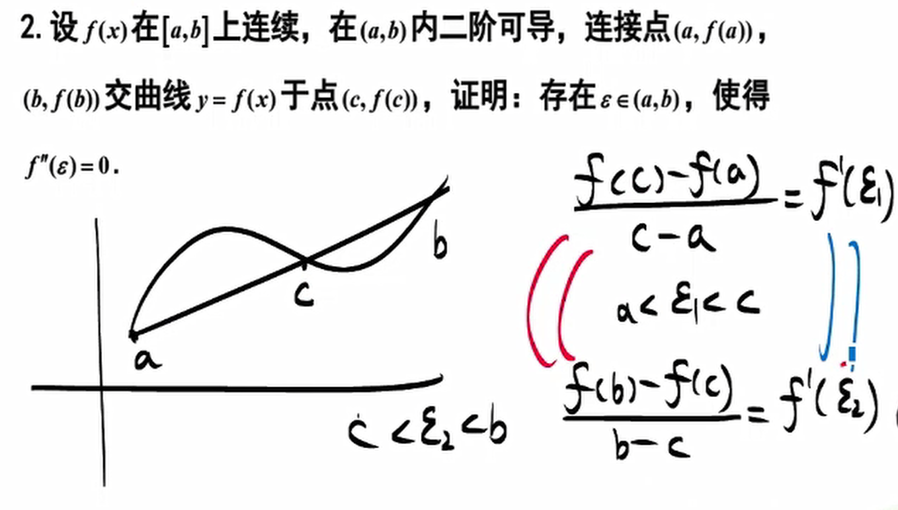

#中值定理
##罗尔定理

**直接法**

$f'(\xi)=A\rightarrow F(x)=f(x)-Ax$

**组合还原法** 

$f'(\xi) g(x) + f(\xi)g'(x)=0\Rightarrow f(x)g(x)=F(x)$

$f'(\xi)g(\xi)-f(\xi)g(\xi)=0 \Rightarrow \displaystyle\frac{f'(\xi)g(\xi)-f(\xi)g(\xi)}{g^2(\xi)}=0\Rightarrow F(x)=\left(\frac{f(x)}{g(x)}\right)'$

**同乘因子法**

$f'(\xi)+\lambda f(\xi)=0 \Rightarrow F(x)=e^{\lambda x}f(x)$

##拉格朗日

求二阶导数等于零
